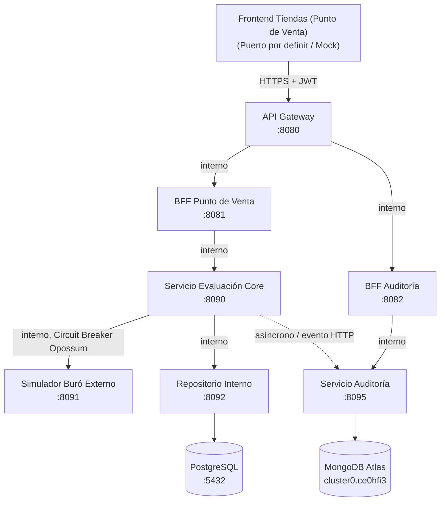

# Arquitectura del Sistema Resuelve - Evaluación de Crédito

## 1. Visión General
El sistema **Resuelve** es una plataforma distribuida diseñada para evaluar solicitudes de crédito en tiendas de forma ágil, segura y resiliente. Está estructurada como un monorepo simple de microservicios independientes en Node.js + Express, comunicados mediante contratos OpenAPI 3.0 (enfoque *contract-first*).

---

## 2. Diagrama de Relación entre Componentes

---

## 3. Matriz de Puertos y Servicios

| Componente | Carpeta | Puerto Interno | Dependencias Principales | Responsabilidad |
|------------|---------|----------------|--------------------------|-----------------|
| **API Gateway** | `services/gateway` | `8080` | Express, `http-proxy-middleware`, `express-jwt`, `express-rate-limit` | Punto único de entrada público, autenticación JWT, limitación de tasa y enrutamiento proxy inverso. |
| **BFF Punto de Venta** | `services/bff-punto-venta` | `8081` | Express, Axios | Orquestación adaptada a la experiencia del usuario y POS. |
| **BFF Auditoría** | `services/bff-auditoria` | `8082` | Express, Axios | Agregación de consultas y reportes para analistas y auditores. |
| **Evaluación Core** | `services/evaluacion-core` | `8090` | Express, Axios, `opossum` | Motor de reglas de negocio (*Chain of Responsibility*), orquestador del flujo decisional. |
| **Buró Simulado** | `services/buro-simulado` | `8091` | Express | Simulación determinística de scoring externo con escenarios (`NORMAL`, `LATENCIA_ALTA`, `CAIDO`). |
| **Repositorio Interno** | `services/repositorio-interno` | `8092` | Express, `pg` | Gestión y consulta del historial de clientes interno respaldado en PostgreSQL. |
| **Auditoría** | `services/auditoria` | `8095` | Express, `mongodb` | Registro inmutable de eventos y decisiones de crédito en MongoDB Atlas. |

---

## 4. Contratos OpenAPI (Carpeta `contracts/`)

Cada microservicio implementa su contrato OpenAPI 3.0:
- `spec0-frontend.yaml`: Contrato para el frontend de tiendas (mocking con Prism/MSW).
- `spec1-gateway.yaml`: Contrato público expuesto por el API Gateway.
- `spec2-bff-pos.yaml`: Contrato interno de BFF Punto de Venta.
- `spec3-bff-auditoria.yaml`: Contrato interno de BFF Auditoría.
- `spec4-evaluacion-core.yaml`: Contrato del core de evaluación de crédito.
- `spec5-buro-simulado.yaml`: Contrato del simulador de buró externo.
- `spec6-repositorio-interno.yaml`: Contrato del repositorio de clientes.
- `spec7-auditoria.yaml`: Contrato del servicio de auditoría.

---

## 5. Patrones de Resiliencia y Diseño
- **Chain of Responsibility**: En `evaluacion-core`, las reglas de negocio (`reglaMoraVigente`, `reglaClienteNuevo`, `reglaScoreBuro`, `reglaCapacidadPago`) se evalúan secuencialmente desacopladas unas de otras.
- **Circuit Breaker (Opossum)**: La llamada a `buro-simulado` está protegida por un interruptor de circuito que conmuta a un *fallback* ante caídas o latencias excesivas.
- **BFF (Backend for Frontend)**: Desacopla la lógica de visualización del frontend y del panel de auditoría respecto a las entidades y modelos del núcleo de negocio.
