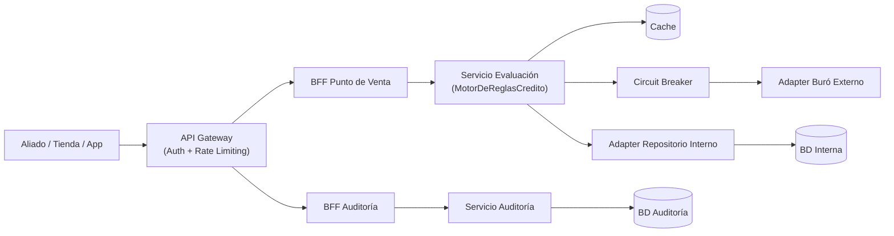
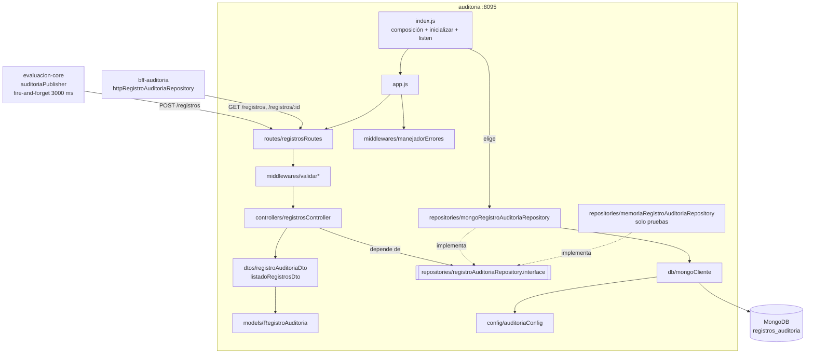
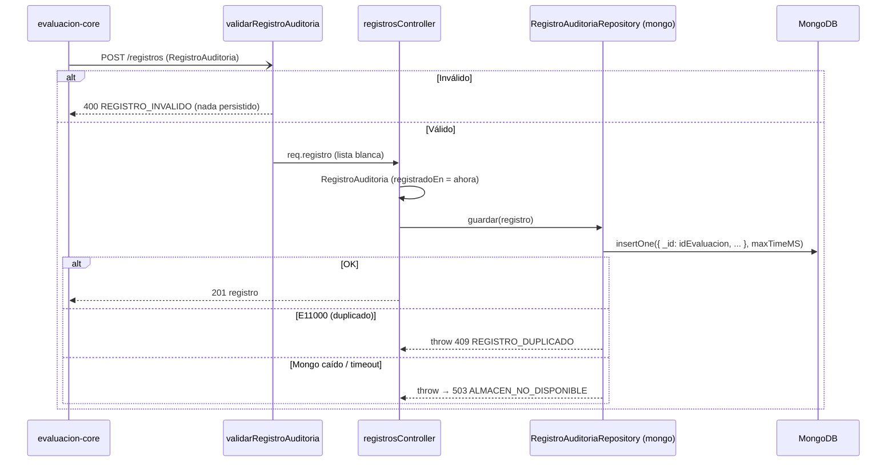
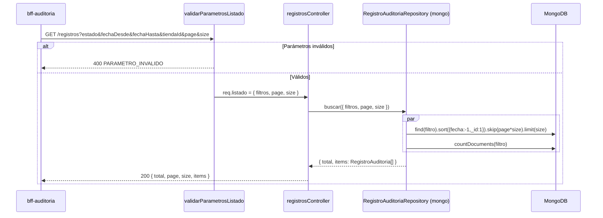

# Design Document

## Overview

Esta funcionalidad convierte el **Servicio de Auditoría** (`auditoria`, puerto 8095) en el registro inmutable y consultable de todas las decisiones de crédito: persiste en MongoDB cada `RegistroAuditoria` que publica el core (RF-01) y lo expone filtrado (RF-02), por identificador (soporte a RF-03) y siempre paginado (RF-04).

El objetivo central del diseño es doble:

1. **Corrección funcional y contractual**: validar y persistir el registro por lista blanca, filtrar por estado, rango de fechas y tienda, y paginar con base 0 según `contracts/spec7-auditoria.yaml`, que se actualiza **primero** (steering `tech.md`).
2. **Escalar con el volumen**: cada venta genera un registro, así que la colección crece sin límite. El diseño se apoya en índices que cubren filtro y orden, en un tamaño de página máximo y en timeouts cortos. La escritura desde el core es fire-and-forget con 3000 ms, por lo que un `insertOne` por `_id` mantiene al servicio fuera del camino crítico del KPI de 3 s.

Cambios frente al código actual:

- **Persistencia real.** Se reemplaza `memoriaRegistroAuditoriaRepository` por `mongoRegistroAuditoriaRepository` en la raíz de composición. La implementación en memoria se conserva, alineada con la misma semántica, para las pruebas.
- **Sin credenciales en el código.** `db/connection.js` (con la cadena de Atlas como valor por defecto) se reemplaza por `db/mongoCliente.js`, que solo lee `MONGO_URI` y `DB_NAME` del entorno.
- **Contrato Spec 7.** `estado` en lugar de `decision`, `page` con base 0, `size`, respuesta `{ total, page, size, items }`, filtros de fecha y tienda y `GET /registros/{idEvaluacion}`.
- **Validación y errores.** 400 / 404 / 409 / 503 / 500 con textos fijos, sin filtrar mensajes del driver.

### Alineación con el steering (`.kiro/steering/`)

| Regla del steering | Cómo se cumple |
|---|---|
| `tech.md`: MongoDB para `auditoria` (documentos semi-estructurados) | Colección `registros_auditoria` con el driver oficial `mongodb`. |
| `tech.md`: contrato primero | La tarea 1 del plan actualiza `spec7-auditoria.yaml` (v1.1.0) antes del código. |
| `tech.md`: timeout y error explícitos en toda llamada saliente | `serverSelectionTimeoutMS` / `connectTimeoutMS` / `maxTimeMS` = `MONGO_TIMEOUT_MS`; clasificación 503 / 500. |
| `tech.md`: Circuit Breaker | No aplica: la dependencia es la base propia del servicio (arquitectura de referencia: `Servicio Auditoría → BD Auditoría`, directa). |
| `structure.md`: estructura estándar con patrón Repository | Interfaz `registroAuditoriaRepository.interface.js` + implementaciones `mongoRegistroAuditoriaRepository.js` (producción) y `memoriaRegistroAuditoriaRepository.js` (pruebas); modelo, DTOs, middlewares y controlador separados. |
| `structure.md`: contrato por ruta relativa, sin copia | No hay YAML dentro de `services/auditoria/`. |
| `product.md`: auditar el KPI del 60 % sin buró | `consultaBuroRealizada` y `reglasAplicadas` son obligatorios y se conservan exactos. |

### Mapa de decisiones de diseño → requisitos

| Decisión de diseño | Requisitos que satisface |
|---|---|
| Validación por lista blanca del `RegistroAuditoria` (middleware + DTO) | Req 1 (crit. 3-5) |
| `_id = idEvaluacion` (unicidad nativa) + 409 ante duplicado | Req 1 (crit. 6-7), Req 5 (crit. 2) |
| `fecha` y `registradoEn` almacenados como `Date` | Req 2 (crit. 3-4, 6) |
| Índices compuestos `{fecha:-1,_id:1}`, `{decision:1,fecha:-1,_id:1}`, `{tiendaId:1,fecha:-1,_id:1}` | Req 2, Req 5 (crit. 2), KPIs |
| Paginación base 0 con `size` acotado por configuración | Req 4 |
| `GET /registros/{idEvaluacion}` por `_id` | Req 3 |
| Creación de índices al arrancar con reintentos | Req 5 (crit. 3) |
| Clasificación centralizada de errores de MongoDB | Req 5 (crit. 4-6) |

## Architecture

### Arquitectura de referencia del sistema

Este servicio implementa los nodos `Servicio Auditoría` y `BD Auditoría`. Lo escribe el Servicio de Evaluación y lo lee el BFF Auditoría.



> El core publica en `POST /registros` de forma no bloqueante (`clients/auditoriaPublisher.js`); en el diagrama de referencia esa flecha es implícita.

### Estructura del servicio

```text
services/auditoria/src/
├── config/auditoriaConfig.js                         # env: Mongo, paginación, reintentos
├── controllers/registrosController.js                # crear / listar / obtenerPorId
├── dtos/
│   ├── registroAuditoriaDto.js                       # validación (lista blanca) + salida del registro
│   └── listadoRegistrosDto.js                        # validación de filtros/paginación + Pagina
├── middlewares/
│   ├── validarRegistroAuditoria.js                   # 400 REGISTRO_INVALIDO
│   ├── validarParametrosListado.js                   # 400 PARAMETRO_INVALIDO (usa config)
│   ├── validarIdEvaluacion.js                        # 400 PARAMETRO_INVALIDO
│   └── manejadorErrores.js
├── models/registroAuditoria.js                       # modelo inmutable (fecha y registradoEn como Date)
├── repositories/
│   ├── registroAuditoriaRepository.interface.js      # inicializar / guardar / buscarPorId / buscar
│   ├── mongoRegistroAuditoriaRepository.js           # producción
│   └── memoriaRegistroAuditoriaRepository.js         # pruebas (misma semántica)
├── routes/registrosRoutes.js
├── utils/
│   ├── errorAuditoria.js                             # ErrorAuditoria + clasificarErrorAlmacen
│   └── fechas.js                                     # YYYY-MM-DD, límites de día en UTC
├── db/mongoCliente.js                                # MongoClient con timeouts (sin credenciales)
├── app.js                                            # crearApp(deps)
└── index.js                                          # composición + índices con reintentos + listen
```



### Contratos como fuente de verdad

- `contracts/spec7-auditoria.yaml` (**v1.1.0, tarea 1**): se añaden `identificacion`, `montoSolicitado` y `plazoMeses` a `RegistroAuditoria` (el core ya los envía por su RF-08), `registradoEn` en la respuesta, el filtro `tiendaId`, `GET /registros/{idEvaluacion}`, `size` con máximo, `PaginaRegistros { total, page, size, items }`, `ErrorRespuesta` y los códigos 201/400/404/409/500/503.
- Productor: `evaluacion-core` (`dtos/registroAuditoriaDto.js` del core) ya envía la forma de Spec 7.
- Consumidor: `bff-auditoria` (feature `bff-auditoria`, que toma este contrato como entrada).

### Flujo `POST /registros`



### Flujo `GET /registros` (listado paginado)



**Tradeoff de la paginación por `skip`.** `skip(page * size)` recorre los documentos saltados, así que su costo crece con el número de página. Se elige porque el contrato (Spec 1/3/7) define paginación por número de página y el panel necesita "ir a la página N". Con los índices compuestos, el recorrido ocurre dentro del índice y no sobre los documentos. Si el volumen hiciera lentas las páginas profundas, la evolución natural sería la paginación por cursor (`fecha`, `_id`) como parámetro adicional, sin romper el contrato actual.

**Tradeoff de `countDocuments`.** Contar sobre el mismo filtro indexado tiene costo proporcional a los documentos que coinciden. Se acepta porque el panel muestra el total y los filtros más usados (estado, tienda, rango de fechas) están indexados. `estimatedDocumentCount` no respeta filtros y se descarta.

## Components and Interfaces

### 1. `config/auditoriaConfig.js` (reescrito)

```js
{
  port,                           // PORT (8095)
  mongoUri,                       // MONGO_URI (default "mongodb://localhost:27017", sin credenciales)
  dbName,                         // DB_NAME (default "auditoria_db")
  mongoTimeoutMs,                 // MONGO_TIMEOUT_MS (default 2000, > 0)
  paginaTamanoDefecto,            // PAGINA_TAMANO_DEFECTO (default 20)
  paginaTamanoMaximo,             // PAGINA_TAMANO_MAXIMO (default 100); si defecto > máximo → 20/100 + advertencia
  dbInitReintentos,               // DB_INIT_REINTENTOS (default 10)
  dbInitEsperaMs                  // DB_INIT_ESPERA_MS (default 2000)
}
```

### 2. `db/mongoCliente.js` (reemplaza `db/connection.js`)

```js
function crearClienteMongo({ mongoUri, dbName, mongoTimeoutMs }) // → { client, db, verificarConexion(): Promise<boolean>, cerrar() }
```

`MongoClient` con `serverSelectionTimeoutMS` y `connectTimeoutMS` iguales a `mongoTimeoutMs`. `verificarConexion` ejecuta `db.command({ ping: 1 })`.

### 3. `models/registroAuditoria.js`

```js
class RegistroAuditoria {
  constructor({ idEvaluacion, identificacion, montoSolicitado, plazoMeses, tiendaId, decision, motivo,
                fecha /* Date */, consultaBuroRealizada, scoreBuro, reglasAplicadas, registradoEn /* Date */ }) // inmutable
}
```

Los campos opcionales ausentes se guardan como `null`, para que todos los documentos tengan la misma forma.

### 4. `dtos/registroAuditoriaDto.js`

```js
function validarRegistroAuditoria(body) // → { ok: true, valor } | { ok: false, errores: string[] }
function toRegistroAuditoriaDto(registro) // → objeto JSON: fecha y registradoEn como ISO 8601
```

| Campo | Obligatorio | Regla |
|---|---|---|
| `idEvaluacion` | sí | UUID (`/^[0-9a-f]{8}-[0-9a-f]{4}-[0-9a-f]{4}-[0-9a-f]{4}-[0-9a-f]{12}$/i`) |
| `decision` | sí | `APROBADO` \| `RECHAZADO` \| `REVISION_MANUAL` |
| `fecha` | sí | cadena ISO 8601 con hora, `Date.parse` válido |
| `consultaBuroRealizada` | sí | boolean |
| `reglasAplicadas` | sí | arreglo de cadenas (puede estar vacío) |
| `identificacion`, `tiendaId`, `motivo` | no | cadena |
| `montoSolicitado` | no | número finito |
| `plazoMeses` | no | entero |
| `scoreBuro` | no | entero o `null` |

Cualquier otra clave se descarta (lista blanca).

### 5. `dtos/listadoRegistrosDto.js`

```js
function validarParametrosListado(query, { paginaTamanoDefecto, paginaTamanoMaximo })
  // → { ok: true, valor: { filtros: { estado?, fechaDesde?, fechaHasta?, tiendaId? }, page, size } } | { ok: false, errores }
function toPaginaRegistrosDto({ total, items }, { page, size }) // → { total, page, size, items }
```

`page` y `size` se aceptan como texto de query y deben ser enteros en forma decimal (`/^\d+$/`), así que no se admiten `"1.5"`, `"-1"` ni `"abc"`. `fechaDesde` y `fechaHasta` se validan como fechas de calendario reales (sin `2026-02-30`).

### 6. Patrón Repository

```js
/** @typedef {{
 *   inicializar(): Promise<void>,                          // índices (idempotente)
 *   guardar(registro): Promise<void>,                      // lanza ErrorAuditoria 409 si idEvaluacion ya existe
 *   buscarPorId(idEvaluacion): Promise<RegistroAuditoria|null>,
 *   buscar({ filtros, page, size }): Promise<{ total: number, items: RegistroAuditoria[] }>
 * }} RegistroAuditoriaRepository */
function asegurarRegistroAuditoriaRepository(impl)
```

**`mongoRegistroAuditoriaRepository({ db, mongoTimeoutMs })`** (único módulo que conoce MongoDB):

- Documento: `{ _id: idEvaluacion, identificacion, montoSolicitado, plazoMeses, tiendaId, decision, motivo, fecha: Date, consultaBuroRealizada, scoreBuro, reglasAplicadas, registradoEn: Date }`. Usar `_id = idEvaluacion` da la unicidad sin un índice adicional y hace `buscarPorId` un acceso por clave primaria.
- `inicializar()`: `createIndexes` para `{ fecha: -1, _id: 1 }`, `{ decision: 1, fecha: -1, _id: 1 }` y `{ tiendaId: 1, fecha: -1, _id: 1 }` (idempotente).
- Filtro: `decision = estado`, `tiendaId`, y `fecha: { $gte: inicioDíaUTC(fechaDesde), $lt: inicioDíaSiguienteUTC(fechaHasta) }`.
- Error `11000` (clave duplicada) → `ErrorAuditoria(409, REGISTRO_DUPLICADO)`. Las consultas usan `maxTimeMS: mongoTimeoutMs`.

**`memoriaRegistroAuditoriaRepository()`**: la misma semántica (duplicado 409, filtros, orden y paginación) sobre un `Map`, usada en pruebas. Un conjunto de **pruebas de contrato compartidas** se ejecuta contra ambas implementaciones: la de MongoDB corre cuando `MONGO_URI_TEST` está definida.

### 7. `utils/errorAuditoria.js`

| Situación | HTTP | `code` |
|---|---|---|
| Registro inválido | 400 | `REGISTRO_INVALIDO` |
| Filtros / paginación / id inválidos | 400 | `PARAMETRO_INVALIDO` |
| JSON mal formado | 400 | `REGISTRO_INVALIDO` |
| Registro inexistente | 404 | `REGISTRO_NO_ENCONTRADO` |
| `idEvaluacion` duplicado | 409 | `REGISTRO_DUPLICADO` |
| `MongoServerSelectionError`, `MongoNetworkError`, `MongoNetworkTimeoutError`, `MongoNotConnectedError`, código `50` (`MaxTimeMSExpired`) | 503 | `ALMACEN_NO_DISPONIBLE` |
| Cualquier otro | 500 | `ERROR_INTERNO` |

### 8. Controlador, rutas, `app.js` e `index.js`

- `crearRegistrosController({ registroRepository, ahora })` → `crear` (201), `listar` (200) y `obtenerPorId` (200 / 404).
- `crearRegistrosRoutes(controller, config)`: `POST /` → `validarRegistroAuditoria` → `crear`; `GET /` → `validarParametrosListado(config)` → `listar`; `GET /:idEvaluacion` → `validarIdEvaluacion` → `obtenerPorId`.
- `crearApp({ registroRepository, verificarAlmacen, config, ahora })`: verifica la interfaz y monta `/health` (siempre 200, con `almacen: "UP" | "DOWN"`), `/registros` y `manejadorErrores`.
- `index.js`: crea el cliente Mongo y `mongoRegistroAuditoriaRepository`, ejecuta `inicializar()` con reintentos (mismo patrón que `repositorio-interno`) y luego `listen`; si se agotan los intentos, `exit(1)`.

## Data Models

### `RegistroAuditoria` (entrada — Spec 7)

```js
{ idEvaluacion: uuid, decision: "APROBADO"|"RECHAZADO"|"REVISION_MANUAL", fecha: date-time,
  consultaBuroRealizada: boolean, reglasAplicadas: string[],                     // obligatorios
  identificacion?: string, montoSolicitado?: number, plazoMeses?: integer,
  tiendaId?: string, motivo?: string, scoreBuro?: integer|null }                 // opcionales
```

### `RegistroAuditoria` almacenado (respuesta)

Los mismos campos (los opcionales ausentes como `null`) más `registradoEn: date-time`.

### `PaginaRegistros` (respuesta — Spec 7)

```js
{ total: integer, page: integer /* base 0 */, size: integer, items: RegistroAuditoria[] }
```

### Documento MongoDB (`registros_auditoria`)

```js
{ _id: idEvaluacion, ...campos, fecha: Date, registradoEn: Date }
```

## Correctness Properties

*Una propiedad es una característica o comportamiento que debe cumplirse en todas las ejecuciones válidas del sistema — esencialmente, una afirmación formal sobre lo que el sistema debe hacer. Las propiedades son el puente entre las especificaciones legibles por humanos y las garantías de corrección verificables por máquina.*

La validación, los filtros y la paginación tienen espacios de entrada amplios (fechas, combinaciones de filtros, tamaños y páginas), por lo que PBT con `fast-check` es apropiado. Las propiedades HTTP usan `crearApp` con `memoriaRegistroAuditoriaRepository`. Las **pruebas de contrato** del repositorio verifican que MongoDB tenga la misma semántica.

### Property 1: Ida y vuelta de un registro válido

*Para todo* `RegistroAuditoria` válido (con campos extra arbitrarios), `POST /registros` responde 201 y `GET /registros/{idEvaluacion}` devuelve exactamente los campos de Spec 7 con los valores enviados (`fecha` normalizada a ISO), incluidos `consultaBuroRealizada` y `reglasAplicadas` en el mismo orden, más `registradoEn`, y sin ningún campo extra.

**Validates: Requirements 1.1, 1.2, 1.3, 3.1**

### Property 2: Un registro inválido se rechaza sin persistir

*Para todo* registro al que se le altera un campo obligatorio (UUID inválido, decisión fuera del enum, fecha inválida, booleano o lista con tipo incorrecto) o un opcional con tipo incorrecto, `POST /registros` responde 400 `REGISTRO_INVALIDO` y el total de registros no cambia.

**Validates: Requirements 1.4, 1.5**

### Property 3: El listado devuelve exactamente los registros que cumplen los filtros

*Para todo* conjunto de registros y toda combinación de filtros (`estado`, `fechaDesde`, `fechaHasta`, `tiendaId`), `total` es igual al número de registros del conjunto que cumplen todos los filtros según un oráculo independiente, y cada elemento de `items` los cumple.

**Validates: Requirements 2.1, 2.2, 2.3, 2.4, 2.5**

### Property 4: La paginación es estable, completa y acotada

*Para todo* conjunto de registros, filtros y `size` válido, recorrer las páginas 0..⌈total/size⌉−1 devuelve cada registro que cumple los filtros exactamente una vez, en orden `fecha` descendente e `idEvaluacion` ascendente, con `items.length <= size` en cada página y `items` vacío en la página siguiente a la última.

**Validates: Requirements 2.6, 4.1, 4.6**

### Property 5: Parámetros de listado inválidos se rechazan con 400

*Para todo* `page` que no es un entero ≥ 0, `size` fuera de [1, máximo], `estado` fuera del enum, fecha inválida o `fechaDesde > fechaHasta`, `GET /registros` responde 400 `PARAMETRO_INVALIDO` y el repositorio registra cero búsquedas.

**Validates: Requirements 2.7, 4.4**

### Property 6: Un duplicado se rechaza y el original no cambia

*Para todo* par de registros válidos con el mismo `idEvaluacion`, el segundo `POST` responde 409 `REGISTRO_DUPLICADO` y `GET /registros/{idEvaluacion}` sigue devolviendo el primero.

**Validates: Requirements 1.6, 1.7**

### Property 7: Todo fallo del almacén se traduce sin filtraciones

*Para todo* error generado (clases de error de MongoDB, códigos arbitrarios, mensajes con cadenas de conexión y hosts), `clasificarErrorAlmacen(e).toRespuesta()` tiene exactamente `{ error: { code, message } }`, con 503 `ALMACEN_NO_DISPONIBLE` para los errores de disponibilidad, 500 `ERROR_INTERNO` para el resto, y ningún texto del error original.

**Validates: Requirements 5.4, 5.5, 5.6**

## Error Handling

- **Registro inválido / JSON mal formado** → `400 REGISTRO_INVALIDO`, sin persistir.
- **Parámetros inválidos** → `400 PARAMETRO_INVALIDO`, sin consultar MongoDB.
- **Registro inexistente** → `404 REGISTRO_NO_ENCONTRADO`.
- **Duplicado** → `409 REGISTRO_DUPLICADO`; el core lo registra como advertencia (fire-and-forget) y la decisión de crédito no se ve afectada.
- **MongoDB caído / timeout** → `503 ALMACEN_NO_DISPONIBLE`. Para el core es una advertencia en log; para el BFF, un 503 reintentable.
- **Error no previsto** → `500 ERROR_INTERNO`; el detalle queda solo en el log.
- **Arranque sin MongoDB** → reintentos de `inicializar()`; si se agotan, `exit(1)` y Docker reinicia el contenedor.

## Testing Strategy

- **`fast-check` `4.10.2`** (misma versión que los demás servicios) sobre Jest + Supertest; 100 iteraciones por propiedad (50 en la Property 4, que recorre todas las páginas); etiqueta `// Feature: servicio-auditoria, Property {n}: {texto}`.
- **Generadores:** UUID (`fc.uuid()`), decisiones, fechas en un rango acotado (`fc.date`), tiendas de un conjunto pequeño (para que los filtros coincidan), `reglasAplicadas` como subconjunto ordenado de los nombres del core, `scoreBuro` como `fc.option(fc.integer({min:300,max:850}), {nil:null})`.
- **Pruebas de contrato del repositorio** (`repositories/registroAuditoriaRepository.contrato.js`): una sola batería (guardar/duplicado, buscarPorId, filtros, orden, paginación, `inicializar` idempotente) ejecutada contra la implementación en memoria siempre y contra MongoDB cuando `MONGO_URI_TEST` está definida (verificado con `mongo:7` en Docker).
- **Ejemplos:** `auditoriaConfig` (defaults, defecto > máximo), `fechas` (bordes de día UTC, fechas inexistentes), `/health` UP/DOWN, arranque con reintentos y `exit(1)`.
