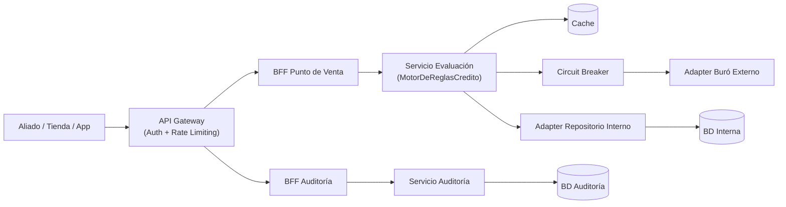
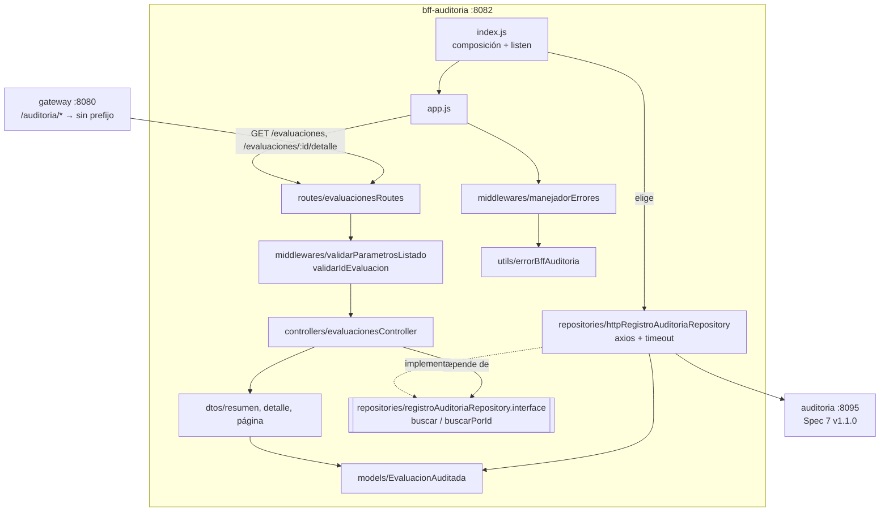
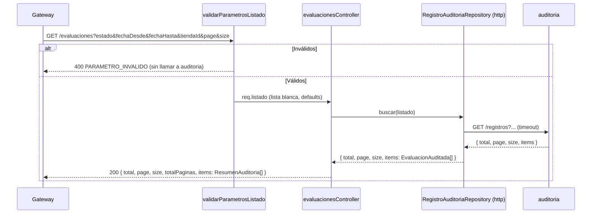
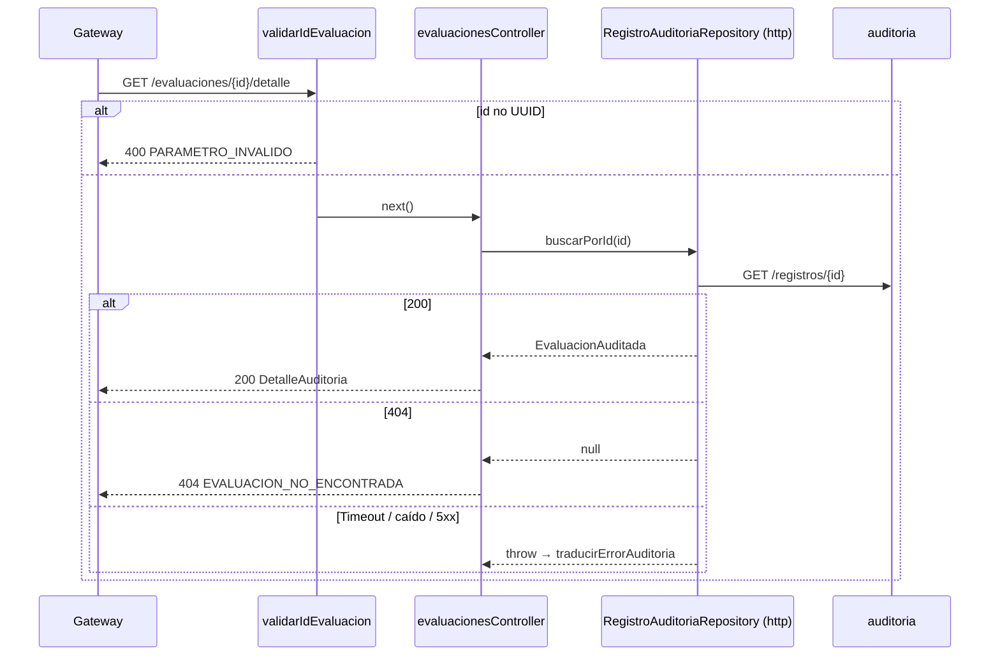

# Design Document

## Overview

Esta funcionalidad convierte el **BFF Auditoría** (`bff-auditoria`, puerto 8082) en la capa de adaptación entre el panel interno de analistas y el Servicio de Auditoría. Expone el listado filtrado y paginado de evaluaciones (RF-02, RF-04) y el detalle completo de una evaluación (RF-03), con los datos que el Frontend Tiendas nunca ve: score del buró, reglas aplicadas y si se consultó el buró.

El objetivo central del diseño es doble:

1. **Corrección funcional y contractual**: implementar `contracts/spec3-bff-auditoria.yaml`, que se actualiza **primero** (steering `tech.md`), sobre el contrato `spec7-auditoria.yaml` v1.1.0 que produce la feature `servicio-auditoria`.
2. **Payloads livianos y fallos claros**: el listado devuelve un resumen de 5 campos y el detalle completo se pide aparte. La paginación siempre está acotada y cualquier fallo aguas abajo se traduce a un error estructurado, sin filtrar detalles técnicos.

Cambios frente al código actual (passthrough):

- **Contrato Spec 3.** `estado` en lugar de `decision`, `page` con base 0, `size` en lugar de `limit`, filtro `tiendaId` y respuesta `{ total, page, size, totalPaginas, items }`.
- **Nuevo detalle.** `GET /evaluaciones/{id}/detalle` → `GET /registros/{id}` del Servicio de Auditoría.
- **Validación y acotamiento.** Se valida antes de salir a red, con `size` limitado por configuración.
- **Errores.** Se elimina la filtración de `err.message` y `err.response.data`, con la misma convención de error que el BFF Punto de Venta.

> **Decisión de diseño: resumen en el listado, detalle aparte.** Spec 3 v1.0.0 devolvía el detalle completo en cada elemento del listado. RF-04 pide evitar payloads sobrecargados y RF-03 pide exponer el detalle de *una* evaluación, así que la v1.1.0 separa las dos formas: `ResumenAuditoria` (5 campos) en el listado y `DetalleAuditoria` (12 campos) en `/evaluaciones/{id}/detalle`. Con `size` = 100, esto reduce el listado a una fracción del tamaño (sin `motivo`, `reglasAplicadas` ni los datos de la solicitud) y deja los datos sensibles (`identificacion`, `scoreBuro`) solo en la vista puntual.

### Alineación con el steering (`.kiro/steering/`)

| Regla del steering | Cómo se cumple |
|---|---|
| `tech.md`: BFF sin lógica de negocio | Solo valida la **forma** de los parámetros, delega el filtrado en el Servicio de Auditoría y adapta la presentación (resumen / detalle / `totalPaginas`). |
| `tech.md`: un BFF por tipo de consumidor | `bff-auditoria` sirve solo al panel interno; `ResumenAuditoria` y `DetalleAuditoria` son exclusivos de este BFF. |
| `tech.md`: contrato primero | La tarea 1 del plan actualiza `spec3-bff-auditoria.yaml` (v1.1.0). |
| `tech.md`: timeout y error explícitos en llamadas salientes | `AUDITORIA_TIMEOUT_MS` en axios y `traducirErrorAuditoria` centralizado. |
| `tech.md`: Circuit Breaker | No aplica: la arquitectura de referencia conecta `BFF Auditoría → Servicio Auditoría` directamente (el breaker vive solo entre Evaluación y Buró). |
| `structure.md`: estructura estándar con patrón Repository | Lectura remota vía `repositories/registroAuditoriaRepository.interface.js` + `httpRegistroAuditoriaRepository.js`, modelo `EvaluacionAuditada`, DTOs, middlewares y controlador. |
| `structure.md`: servicios independientes | Validación de fechas y errores propios del servicio, sin código compartido con `auditoria`. |

### Mapa de decisiones de diseño → requisitos

| Decisión de diseño | Requisitos que satisface |
|---|---|
| Validación de parámetros en middleware antes de salir a red | Req 1 (crit. 3), Req 2 (crit. 2), Req 3 (crit. 4) |
| Lista blanca de parámetros hacia el Servicio de Auditoría | Req 1 (crit. 2) |
| `ResumenAuditoria` en el listado; `DetalleAuditoria` solo en el detalle | Req 2 (crit. 4), Req 3, RF-04 |
| Modelo `EvaluacionAuditada` con campos opcionales normalizados a `null` | Req 3 (crit. 2-3) |
| `totalPaginas = ceil(total / size)` | Req 2 (crit. 3) |
| Traducción centralizada de errores | Req 3 (crit. 5), Req 4 |

## Architecture

### Arquitectura de referencia del sistema

Este servicio implementa el nodo `BFF Auditoría`. El Gateway le reenvía `/auditoria/*` sin el prefijo.



### Estructura del servicio

```text
services/bff-auditoria/src/
├── config/bffAuditoriaConfig.js                      # URL, timeout, paginación
├── controllers/evaluacionesController.js             # listar / obtenerDetalle
├── dtos/
│   ├── parametrosListadoDto.js                       # validación + lista blanca de filtros
│   ├── resumenAuditoriaDto.js                        # EvaluacionAuditada -> ResumenAuditoria (5 campos)
│   ├── detalleAuditoriaDto.js                        # EvaluacionAuditada -> DetalleAuditoria (12 campos)
│   └── paginaResumenAuditoriaDto.js                  # { total, page, size, totalPaginas, items }
├── middlewares/
│   ├── validarParametrosListado.js                   # 400 PARAMETRO_INVALIDO (usa config)
│   ├── validarIdEvaluacion.js                        # 400 PARAMETRO_INVALIDO
│   └── manejadorErrores.js
├── models/evaluacionAuditada.js                      # modelo inmutable + desdeRegistro (502 si no cumple Spec 7)
├── repositories/
│   ├── registroAuditoriaRepository.interface.js      # buscar / buscarPorId
│   └── httpRegistroAuditoriaRepository.js            # GET /registros, GET /registros/{id}
├── routes/evaluacionesRoutes.js
├── utils/
│   ├── errorBffAuditoria.js                          # ErrorBffAuditoria + traducirErrorAuditoria
│   └── fechas.js                                     # validación YYYY-MM-DD
├── app.js
└── index.js
```



### Contratos como fuente de verdad

- `contracts/spec3-bff-auditoria.yaml` (**v1.1.0, tarea 1**): `tiendaId`, `size` con máximo, `PaginaResumenAuditoria { total, page, size, totalPaginas, items: ResumenAuditoria[] }`, `DetalleAuditoria` con `identificacion`, `montoSolicitado`, `plazoMeses` y `registradoEn`, `ErrorRespuestaAuditoria` y los códigos 400/404/500/502/503/504.
- `contracts/spec7-auditoria.yaml` v1.1.0 (dependencia, feature `servicio-auditoria`).
- `contracts/spec1-gateway.yaml` sigue describiendo `PaginaAuditoria` de `Decision`: se realineará en la feature del Gateway con este contrato como entrada.

### Flujo `GET /evaluaciones`



### Flujo `GET /evaluaciones/{id}/detalle`



## Components and Interfaces

### 1. `config/bffAuditoriaConfig.js`

```js
{ port, auditoriaServiceUrl, auditoriaTimeoutMs /* AUDITORIA_TIMEOUT_MS, 3000 */,
  paginaTamanoDefecto /* 20 */, paginaTamanoMaximo /* 100 */ }   // mismas reglas de validación que auditoria
```

Los límites de paginación coinciden con los del Servicio de Auditoría, para que el BFF nunca pida un `size` que el servicio vaya a rechazar.

### 2. `dtos/parametrosListadoDto.js` y `middlewares/validarParametrosListado.js`

```js
function validarParametrosListado(query, { paginaTamanoDefecto, paginaTamanoMaximo })
  // → { ok: true, valor: { estado?, fechaDesde?, fechaHasta?, tiendaId?, page, size } } | { ok: false, errores }
```

Aplica las mismas reglas de forma que Spec 7 (enum, `YYYY-MM-DD` real, rango, `page` ≥ 0, `size` en [1, máximo]). El `valor` contiene solo las claves con valor (lista blanca) y el middleware lo deja en `req.listado`.

### 3. `models/evaluacionAuditada.js`

```js
class EvaluacionAuditada {
  constructor({ idEvaluacion, fecha, decision, tiendaId, consultaBuroRealizada, identificacion,
                montoSolicitado, plazoMeses, motivo, scoreBuro, reglasAplicadas, registradoEn }) // inmutable; opcionales → null
  static desdeRegistro(registro) // → EvaluacionAuditada | lanza ErrorBffAuditoria(502, ERROR_AUDITORIA)
}
```

`desdeRegistro` exige `idEvaluacion` (cadena no vacía), `decision` del enum, `fecha` cadena, `consultaBuroRealizada` booleano y `reglasAplicadas` arreglo. Si falta alguno, la respuesta del servicio no cumple Spec 7 y se responde 502 en lugar de mostrar un detalle incompleto.

### 4. DTOs de salida

```js
toResumenAuditoriaDto(e)   // { idEvaluacion, fecha, decision, tiendaId, consultaBuroRealizada }
toDetalleAuditoriaDto(e)   // resumen + { identificacion, montoSolicitado, plazoMeses, motivo, scoreBuro, reglasAplicadas, registradoEn }
toPaginaResumenAuditoriaDto({ total, page, size, items }) // + totalPaginas = total === 0 ? 0 : Math.ceil(total / size)
```

### 5. Patrón Repository

```js
/** @typedef {{
 *   buscar(listado): Promise<{ total, page, size, items: EvaluacionAuditada[] }>,
 *   buscarPorId(idEvaluacion): Promise<EvaluacionAuditada|null>
 * }} RegistroAuditoriaRepository */
function crearHttpRegistroAuditoriaRepository({ baseURL, timeoutMs, httpClient })
```

- `buscar` → `GET /registros` con `params` = `listado` (solo claves con valor). Valida que la respuesta tenga `total` numérico e `items` arreglo; si no, 502.
- `buscarPorId` → `GET /registros/{encodeURIComponent(id)}`; 404 → `null`.
- Los errores de axios se propagan y los traduce `traducirErrorAuditoria` en el manejador central.

### 6. `utils/errorBffAuditoria.js`

| Situación | HTTP | `code` | `reintentable` |
|---|---|---|---|
| Parámetros inválidos (BFF) o 400 del servicio | 400 | `PARAMETRO_INVALIDO` | false |
| Evaluación inexistente | 404 | `EVALUACION_NO_ENCONTRADA` | false |
| Timeout (`ECONNABORTED`, `ETIMEDOUT`) | 504 | `AUDITORIA_TIMEOUT` | true |
| No alcanzable (sin `response`) o 503 | 503 | `SERVICIO_NO_DISPONIBLE` | true |
| Otro 5xx / estado inesperado / respuesta fuera de Spec 7 | 502 | `ERROR_AUDITORIA` | true |
| No previsto | 500 | `ERROR_INTERNO` | true |

Los `message` son textos fijos en español; nunca se copian el `message` de axios ni el cuerpo aguas abajo.

### 7. Controlador, rutas, `app.js` e `index.js`

- `crearEvaluacionesController({ registroRepository })` → `listar` (200 página de resúmenes) y `obtenerDetalle` (200 detalle / 404).
- `crearEvaluacionesRoutes(controller, config)`: `GET /` → `validarParametrosListado` → `listar`; `GET /:id/detalle` → `validarIdEvaluacion` → `obtenerDetalle`.
- `crearApp({ registroRepository, config })` verifica la interfaz; `index.js` elige `httpRegistroAuditoriaRepository`.

## Data Models

```js
// ResumenAuditoria (listado)
{ idEvaluacion, fecha, decision, tiendaId: string|null, consultaBuroRealizada }

// DetalleAuditoria (detalle) — siempre las 12 claves
{ idEvaluacion, fecha, decision, tiendaId, consultaBuroRealizada,
  identificacion, montoSolicitado, plazoMeses, motivo, scoreBuro, reglasAplicadas, registradoEn }

// PaginaResumenAuditoria
{ total, page, size, totalPaginas, items: ResumenAuditoria[] }

// ErrorRespuestaAuditoria
{ error: { code, message, reintentable } }
```

## Correctness Properties

*Una propiedad es una característica o comportamiento que debe cumplirse en todas las ejecuciones válidas del sistema — esencialmente, una afirmación formal sobre lo que el sistema debe hacer. Las propiedades son el puente entre las especificaciones legibles por humanos y las garantías de corrección verificables por máquina.*

### Property 1: El listado delega con lista blanca y devuelve resúmenes en el mismo orden

*Para todo* conjunto de parámetros válidos (con parámetros extra arbitrarios) y toda página devuelta por el Servicio de Auditoría, el BFF invoca `buscar` exactamente una vez con solo `estado`, `fechaDesde`, `fechaHasta`, `tiendaId`, `page` y `size` (los que tienen valor), y cada elemento de `items` tiene exactamente las 5 claves del resumen, en el mismo orden que la página de origen.

**Validates: Requirements 1.1, 1.2, 1.4, 2.4**

### Property 2: Parámetros inválidos se rechazan sin salir a red

*Para todo* `estado` fuera del enum, fecha inválida, `fechaDesde > fechaHasta`, `page` que no es un entero ≥ 0 o `size` fuera de [1, máximo], `GET /evaluaciones` responde 400 `PARAMETRO_INVALIDO` con cero invocaciones al repositorio.

**Validates: Requirements 1.3, 2.2**

### Property 3: `totalPaginas` es consistente con `total` y `size`

*Para todo* `total ≥ 0` y `size` en [1, máximo], `totalPaginas` es 0 si `total` es 0 y, en otro caso, el menor entero `n` tal que `n × size ≥ total`.

**Validates: Requirements 2.3**

### Property 4: El detalle tiene siempre la forma completa y conserva los datos del analista

*Para todo* registro válido de Spec 7 (con o sin campos opcionales), el detalle tiene exactamente las 12 claves, los opcionales ausentes valen `null`, y `consultaBuroRealizada`, `scoreBuro` y `reglasAplicadas` (en el mismo orden) son iguales a los del registro.

**Validates: Requirements 3.1, 3.2, 3.3**

### Property 5: Todo fallo del Servicio de Auditoría se traduce sin filtraciones

*Para todo* error de cliente HTTP generado (timeouts, códigos de red, estados 400-599 con cuerpos arbitrarios), `traducirErrorAuditoria(e).toRespuesta()` tiene exactamente `{ error: { code, message, reintentable } }`, con `code` del conjunto documentado, `status` coherente con la tabla y ningún texto del error original.

**Validates: Requirements 4.1, 4.2, 4.3, 4.4, 4.5**

## Error Handling

- **Parámetros o id inválidos** → `400 PARAMETRO_INVALIDO`, sin salir a red.
- **Evaluación inexistente** → `404 EVALUACION_NO_ENCONTRADA`.
- **Auditoría lenta / caída / 5xx / respuesta fuera de contrato** → `504` / `503` / `502`, reintentables; sin reintentos automáticos (lectura sin urgencia; el analista decide).
- **Error no previsto** → `500 ERROR_INTERNO`, detalle solo en log.

## Testing Strategy

- **`fast-check` `4.10.2`** sobre Jest + Supertest, 100 iteraciones por propiedad, etiqueta `// Feature: bff-auditoria, Property {n}: {texto}`.
- Properties 1, 2 y 4 sobre HTTP con `crearApp` y un doble del repositorio que cuenta invocaciones. Property 3 sobre el DTO. Property 5 sobre `traducirErrorAuditoria`.
- **Ejemplos:** `httpRegistroAuditoriaRepository` con un `httpClient` inyectado (params, 404 → `null`, respuesta fuera de contrato → 502), la configuración y `/health`.
- **Verificación de extremo a extremo:** `bff-auditoria` → `auditoria` → MongoDB (`mongo:7` en Docker), con registros publicados por la forma que envía el core.
