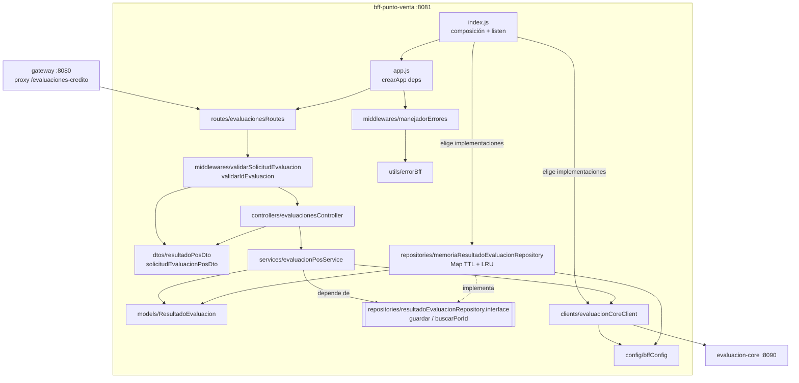
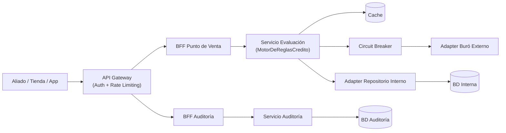
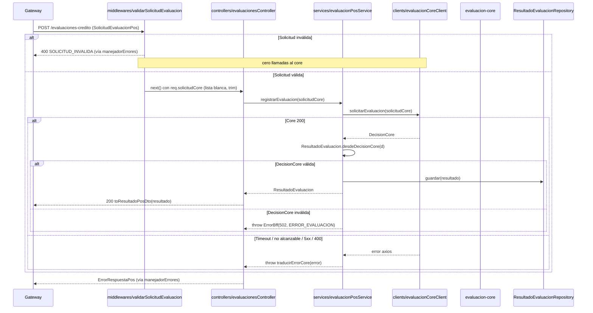
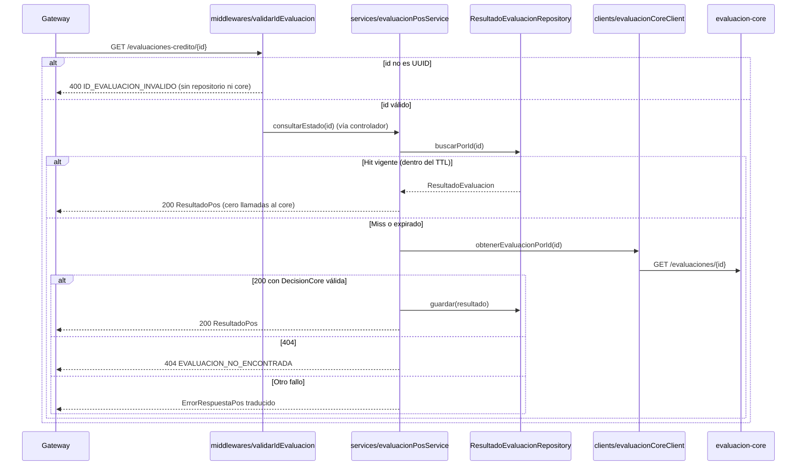

# Design Document

## Overview

Esta funcionalidad implementa la lógica real del **BFF Punto de Venta** (`bff-punto-venta`, puerto 8081), reemplazando el esqueleto actual, que reenvía el cuerpo sin validar, devuelve la forma equivocada y filtra errores crudos, por una capa de adaptación entre la caja de la tienda y el motor de evaluación (`evaluacion-core`).

El objetivo central del diseño es doble:

1. **Corrección funcional**: validar y traducir la solicitud (RF-01), reducir la `DecisionCore` a `ResultadoPos` (RF-02), generar el mensaje para el cliente (RF-03), servir las reconsultas desde una caché (RF-04) y traducir los fallos del core a errores comprensibles (RF-05). Todo respeta `contracts/spec2-bff-pos.yaml` y `contracts/spec4-evaluacion-core.yaml` como fuente de verdad.
2. **No degradar los KPIs del sistema**: **95% en menos de 3 s**, **p95 < 500 ms** y **tasa de error < 1%**. El BFF está en el camino crítico de cada venta, así que debe añadir un costo mínimo: validación y mapeo en memoria, caché local sin salida de red, ningún reintento sobre una operación no idempotente y timeouts explícitos.

Los cambios más relevantes frente al código actual:

- **Forma de respuesta incorrecta.** `decisionToResultadoPos` devuelve `{decision, motivo, consultaBuroRealizada, fecha}`, no el `ResultadoPos` de Spec 2 (`{idEvaluacion, aprobado, mensajeParaCliente}`). Además rellena `PENDIENTE` y un UUID de ceros cuando el core responde algo inesperado, lo que puede mostrar en caja un resultado inventado.
- **Filtración de errores.** El manejador de errores devuelve `err.response.data` (cuerpo crudo del core) y `err.message` de axios (por ejemplo, `connect ECONNREFUSED 172.18.0.5:8090`).
- **Sin validación.** Cualquier cuerpo se reenvía al core, que hoy tampoco valida la entrada, así que los datos inválidos llegan hasta el repositorio interno.
- **Reconsulta siempre remota.** `GET /evaluaciones-credito/{id}` llama siempre al core.

Patrones aplicados: **BFF** (adaptación por cliente), **Repository** (interfaz `ResultadoEvaluacionRepository` + implementación en memoria), **Adapter / Anti-Corruption Layer** (modelo `ResultadoEvaluacion` y DTOs que aíslan el modelo del core del modelo de caja), **Cache-Aside** con TTL y desalojo LRU sobre el repositorio (reconsultas) y **traducción centralizada de errores** (un solo punto convierte fallos técnicos en `ErrorRespuestaPos`).

### Alineación con el steering (`.kiro/steering/`)

| Regla del steering | Cómo se cumple |
|---|---|
| `tech.md`: "Nunca implementar lógica de negocio en cualquier BFF" | El BFF no decide crédito. Solo valida la **forma** del contrato (tipos, obligatoriedad, positivos) y traduce la presentación (`decision` → `aprobado` + mensaje). Las reglas de negocio (umbrales, mora, cuota/ingreso) siguen únicamente en `evaluacion-core`. |
| `tech.md`: "Todo cambio de contrato se hace primero en el YAML" | La tarea 1 del plan actualiza `spec2-bff-pos.yaml` antes de cualquier cambio de código. |
| `tech.md`: "Toda llamada saliente debe manejar timeout y error explícitamente" | `CORE_TIMEOUT_MS` en el cliente axios y la traducción centralizada de errores (`traducirErrorCore`). |
| `tech.md`: BFF por tipo de consumidor | `bff-punto-venta` sirve solo a la caja; `ResultadoPos` es exclusivo de este BFF. |
| `tech.md`: Circuit Breaker (opossum) en adapters hacia servicios externos | No aplica al BFF: según la arquitectura de referencia, el breaker vive solo en `Servicio Evaluación → Adapter Buró Externo`. El BFF aplica timeout y traducción de errores explícitos (ver "Decisión" en Error Handling). |
| `tech.md`: Cache-Aside de "resultados de reglas internas por cliente" | Esa caché pertenece al Servicio de Evaluación (nodo `Cache` de la arquitectura de referencia). El `ResultadoEvaluacionRepository` del BFF es otra cosa: guarda el resultado ya emitido para las reconsultas de RF-04 y no cachea reglas ni evita evaluaciones. |
| `tech.md`: Repository/Adapter (depender de interfaces, no de implementaciones) | El servicio depende de `resultadoEvaluacionRepository.interface.js`; `memoriaResultadoEvaluacionRepository.js` la implementa y se elige solo en `index.js`. |
| `structure.md`: contrato por ruta relativa, sin copia del YAML | No existe `openapi.yaml` dentro de `services/bff-punto-venta/`. |
| `structure.md`: nombres de archivo en español y camelCase | Capas `config/ controllers/ dtos/ middlewares/ models/ repositories/ services/ clients/ routes/ utils/`, con archivos en español y camelCase (`evaluacionesController.js`, `resultadoPosDto.js`, `resultadoEvaluacion.js`, `memoriaResultadoEvaluacionRepository.js`) y sufijos técnicos (`Client`, `Service`, `Repository`) como en el código existente (`evaluacionCoreClient.js`, `buroExternoAdapter.js`). `index.js` sigue siendo el punto de entrada. |
| `product.md`: KPIs no negociables | Trabajo O(1) en memoria en el camino crítico, sin reintentos y con timeout explícito (ver Overview). |

### Mapa de decisiones de diseño → requisitos

| Decisión de diseño | Requisitos que satisface |
|---|---|
| Validación temprana en el BFF antes de llamar al core | RF-01 (crit. 3-8), KPI latencia (se evita un viaje de red con datos inválidos) |
| Mapper explícito `SolicitudEvaluacionPos → SolicitudCore` (lista blanca de campos) | RF-01 (crit. 1-2) |
| Mapper `DecisionCore → ResultadoPos` con tabla cerrada de mensajes y sin valores por defecto | RF-02, RF-03 |
| Caché en memoria (Cache-Aside) con TTL y LRU, escrita tras cada `POST` exitoso | RF-04, KPI p95 < 500 ms en reconsultas |
| Traducción centralizada de errores (`ErrorBff` + `traducirErrorCore`) | RF-05 (crit. 1-6) |
| Sin reintentos automáticos sobre `POST /evaluar` | RF-05 (crit. 7) |
| Módulo de configuración (`bffConfig`) con valores por defecto y validación | RF-04 (crit. 6-7), RF-05 (crit. 1) |

## Architecture

El servicio se organiza por capas con el **patrón Repository**: el servicio de aplicación depende de una **interfaz** (`resultadoEvaluacionRepository.interface.js`) y no de la implementación en memoria. El repositorio guarda y devuelve **modelos de dominio** (`ResultadoEvaluacion`: `idEvaluacion` + `decision`) y el controlador los convierte al **DTO** de caja (`ResultadoPos`). Los middlewares validan la entrada antes de llegar al controlador. `index.js` es el punto de entrada (steering `structure.md`) y la *raíz de composición*: elige las implementaciones concretas y las inyecta en `app.js`.

```text
services/bff-punto-venta/src/
├── config/
│   └── bffConfig.js                                 # variables de entorno tipadas + defaults
├── controllers/
│   └── evaluacionesController.js                    # HTTP <-> caso de uso; arma el DTO de caja
├── dtos/
│   ├── solicitudEvaluacionPosDto.js                 # validación de forma + toSolicitudCore (lista blanca)
│   └── resultadoPosDto.js                           # ResultadoEvaluacion -> ResultadoPos + tabla de mensajes
├── middlewares/
│   ├── validarSolicitudEvaluacion.js                # 400 antes de llamar al core
│   ├── validarIdEvaluacion.js                       # 400 si :id no es UUID
│   └── manejadorErrores.js                          # ErrorRespuestaPos sin filtraciones
├── models/
│   └── resultadoEvaluacion.js                       # modelo de dominio + desdeDecisionCore (502 si inválida)
├── repositories/
│   ├── resultadoEvaluacionRepository.interface.js   # puerto: contrato + verificación en runtime
│   └── memoriaResultadoEvaluacionRepository.js      # implementación en memoria (TTL + LRU)
├── services/
│   └── evaluacionPosService.js                      # caso de uso: core + repositorio (Cache-Aside)
├── clients/
│   └── evaluacionCoreClient.js                      # salida HTTP a evaluacion-core (axios + timeout)
├── routes/
│   └── evaluacionesRoutes.js                        # cablea middlewares + controlador
├── utils/
│   └── errorBff.js                                  # ErrorBff + traducirErrorCore
├── app.js                                           # crearApp(deps): Express + inyección
└── index.js                                         # punto de entrada: composición + listen
```



**Por qué una interfaz en JavaScript.** JavaScript no tiene `implements`, así que el puerto se expresa con un `@typedef` JSDoc y una función `asegurarResultadoEvaluacionRepository(impl)` que verifica en tiempo de ejecución, al inyectar, que la implementación tenga `guardar` y `buscarPorId`. El servicio falla al construirse si recibe un repositorio incompleto. Así la implementación en memoria puede reemplazarse por una sobre Redis cuando el BFF escale a varias réplicas, sin tocar el servicio ni el controlador.

### Arquitectura de referencia del sistema

Ubicación del BFF en la arquitectura acordada del sistema. El Circuit Breaker y la caché de reglas pertenecen al Servicio de Evaluación, no al BFF.



### Contratos como fuente de verdad

- `contracts/spec2-bff-pos.yaml`: `SolicitudEvaluacionPos` (entrada) y `ResultadoPos` (salida). **Este es el contrato que implementa el BFF.**
- `contracts/spec4-evaluacion-core.yaml`: `SolicitudCore`, `DecisionCore` y `ErrorRespuesta` (dependencia consumida).

> **Nota de contrato (contract-first, steering `tech.md`).** Antes de tocar el código se **actualiza `contracts/spec2-bff-pos.yaml` (v1.1.0)**: restricciones de `SolicitudEvaluacionPos`, `ResultadoPos` con campos requeridos, el esquema `ErrorRespuestaPos`, los códigos 400/404/500/502/503/504, `GET /health` y ejemplos. El código se implementa contra ese YAML, y ese contrato es la entrada de las features siguientes. Según `structure.md`, el servicio lo referencia por ruta relativa y no guarda una copia en su carpeta.
>
> Hoy `contracts/spec0-frontend.yaml` y `contracts/spec1-gateway.yaml` describen una respuesta `DecisionFrontend` / `Decision` (`{idEvaluacion, decision, motivo, consultaBuroRealizada, fecha}`) que no coincide con `ResultadoPos`. Como el Gateway es un proxy transparente, el frontend recibirá lo que devuelva el BFF. Esos contratos se realinean en las features del Gateway y del Frontend, que tomarán como fuente de verdad el `spec2` regenerado aquí; esta feature no los modifica.

### Flujo `POST /evaluaciones-credito`



### Flujo `GET /evaluaciones-credito/{id}` (Cache-Aside sobre el repositorio)



**Tradeoff de la caché.** Es local a cada instancia del BFF: con varias réplicas detrás del Gateway, una reconsulta que llega a otra réplica produce un *miss* y cae al core. Es un comportamiento correcto, solo menos eficiente. Se elige memoria local frente a Redis porque no añade infraestructura ni un salto de red y el caso de uso principal (reabrir la pantalla de resultado segundos después) suele caer en la misma instancia. Si más adelante se escala horizontalmente, el servicio depende de la interfaz `ResultadoEvaluacionRepository` (`guardar` / `buscarPorId`), que puede reimplementarse sobre Redis sin tocar el servicio. Como una decisión de crédito ya emitida no cambia, el TTL solo acota el uso de memoria y no afecta la consistencia.

> **Dependencia conocida.** Hoy `GET /evaluaciones/{id}` en `evaluacion-core` es un placeholder que responde `{ idEvaluacion, status: "COMPLETADA" }`, sin `decision`. Con este diseño, un *miss* de caché produce `502 ERROR_EVALUACION` hasta que el core implemente la consulta real según Spec 4. Es el comportamiento deseado: nunca se inventa un resultado. Los *hits* de caché funcionan de forma independiente.

## Components and Interfaces

### 1. `src/config/bffConfig.js` (nuevo)

Lee `process.env` una sola vez al cargar el módulo y expone valores tipados con defaults. Un valor inválido (no numérico o ≤ 0) se reemplaza por el default y se registra una advertencia en log. A diferencia de `reglasConfig` del core, aquí no hay reglas que puedan "auto-inhibirse", así que el default seguro es la mejor opción.

```js
module.exports = {
  coreUrl: string,          // EVALUACION_CORE_URL (default "http://evaluacion-core:8090")
  coreTimeoutMs: number,    // CORE_TIMEOUT_MS (default 5000, > 0)
  cacheTtlMs: number,       // CACHE_TTL_MS (default 900000 = 15 min, > 0)
  cacheMaxEntradas: number  // CACHE_MAX_ENTRADAS (default 1000, entero > 0)
};
```

Sobre `CORE_TIMEOUT_MS = 5000`: en el peor caso el core tarda repositorio (4000 ms) + buró (3000 ms). El valor de 5 s está por encima del camino normal (resolución sin buró o buró sano) y corta los casos degenerados sin esperar indefinidamente. Es configurable para ajustarlo tras las pruebas de carga con k6.

### 2. `src/dtos/solicitudEvaluacionPosDto.js` (nuevo) y `src/middlewares/validarSolicitudEvaluacion.js` (nuevo)

```js
function validarSolicitudEvaluacionPos(body) // → { ok: true, valor: SolicitudCore } | { ok: false, errores: string[] }
function toSolicitudCore(solicitudPos)       // → { identificacion, montoSolicitado, plazoMeses, tiendaId }
function validarSolicitudEvaluacion(req, res, next) // middleware: 400 SOLICITUD_INVALIDA o deja req.solicitudCore
```

| Campo | Regla | Mensaje (ejemplo) |
|---|---|---|
| (cuerpo) | objeto no nulo, no array | "El cuerpo de la solicitud debe ser un objeto JSON" |
| `identificacion` | `string`, no vacía tras `trim()` | "La identificación es obligatoria" |
| `montoSolicitado` | `number`, finito, `> 0` | "El monto solicitado debe ser un número mayor que cero" |
| `plazoMeses` | `Number.isInteger`, `> 0` | "El plazo en meses debe ser un número entero mayor que cero" |
| `tiendaId` | `string`, no vacía tras `trim()` | "El identificador de tienda es obligatorio" |

- Es validación de **forma** del contrato, no de negocio: las reglas de crédito viven solo en `evaluacion-core` (steering `tech.md`).
- Acumula todos los errores para que el cajero corrija el formulario en un solo intento. No acepta números en texto (`"450"`): el contrato declara `number` y la coerción silenciosa esconde errores del frontend.
- `toSolicitudCore` construye la `SolicitudCore` por **lista blanca**: copia solo los cuatro campos y aplica `trim()` a `identificacion` y `tiendaId`. Cualquier campo extra (por ejemplo `referenciaPartner` del Gateway) se descarta y no llega al core.

### 3. `src/models/resultadoEvaluacion.js` (nuevo)

```js
class ResultadoEvaluacion {
  constructor({ idEvaluacion, decision })     // inmutable (Object.freeze)
  static esDecisionCoreValida(decisionCore)   // → boolean
  static desdeDecisionCore(decisionCore)      // → ResultadoEvaluacion | lanza ErrorBff(502, ERROR_EVALUACION)
}
```

- Modelo de dominio del BFF: conserva solo lo necesario de la `DecisionCore` (`idEvaluacion` + `decision`) y no conoce el formato de caja.
- Sin valores por defecto: si `idEvaluacion` no es una cadena no vacía o `decision` no pertenece a `{APROBADO, RECHAZADO, REVISION_MANUAL}`, lanza `ErrorBff` (RF-02 crit. 5).

### 4. `src/dtos/resultadoPosDto.js` (nuevo)

```js
const MENSAJES_POR_DECISION = Object.freeze({
  APROBADO: "Crédito aprobado",
  REVISION_MANUAL: "En revisión, te contactaremos",
  RECHAZADO: "Crédito no aprobado en esta ocasión"
});

function toResultadoPosDto(resultado) // → { idEvaluacion, aprobado, mensajeParaCliente } (exactamente 3 claves)
```

- `aprobado = decision === "APROBADO"`: solo la igualdad estricta con `APROBADO` produce `true` (RF-02 crit. 3).
- `mensajeParaCliente` sale solo de la tabla. El modelo ni siquiera guarda el `motivo` (RF-03 crit. 4): el motivo del core puede decir "El cliente registra mora vigente" o revelar el score, y eso no debe leerse en voz alta en caja.

### 5. `src/utils/errorBff.js` (nuevo) y `src/middlewares/manejadorErrores.js` (nuevo)

```js
class ErrorBff extends Error {
  constructor(status, code, message, reintentable) // status HTTP, code estable, message humano
  toRespuesta() // → { error: { code, message, reintentable } }
}

function traducirErrorCore(error, { operacion }) // → ErrorBff ("crear" | "consultar")
function manejadorErrores(err, req, res, next)   // middleware central
```

Tabla de traducción (un único punto de verdad para RF-05):

| Situación detectada | HTTP | `code` | `reintentable` | `message` (humano) |
|---|---|---|---|---|
| Validación del BFF / JSON mal formado | 400 | `SOLICITUD_INVALIDA` | false | Detalle del campo inválido |
| `id` no UUID | 400 | `ID_EVALUACION_INVALIDO` | false | "El identificador de evaluación no es válido" |
| Core 400 con `INVALID_IDENTIFICACION` | 400 | `SOLICITUD_INVALIDA` | false | "La identificación ingresada no es válida" |
| Core 400 (otro) | 400 | `SOLICITUD_INVALIDA` | false | "Los datos de la solicitud no son válidos" |
| Core 404 (consulta) | 404 | `EVALUACION_NO_ENCONTRADA` | false | "No encontramos esa evaluación" |
| Timeout (`ECONNABORTED` / `ETIMEDOUT`) | 504 | `EVALUACION_TIMEOUT` | true | "La evaluación está tardando más de lo normal. Intenta nuevamente en unos segundos." |
| No alcanzable (`ECONNREFUSED`, `ENOTFOUND`, `ECONNRESET`, `EAI_AGAIN`, sin `response`) | 503 | `SERVICIO_NO_DISPONIBLE` | true | "El servicio de evaluación no está disponible. Intenta nuevamente en unos minutos." |
| Core 5xx / otro estado / `DecisionCore` inválida | 502 | `ERROR_EVALUACION` | true | "No pudimos completar la evaluación. Intenta nuevamente." |
| Error no previsto en el BFF | 500 | `ERROR_INTERNO` | true | "Ocurrió un error inesperado. Intenta nuevamente." |

> Sobre "timeout del buró externo" (RF-05): el core **absorbe** los fallos del buró con su Circuit Breaker y fallback (RF-07 del core), así que el BFF nunca ve un error del buró como tal. Lo que el BFF sí puede observar es un core lento o caído, y eso es lo que traduce esta tabla.

`reintentable` es un dato para la UI (mostrar o no un botón "Reintentar"); el BFF **no** reintenta por su cuenta (RF-05 crit. 7). `manejadorErrores` responde `err.toRespuesta()` si es un `ErrorBff`, convierte `entity.parse.failed` de `express.json` en `400 SOLICITUD_INVALIDA` y, para cualquier otro error, registra el detalle en log y responde `500 ERROR_INTERNO`. **Nunca** incluye `err.response.data` ni `err.message` de librerías.

### 6. Patrón Repository: `src/repositories/resultadoEvaluacionRepository.interface.js` y `memoriaResultadoEvaluacionRepository.js` (nuevos)

```js
/** @typedef {{ guardar(resultado): Promise<void>, buscarPorId(idEvaluacion): Promise<ResultadoEvaluacion|null> }} ResultadoEvaluacionRepository */
function asegurarResultadoEvaluacionRepository(implementacion) // → la misma implementación | TypeError si falta un método

function crearMemoriaResultadoEvaluacionRepository({ ttlMs, maxEntradas, ahora = Date.now }) // → ResultadoEvaluacionRepository
```

- Implementación sobre `Map`, que conserva el orden de inserción. En una lectura con acierto la entrada se reinserta (se mueve al final) y en un `guardar` con el cupo lleno se elimina la primera clave (la usada menos recientemente). Todas las operaciones son O(1).
- Cada entrada guarda `{ resultado, expiraEn }`. Una lectura sobre una entrada expirada la elimina y devuelve `null` (expiración perezosa, sin temporizadores).
- `ahora` es inyectable para probar el TTL de forma determinista, sin fake timers.
- Los `ResultadoEvaluacion` son inmutables, así que se guardan y devuelven sin copiar y ningún llamador puede alterar la entrada.

### 7. `src/clients/evaluacionCoreClient.js` (modificado)

- `baseURL` y `timeout` provienen de `bffConfig`.
- `obtenerEvaluacionPorId(id)` aplica `encodeURIComponent(id)` (defensa en profundidad; el middleware ya validó el UUID).
- Sin reintentos y sin lógica de negocio: devuelve `response.data` o propaga el error de axios, que traduce el servicio.

### 8. `src/services/evaluacionPosService.js` (nuevo, caso de uso)

```js
function crearEvaluacionPosService({ coreClient, resultadoRepository }) // → { registrarEvaluacion(solicitudCore), consultarEstado(idEvaluacion) }
```

- Verifica la interfaz del repositorio al construirse.
- `registrarEvaluacion(solicitudCore)`: una sola llamada a `coreClient.solicitarEvaluacion` → `ResultadoEvaluacion.desdeDecisionCore` → `repositorio.guardar` → devuelve el modelo. Traduce los errores del cliente con `traducirErrorCore(err, { operacion: "crear" })`.
- `consultarEstado(id)`: `repositorio.buscarPorId` → si hay *miss*, `coreClient.obtenerEvaluacionPorId` → modelo → `repositorio.guardar`. Nunca guarda errores.

### 9. `src/controllers/evaluacionesController.js`, `src/routes/evaluacionesRoutes.js`, `src/app.js` e `src/index.js`

- `crearEvaluacionesController({ evaluacionPosService })` → `crear` y `obtenerEstado`: llaman al caso de uso y responden `toResultadoPosDto(resultado)`.
- `crearEvaluacionesRoutes(controller)`: `POST /` → `validarSolicitudEvaluacion` → `crear`; `GET /:id` → `validarIdEvaluacion` → `obtenerEstado`. Las rutas solo cablean.
- `crearApp({ coreClient, resultadoRepository })`: construye servicio y controlador, y monta `/health`, `/evaluaciones-credito` y `manejadorErrores`.
- `index.js` (punto de entrada y raíz de composición): crea `crearMemoriaResultadoEvaluacionRepository` con `bffConfig`, lo inyecta en `crearApp` junto con `evaluacionCoreClient` y hace `listen` si `NODE_ENV !== "test"`.

## Data Models

### `SolicitudEvaluacionPos` (entrada — Spec 2)

```js
{ identificacion: string, montoSolicitado: number, plazoMeses: integer, tiendaId: string } // todos obligatorios
```

### `SolicitudCore` (hacia el core — Spec 4)

```js
{ identificacion: string /* trim */, montoSolicitado: number /* > 0 */, plazoMeses: integer /* > 0 */, tiendaId: string /* trim */ }
```

### `DecisionCore` (desde el core — Spec 4)

```js
{ idEvaluacion: string (uuid), decision: "APROBADO"|"RECHAZADO"|"REVISION_MANUAL",
  motivo: string, fecha: string, consultaBuroRealizada: boolean, reglasAplicadas: string[] }
```

### `ResultadoPos` (salida — Spec 2)

```js
{ idEvaluacion: string (uuid), aprobado: boolean, mensajeParaCliente: string } // exactamente 3 claves
```

### `ErrorRespuestaPos` (salida de error)

```js
{ error: { code: string, message: string, reintentable: boolean } } // sin otros campos
```

Mantiene la convención `{ error: { message, code } }` de `evaluacion-core` y `buro-simulado`, y añade `reintentable`.

### Entrada del repositorio en memoria

```js
Map<idEvaluacion, { resultado: ResultadoEvaluacion, expiraEn: number /* epoch ms */ }>
```

## Correctness Properties

*Una propiedad es una característica o comportamiento que debe cumplirse en todas las ejecuciones válidas del sistema — esencialmente, una afirmación formal sobre lo que el sistema debe hacer. Las propiedades son el puente entre las especificaciones legibles por humanos y las garantías de corrección verificables por máquina.*

La validación y los DTOs, el modelo `ResultadoEvaluacion` y la traducción de errores son **funciones puras** con espacios de entrada amplios (cadenas arbitrarias, números en los bordes, decisiones desconocidas, códigos de error de red), por lo que el testing basado en propiedades (PBT con `fast-check`) es apropiado. Las propiedades de orquestación usan un **cliente del core simulado** que cuenta invocaciones y el repositorio en memoria real.

### Property 1: `aprobado` es verdadero si y solo si la decisión es `APROBADO`

*Para toda* `DecisionCore` válida, `toResultadoPosDto(ResultadoEvaluacion.desdeDecisionCore(d)).aprobado === (d.decision === "APROBADO")`.

**Validates: Requirements 2.3, 3.1**

### Property 2: El mensaje depende solo de la decisión y nunca expone el motivo

*Para toda* `DecisionCore` válida con `motivo` arbitrario, `mensajeParaCliente` es igual a `MENSAJES_POR_DECISION[decision]`, y dos decisiones con igual `decision` pero distinto `motivo` producen el mismo mensaje.

**Validates: Requirements 3.1, 3.2, 3.3, 3.4**

### Property 3: `ResultadoPos` tiene exactamente tres campos y preserva el `idEvaluacion`

*Para toda* `DecisionCore` válida (incluidos campos extra arbitrarios), el `ResultadoPos` tiene exactamente las claves `{idEvaluacion, aprobado, mensajeParaCliente}` y su `idEvaluacion` es igual al de la entrada.

**Validates: Requirements 2.1, 2.2, 2.4**

### Property 4: Una `DecisionCore` inválida nunca produce un resultado

*Para todo* objeto cuya `decision` no pertenece a {`APROBADO`, `RECHAZADO`, `REVISION_MANUAL`} o cuyo `idEvaluacion` no es una cadena no vacía, `ResultadoEvaluacion.desdeDecisionCore` lanza `ErrorBff` con `status 502` y `code ERROR_EVALUACION` (en particular, nunca devuelve `aprobado: true`).

**Validates: Requirements 2.5, 5.3**

### Property 5: La traducción de la solicitud preserva los valores y usa lista blanca

*Para toda* `SolicitudEvaluacionPos` válida con campos extra arbitrarios, la `SolicitudCore` resultante tiene exactamente las claves `{identificacion, montoSolicitado, plazoMeses, tiendaId}`, conserva `montoSolicitado` y `plazoMeses` y tiene `identificacion` y `tiendaId` iguales a los valores de entrada con `trim()`. Además, el core se invoca exactamente una vez con esa solicitud.

**Validates: Requirements 1.1, 1.2**

### Property 6: Una solicitud inválida se rechaza con 400 sin tocar el core

*Para toda* solicitud en la que al menos un campo viola su regla (identificación vacía o no string, monto ≤ 0 o no finito, plazo no entero o ≤ 0, tienda vacía, cuerpo no objeto), `POST /evaluaciones-credito` responde `400` con `code SOLICITUD_INVALIDA` (middleware `validarSolicitudEvaluacion`), y el cliente del core registra **cero** invocaciones.

**Validates: Requirements 1.3, 1.4, 1.5, 1.6, 1.7**

### Property 7: Ida y vuelta por caché sin volver al core

*Para toda* solicitud válida y `DecisionCore` válida devuelta por el core, `consultarEstado(idEvaluacion)` llamado dentro del TTL tras `registrarEvaluacion` devuelve un `ResultadoEvaluacion` igual (profundo) al devuelto por `registrarEvaluacion`, con **cero** invocaciones a `obtenerEvaluacionPorId`.

**Validates: Requirements 4.1, 4.2**

### Property 8: Todo fallo del core se traduce a un error estructurado y sin filtraciones

*Para todo* error de cliente HTTP generado (timeout, códigos de red, estados 4xx/5xx arbitrarios con cuerpos arbitrarios), `traducirErrorCore(...).toRespuesta()` tiene exactamente la forma `{ error: { code, message, reintentable } }`, con `code` perteneciente al conjunto documentado, `message` no vacío y distinto de cualquier texto del cuerpo o del mensaje de la librería, y `status` coherente con la tabla de traducción.

**Validates: Requirements 5.1, 5.2, 5.3, 5.4, 5.5**

## Error Handling

- **Solicitud inválida o JSON mal formado** → `400 SOLICITUD_INVALIDA` antes de salir a red (RF-01 crit. 3-8).
- **`id` sin formato UUID** → `400 ID_EVALUACION_INVALIDO` sin consultar caché ni core (RF-04 crit. 4).
- **Core 400** → `400 SOLICITUD_INVALIDA` no reintentable; mensaje específico para `INVALID_IDENTIFICACION` (RF-05 crit. 4).
- **Core 404 en consulta** → `404 EVALUACION_NO_ENCONTRADA` (RF-04 crit. 5).
- **Core lento (> `CORE_TIMEOUT_MS`)** → `504 EVALUACION_TIMEOUT` reintentable (RF-05 crit. 1).
- **Core caído / no resoluble** → `503 SERVICIO_NO_DISPONIBLE` reintentable (RF-05 crit. 2).
- **Core 5xx o respuesta con forma inválida** → `502 ERROR_EVALUACION` reintentable; nunca se inventan valores por defecto (RF-02 crit. 5, RF-05 crit. 3).
- **Error no previsto** → `500 ERROR_INTERNO`; el detalle técnico queda solo en el log (RF-05 crit. 6).
- **Sin reintentos automáticos** sobre `POST /evaluar`: el core genera un `idEvaluacion` nuevo y publica auditoría en cada llamada, así que un reintento del BFF duplicaría evaluaciones (RF-05 crit. 7).
- **Configuración inválida** → se usa el valor por defecto y se registra una advertencia; el servicio arranca igualmente.

> **Decisión: sin Circuit Breaker en BFF → core.** La arquitectura de referencia del sistema (ver "Arquitectura de referencia" en Architecture) ubica el Circuit Breaker **únicamente** entre el Servicio de Evaluación y el Adapter del Buró Externo, que es el servicio externo con fallback a reglas internas (`tech.md`). La relación `BFF Punto de Venta → Servicio Evaluación` es directa. El BFF cumple la regla "toda llamada saliente debe manejar timeout y error explícitamente" con `CORE_TIMEOUT_MS` y `traducirErrorCore`, sin reintentos. **Riesgo aceptado:** con el core caído y 100-500 usuarios concurrentes, cada petición espera hasta `CORE_TIMEOUT_MS` (5 s) antes de responder `504`; si las pruebas de carga con k6 muestran saturación en ese escenario, se reevaluará junto con la arquitectura de referencia.

## Testing Strategy

Enfoque dual: **pruebas basadas en propiedades** para las funciones puras y la orquestación con dobles, y **pruebas de ejemplo/integración** (Supertest) para HTTP, bordes y el manejador central de errores.

### Librería de PBT

Se adopta **`fast-check`** (devDependency, versión fijada `4.10.2`, la misma que `evaluacion-core`) sobre **Jest + Supertest**, que ya están en `package.json`.

- Cada propiedad se implementa con **un único test de propiedad**, con **100 iteraciones** mínimas (`fc.assert(..., { numRuns: 100 })`).
- Cada test lleva el comentario `// Feature: bff-punto-venta, Property {número}: {texto de la propiedad}`.
- Generadores: `SolicitudEvaluacionPos` válida (identificación con espacios alrededor, monto `fc.double` finito > 0, plazo `fc.integer({min:1})`, tienda no vacía, campos extra con `fc.dictionary`); mutaciones inválidas por campo; `DecisionCore` válida (`fc.uuid()`, `fc.constantFrom` de las tres decisiones, `motivo` con `fc.string()`); decisiones inválidas (`fc.string()` filtrado fuera del enum, `null`, números); errores de axios sintéticos (`code` de red, `response.status` 400-599, `response.data` arbitrario).
- Un **doble del cliente del core** (`jest.fn()`) cuenta invocaciones (Properties 5, 6 y 7). Las Properties 5 y 6 se ejecutan sobre HTTP (Supertest + `crearApp` con dobles), porque la validación vive en un middleware.

### Pruebas unitarias por ejemplo (Jest)

- `bffConfig`: defaults, parsing y reemplazo por default ante valores inválidos.
- `memoriaResultadoEvaluacionRepository`: expiración por TTL con reloj inyectado (RF-04 crit. 6); desalojo LRU al superar la capacidad y renovación de la posición tras una lectura (crit. 7).
- Interfaz `ResultadoEvaluacionRepository`: la implementación en memoria la cumple; `asegurarResultadoEvaluacionRepository` rechaza implementaciones incompletas; el servicio falla al construirse con un repositorio inválido.
- `ResultadoEvaluacion`: conserva solo `idEvaluacion` + `decision` y es inmutable.
- `resultadoPosDto`: los tres textos exactos (RF-03 crit. 1-3).
- `solicitudEvaluacionPosDto`: un caso por regla de validación y acumulación de errores.
- `traducirErrorCore`: un ejemplo por fila de la tabla, incluido el mensaje específico de `INVALID_IDENTIFICACION`.

### Pruebas de integración (Supertest + `jest.mock` del cliente del core)

- `POST /evaluaciones-credito` 200 con `ResultadoPos` de exactamente tres campos.
- `POST` con JSON mal formado → 400 `SOLICITUD_INVALIDA` y cero llamadas al core.
- `POST` con core en timeout / caído / 500 → 504 / 503 / 502, con cuerpo sin filtraciones.
- `GET` tras `POST` → hit de caché sin llamar al core; `GET` con id no UUID → 400; `GET` con *miss* y core 404 → 404.
- `GET /health` → 200 (smoke).

### Cobertura de KPIs (fuera de PBT)

- El BFF solo añade trabajo O(1) en memoria al camino crítico; su contribución a `p95 < 500 ms` se valida con el escenario k6 existente (`perf/k6/evaluacion-carga.js`) contra el Gateway.
- Las reconsultas servidas desde caché no generan carga en el core, lo que aporta margen a los KPIs del core bajo tráfico sostenido.
