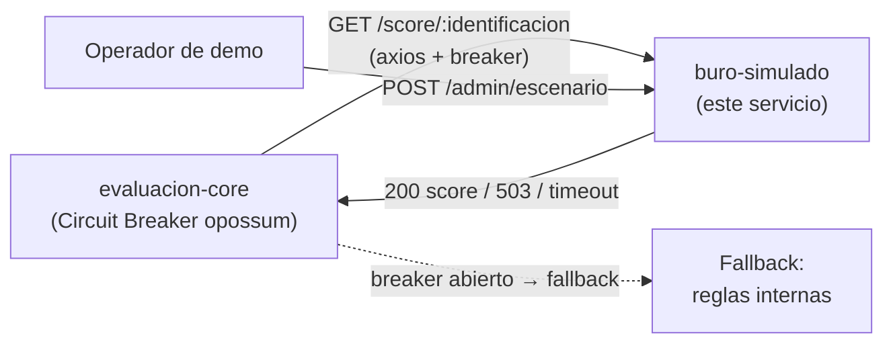
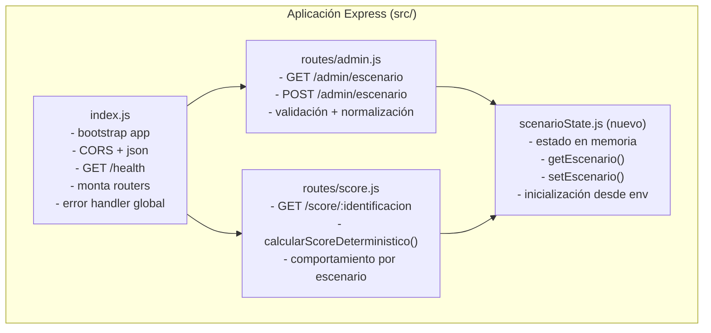
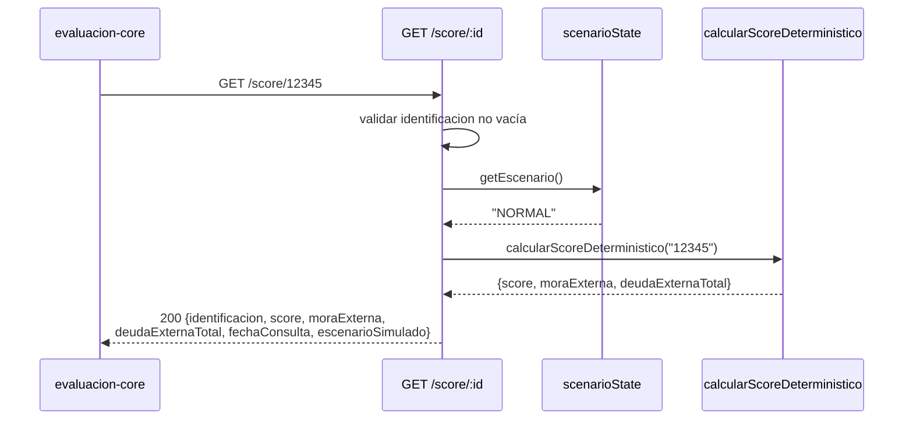
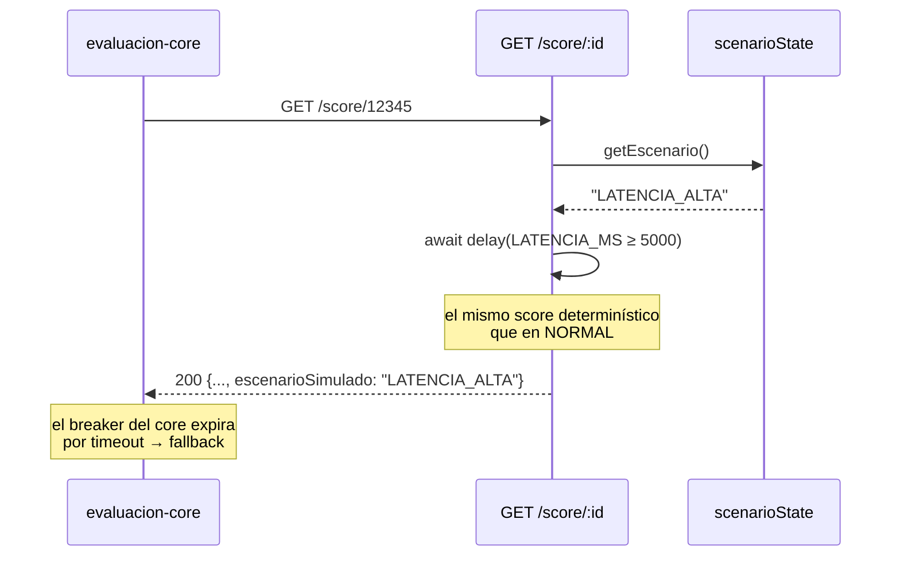
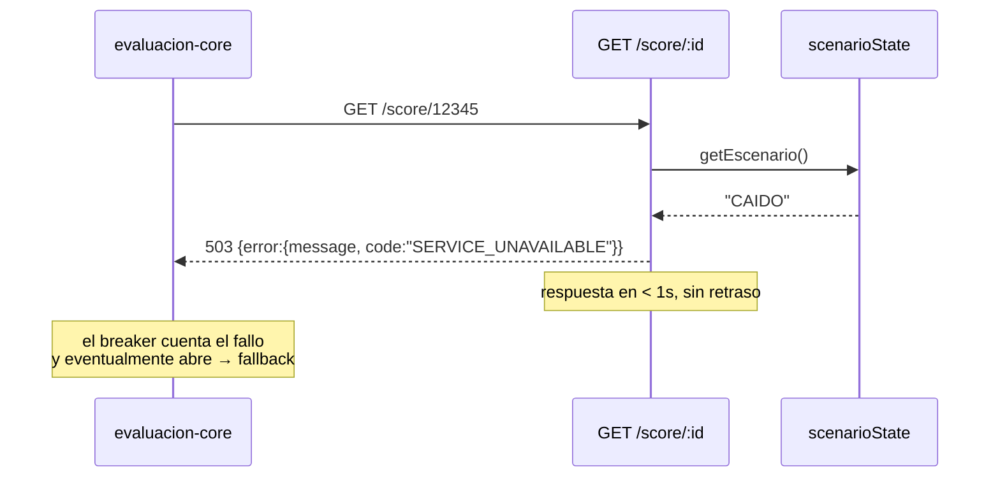
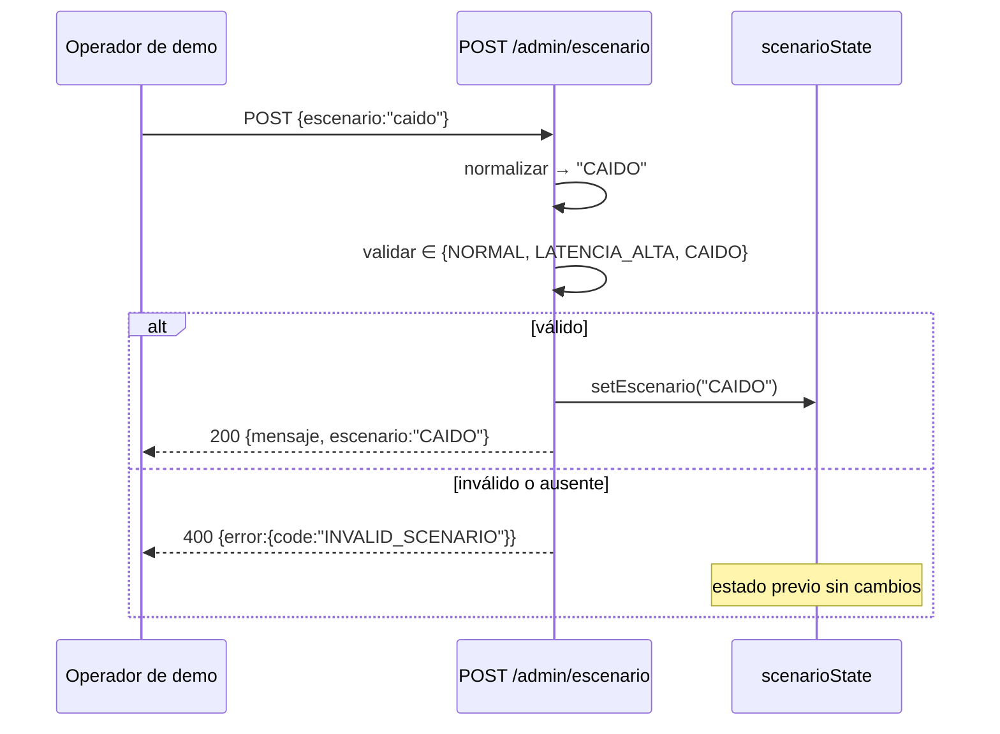

# Design Document

## Overview

El **Buró Simulado** (`buro-simulado`) es el adaptador / simulador del buró de crédito externo dentro del sistema **Resuelve Crédito**. Es un microservicio Node.js 20 LTS + Express que devuelve puntajes crediticios (scores) **simulados y determinísticos**, y que permite alternar en caliente entre escenarios de operación (`NORMAL`, `LATENCIA_ALTA`, `CAIDO`) mediante un endpoint administrativo. No es el buró real: es un sustituto controlable cuyo objetivo es habilitar demostraciones reproducibles de los patrones de resiliencia del núcleo.

### Rol en la arquitectura de Resuelve

En el flujo de evaluación de crédito, `evaluacion-core` consulta al buró externo únicamente cuando las reglas internas no bastan para decidir (recordando el KPI de "al menos 60% de evaluaciones resueltas sin consultar el buró"). Esa consulta saliente desde el core se envuelve con un **Circuit Breaker** (`opossum`) que, ante fallo o demora, hace *fallback* a reglas internas.

`buro-simulado` existe precisamente para ejercitar ese patrón en vivo:

- El escenario `NORMAL` responde rápido (muy por debajo del presupuesto de latencia del core), de modo que el buró **no** sea el cuello de botella cuando sí se le consulta.
- El escenario `LATENCIA_ALTA` (~5 s) y el escenario `CAIDO` (503) están **deliberadamente fuera** del presupuesto de latencia/error del core, para forzar la apertura del breaker y demostrar el *fallback*.

`buro-simulado` es un servicio **hoja** (downstream): recibe llamadas HTTP pero **no realiza ninguna llamada saliente** a otros servicios. Su respuesta se deriva por completo de la `identificacion` recibida, lo que lo hace determinístico, barato y auto-contenido.



### Alcance de este diseño

Este servicio ya está parcialmente construido y funcionando. Este documento describe la **mejora** del servicio existente para satisfacer plenamente los requisitos aprobados, no una construcción desde cero. Los cambios principales sobre el código actual son:

1. **Corrección del rango del score** de `[300, 950]` a `[300, 850]` (Requisito 1, criterio 2).
2. **Validación de `identificacion` vacía** con HTTP 400 (Requisito 2, criterio 5).
3. **Latencia configurable por entorno** (`LATENCIA_MS`) para testabilidad (Requisito 3).
4. **Extracción del estado de escenario** a su propio módulo (mejora opcional de bajo riesgo).
5. **Creación del contrato OpenAPI 3.0** en `contracts/buro-simulado.yaml` como fuente de verdad.

## Architecture

### Vista de módulos

`buro-simulado` sigue una organización por responsabilidad: un punto de arranque de la aplicación, un módulo de estado de escenario compartido y dos routers Express (score y admin).



**Decisión de diseño (mejora opcional):** actualmente `routes/score.js` importa `getEscenario` desde `routes/admin.js`, es decir, un router depende de otro router. El diseño propone extraer el estado del escenario a un módulo dedicado `src/scenarioState.js` que exponga `getEscenario()` y `setEscenario()`, y que tanto `admin.js` como `score.js` lo consuman. Esto elimina el acoplamiento router→router y centraliza la lógica de inicialización/normalización del estado. Es una mejora de bajo riesgo: el comportamiento observable no cambia, por lo que puede aplicarse o diferirse sin afectar la conformidad con los requisitos.

### Flujos de petición

**Escenario NORMAL — consulta de score exitosa:**



**Escenario LATENCIA_ALTA:**



**Escenario CAIDO:**



**Cambio de escenario en tiempo de ejecución:**



### Stack y decisiones tecnológicas

- **Node.js 20 LTS + Express** (un servicio por componente), según el stack del proyecto.
- **CORS + `express.json()`** ya configurados en `index.js`.
- **Sin llamadas salientes:** el servicio no usa `axios` ni consulta a terceros. La regla del proyecto "toda llamada saliente debe manejar timeout y error explícitamente" se satisface de forma trivial: no existe ninguna llamada saliente. El consumidor (`evaluacion-core`) es quien envuelve la llamada a este servicio con `opossum` + timeout + fallback.
- **Contenerización:** Dockerfile existente (`node:20-alpine`, `EXPOSE 8091`) integrable a `docker-compose`.
- **Contrato OpenAPI 3.0** en `contracts/buro-simulado.yaml` como fuente de verdad; `Prism` puede levantar un mock a partir de ese YAML.

## Components and Interfaces

### `src/index.js` — Bootstrap de la aplicación

Responsabilidades: crear la app Express, aplicar middlewares (CORS, JSON), exponer `GET /health`, montar los routers `/score` y `/admin`, y registrar el manejador de errores global. Protege `app.listen` con `NODE_ENV !== "test"` y exporta `app` para Supertest.

- `GET /health` → `200 { status, service, timestamp }` (Requisito 6.1).
- Error handler `(err, req, res, next)` → `{ error: { message, code: "BURO_SIMULATOR_ERROR" } }` con `status` de `err.status || 500` (Requisito 7.1).

### `src/scenarioState.js` — Estado de escenario compartido (nuevo módulo)

Centraliza el estado en memoria y su ciclo de vida. Reemplaza la variable `escenarioActual` que hoy vive en `routes/admin.js`.

```
const ESCENARIOS_VALIDOS = ["NORMAL", "LATENCIA_ALTA", "CAIDO"];

// Inicializa el estado desde ESCENARIO_INICIAL con fallback a NORMAL
// si es undefined o no está en el conjunto válido (normaliza a mayúsculas).
function inicializarEscenario(): string

function getEscenario(): string
// Devuelve el escenario activo.

function setEscenario(valor: string): { ok: boolean, escenario: string }
// Normaliza a mayúsculas; si es válido, actualiza y retorna {ok:true, escenario}.
// Si es inválido o ausente, retorna {ok:false} y NO modifica el estado.

function esEscenarioValido(valor: string): boolean
```

- `inicializarEscenario` cubre Requisito 5.5 y 5.6.
- `getEscenario` / `setEscenario` cubren la lógica de estado de los Requisitos 3, 4 y 5.

### `src/routes/admin.js` — Administración de escenarios

Consume `scenarioState`. No contiene el estado directamente.

- `GET /admin/escenario` → `200 { escenario }` (Requisito 5.4).
- `POST /admin/escenario`:
  - Lee `req.body.escenario`, delega en `setEscenario`.
  - Si `ok` → `200 { mensaje, escenario }` (Requisito 5.1, 5.2).
  - Si `!ok` → `400 { error: { message, code: "INVALID_SCENARIO" } }`, estado previo intacto (Requisito 5.3).

### `src/routes/score.js` — Consulta de score

Consume `scenarioState`. Contiene el algoritmo determinístico.

```
function calcularScoreDeterministico(identificacion: string):
  { score: number, moraExterna: boolean, deudaExternaTotal: number }
```

Handler `GET /:identificacion`:

1. Validar `identificacion` no vacía (tras `trim`). Si vacía → `400 { error: { message, code: "INVALID_IDENTIFICACION" } }` (Requisito 2.5).
2. Leer escenario activo con `getEscenario()`.
3. Si `CAIDO` → `503 { error: { message, code: "SERVICE_UNAVAILABLE" } }` sin retraso, respuesta en < 1 s (Requisito 1.7, 4.1, 4.2).
4. Si `LATENCIA_ALTA` → `await delay(LATENCIA_MS)` con `LATENCIA_MS ≥ 5000` (Requisito 1.6, 3.2, 3.3).
5. Calcular score y responder `200 { identificacion, score, moraExterna, deudaExternaTotal, fechaConsulta, escenarioSimulado }` (Requisito 1.1, 3.3).

> **Nota sobre concurrencia (Requisito 3.4):** el retraso se implementa con `await new Promise(resolve => setTimeout(resolve, LATENCIA_MS))` por petición. Al ser el event loop no bloqueante, cada solicitud concurrente aplica su propio temporizador de forma independiente, sin rechazar ni descartar peticiones.

## Data Models

### ScoreResponse (200)

| Campo | Tipo | Descripción |
|-------|------|-------------|
| `identificacion` | string | Igual al valor recibido en la ruta |
| `score` | integer | Entero en `[300, 850]` |
| `moraExterna` | boolean | Indicador de mora simulada |
| `deudaExternaTotal` | number | `> 0` si `moraExterna`, `0` en caso contrario |
| `fechaConsulta` | string (ISO 8601 UTC) | Marca de tiempo de la consulta |
| `escenarioSimulado` | string | Escenario activo al momento de responder |

### AdminEscenario

Request (`POST /admin/escenario`): `{ "escenario": "NORMAL" | "LATENCIA_ALTA" | "CAIDO" }` (no sensible a mayúsculas, se normaliza).

Response 200: `{ "mensaje": string, "escenario": string }`
Response 200 (`GET /admin/escenario`): `{ "escenario": string }`

### Error

`{ "error": { "message": string, "code": string } }`

Códigos: `SERVICE_UNAVAILABLE` (503), `INVALID_SCENARIO` (400 admin), `INVALID_IDENTIFICACION` (400 score), `BURO_SIMULATOR_ERROR` (500 no controlado).

### Health

`{ "status": string, "service": string, "timestamp": string (ISO 8601) }`

### Contrato OpenAPI 3.0 (`contracts/buro-simulado.yaml`)

Actualmente **no existe** un YAML de contrato para este servicio. El diseño exige crearlo como **fuente de verdad** de todo request/response, siguiendo la regla del proyecto (un YAML por servicio en `contracts/`). El contrato debe describir:

- **Paths:** `GET /health`, `GET /score/{identificacion}`, `GET /admin/escenario`, `POST /admin/escenario`.
- **Schemas:** `ScoreResponse`, `AdminEscenarioRequest`, `AdminEscenarioResponse`, `Error`, `Health`.
- **Status codes:** `200`, `400`, `503`, `500`.

`Prism` puede levantar un mock del servicio directamente desde este YAML para pruebas de integración del core sin necesidad de correr el servicio real.

### Algoritmo de scoring determinístico

El score se deriva **exclusivamente** de la `identificacion`, sin dependencia de fecha, hora, número de consultas o reinicios (Requisito 2.3). El procedimiento:

1. **Hash:** recorrer los caracteres de `identificacion` acumulando `hash = (hash << 5) - hash + charCode` con truncamiento a entero de 32 bits (`hash |= 0`). Es el hash tipo "djb2/Java string hash".
2. **`absHash = Math.abs(hash)`**.
3. **`score = 300 + (absHash % 551)`** → produce un entero en `[300, 850]` inclusive.
4. **`moraExterna = (absHash % 10) === 0`** → ~10% de identificaciones con mora, de forma determinística.
5. **`deudaExternaTotal = moraExterna ? (absHash % 5000) + 500 : 0`** → cuando hay mora, valor en `[500, 5499]` (`> 0`); si no, `0`.

**Decisión de diseño — corrección del rango:** el código actual usa `300 + (absHash % 651)`, que produce `[300, 950]` y **viola** el Requisito 1.2 (`[300, 850]`). El diseño especifica cambiar el módulo a **`551`** para obtener `300 + (0..550) = [300, 850]` inclusive. Este es el único cambio en la fórmula; el resto del algoritmo se conserva.

### Gestión de escenarios

- Estado **en memoria** (una sola instancia); no se persiste.
- Conjunto válido fijo: `{ NORMAL, LATENCIA_ALTA, CAIDO }`.
- **Normalización:** todo valor entrante se convierte a mayúsculas antes de validar.
- **Inicialización:** `ESCENARIO_INICIAL` define el estado inicial si su valor normalizado pertenece al conjunto válido; en caso contrario (ausente o inválido) el estado inicial es `NORMAL`.
- **Conmutación en caliente:** un `POST /admin/escenario` válido cambia el estado para todas las consultas posteriores sin reiniciar el servicio.

## Correctness Properties

*Una propiedad es una característica o comportamiento que debe cumplirse en todas las ejecuciones válidas de un sistema; esencialmente, una afirmación formal sobre lo que el sistema debe hacer. Las propiedades sirven de puente entre las especificaciones legibles por humanos y las garantías de corrección verificables por máquina.*

Estas propiedades se derivan del análisis de prework y consolidan criterios de aceptación redundantes en propiedades únicas y comprehensivas.

### Property 1: Determinismo por identificación

*Para toda* `identificacion` no vacía, consultar el score cualquier número de veces bajo el escenario NORMAL produce siempre los mismos valores de `score`, `moraExterna` y `deudaExternaTotal`, sin depender de la fecha, la hora, el número de consultas previas ni reinicios del servicio.

**Validates: Requirements 1.3, 2.1, 2.2, 2.3**

### Property 2: Invariante de rango del score

*Para toda* `identificacion`, el `score` calculado es un entero mayor o igual a 300 y menor o igual a 850.

**Validates: Requirements 1.2**

### Property 3: Bicondicional deuda/mora

*Para toda* `identificacion`, `deudaExternaTotal` es mayor que cero si y solo si `moraExterna` es verdadero; cuando `moraExterna` es falso, `deudaExternaTotal` es exactamente cero.

**Validates: Requirements 1.4, 1.5**

### Property 4: Completitud y tipos de la respuesta NORMAL

*Para toda* `identificacion` no vacía bajo el escenario NORMAL, la respuesta es HTTP 200 y su cuerpo contiene los campos `identificacion` (igual al valor recibido), `score` (entero), `moraExterna` (booleano), `deudaExternaTotal` (número), `fechaConsulta` (cadena ISO 8601) y `escenarioSimulado` (cadena).

**Validates: Requirements 1.1**

### Property 5: Igualdad de valores entre NORMAL y LATENCIA_ALTA

*Para toda* `identificacion`, los valores de `score`, `moraExterna` y `deudaExternaTotal` obtenidos bajo el escenario LATENCIA_ALTA son idénticos a los obtenidos bajo el escenario NORMAL para esa misma `identificacion`.

**Validates: Requirements 1.6, 2.4, 3.3**

### Property 6: Respuesta bajo escenario CAIDO

*Para toda* `identificacion`, cuando el escenario activo es CAIDO la respuesta es HTTP 503 con un objeto `error` cuyos campos `message` y `code` son cadenas no vacías, y no incluye los campos `score`, `moraExterna` ni `deudaExternaTotal`.

**Validates: Requirements 1.7, 4.2**

### Property 7: Conmutación válida gobierna el estado y el comportamiento

*Para todo* valor perteneciente al conjunto {NORMAL, LATENCIA_ALTA, CAIDO} en cualquier capitalización, un `POST /admin/escenario` con ese valor responde HTTP 200 con el escenario normalizado, `GET /admin/escenario` refleja ese mismo valor, y las consultas posteriores a `GET /score/:identificacion` se comportan según el escenario recién establecido.

**Validates: Requirements 3.1, 4.3, 5.1, 5.2, 5.4**

### Property 8: Conmutación inválida rechaza y preserva el estado

*Para todo* valor ausente o que, tras normalizarse a mayúsculas, no pertenece al conjunto {NORMAL, LATENCIA_ALTA, CAIDO}, un `POST /admin/escenario` responde HTTP 400 con `error.code` igual a `INVALID_SCENARIO` y el escenario activo permanece sin cambios respecto al valor previo.

**Validates: Requirements 5.3**

### Property 9: Inicialización total del escenario

*Para todo* valor de la variable de entorno `ESCENARIO_INICIAL`, la inicialización establece el escenario activo en ese valor normalizado si pertenece al conjunto válido, y en NORMAL en cualquier otro caso (valor ausente o inválido).

**Validates: Requirements 5.5, 5.6**

## Error Handling

Todas las respuestas de error usan la forma estructurada `{ error: { message, code } }` para que el consumidor las interprete de forma consistente (Requisito 7.1).

| Situación | Status | code | Origen |
|-----------|--------|------|--------|
| Escenario activo CAIDO | 503 | `SERVICE_UNAVAILABLE` | `routes/score.js` (Req. 1.7, 4.1, 4.2) |
| `escenario` inválido/ausente en admin | 400 | `INVALID_SCENARIO` | `routes/admin.js` (Req. 5.3) |
| `identificacion` vacía | 400 | `INVALID_IDENTIFICACION` | `routes/score.js` (Req. 2.5) |
| Error no controlado | 500 (o `err.status`) | `BURO_SIMULATOR_ERROR` | error handler en `index.js` (Req. 7.1) |

Consideraciones:

- El escenario CAIDO responde **sin aplicar** el retraso de latencia, garantizando la respuesta en < 1 s (Requisito 4.1).
- La validación de `identificacion` aplica `trim()` para rechazar cadenas vacías o de solo espacios en blanco (Requisito 2.5).
- El manejador de errores global captura excepciones propagadas vía `next(error)` desde los handlers `async`.

## Testing Strategy

El proyecto usa **Jest + Supertest** para pruebas unitarias/integración y **k6** para carga/estrés. El diseño combina pruebas basadas en propiedades (para la lógica universal) con pruebas de ejemplo/integración (para temporización, concurrencia, salud y errores).

### Pruebas basadas en propiedades (Property-Based Testing)

La lógica de scoring y de estado de escenario es de función pura / entrada-salida clara, por lo que PBT es apropiado. Se usará una librería de PBT del ecosistema JavaScript (**`fast-check`**), sin implementar PBT desde cero.

- Cada propiedad se implementa con **una única** prueba basada en propiedades.
- Mínimo **100 iteraciones** por prueba (`fast-check` usa 100 por defecto; se hará explícito con `{ numRuns: 100 }`).
- Cada prueba se etiqueta con un comentario que referencia la propiedad del diseño, con el formato:
  `// Feature: buro-simulado, Property {n}: {texto de la propiedad}`
- Para las propiedades 5 y 7 (que involucran LATENCIA_ALTA) se usa un **`LATENCIA_MS` reducido** por entorno para que la suite no sea lenta.

Cobertura de propiedades:

- Property 1 (determinismo), 2 (rango), 3 (bicondicional deuda/mora), 4 (forma de respuesta NORMAL) → generar `identificacion` con `fc.string({ minLength: 1 })`.
- Property 5 (igualdad NORMAL vs LATENCIA_ALTA) → comparar valores con `LATENCIA_MS` bajo.
- Property 6 (CAIDO) → con estado CAIDO, generar identificaciones y verificar 503 + error.
- Property 7 (conmutación válida) → generar escenario válido en capitalización aleatoria.
- Property 8 (conmutación inválida) → generar cadenas fuera del conjunto válido y ausencia del campo.
- Property 9 (inicialización) → generar valores válidos/ inválidos/ausentes para `ESCENARIO_INICIAL`.

### Pruebas de ejemplo / integración (Supertest)

Casos que no varían significativamente con la entrada o cuya naturaleza es de temporización/concurrencia/salud:

- **Latencia (Req. 3.2):** con `fake timers` de Jest o `LATENCIA_MS` reducido, verificar que la respuesta no se emite antes del umbral configurado.
- **Concurrencia (Req. 3.4):** lanzar N peticiones concurrentes bajo LATENCIA_ALTA (con delay reducido) y verificar que todas resuelven 200 sin rechazos.
- **CAIDO rápido (Req. 4.1):** verificar que la respuesta 503 no aplica el retraso de latencia.
- **identificacion vacía (Req. 2.5):** enviar valores en blanco (p. ej. `%20` codificado) y verificar 400 con objeto `error`.
- **Health (Req. 6.1):** un smoke test que verifica 200 y presencia de `status`, `service`, `timestamp`.
- **Error no controlado (Req. 7.1):** forzar un error y verificar el objeto `error` con `message` y `code`.

### Contrato y carga

- **Contrato:** el `contracts/buro-simulado.yaml` (OpenAPI 3.0) es la fuente de verdad; se puede validar la conformidad de las respuestas contra el YAML y levantar un mock con **Prism** para pruebas de integración del core.
- **Carga/estrés (k6):** ejercitar el escenario NORMAL para confirmar que responde muy por debajo del presupuesto de latencia del core (p95 < 500 ms), y usar los escenarios LATENCIA_ALTA/CAIDO para observar aguas abajo la apertura del Circuit Breaker de `evaluacion-core` y su fallback a reglas internas.

## Design Decisions and Rationale

1. **Corrección del rango del score (`% 651` → `% 551`):** el código actual produce `[300, 950]`, incumpliendo el Requisito 1.2. Cambiar el módulo a 551 da `[300, 850]` inclusive con un cambio mínimo y localizado.
2. **Validación de `identificacion` vacía:** se añade una comprobación con `trim()` que devuelve 400 `INVALID_IDENTIFICACION`, satisfaciendo el Requisito 2.5 sin afectar los casos válidos.
3. **Latencia configurable (`LATENCIA_MS`, por defecto 5000):** hace testables los Requisitos 3.2/3.4 sin suites lentas, manteniendo el comportamiento por defecto (≥ 5 s) en producción/demo.
4. **Extracción del estado de escenario a `scenarioState.js`:** elimina el acoplamiento router→router (`score.js` importando de `admin.js`) y centraliza inicialización/normalización. Es opcional y de bajo riesgo porque no cambia el comportamiento observable.
5. **Creación del contrato OpenAPI 3.0:** cumple la regla del proyecto de tener un YAML por servicio como fuente de verdad y habilita el mocking con Prism.
6. **Sin llamadas salientes / auto-contenido:** el servicio deriva todo de la `identificacion`, por lo que no necesita `axios`, timeouts ni breakers propios; la resiliencia frente a este servicio la aporta el consumidor (`evaluacion-core`).
