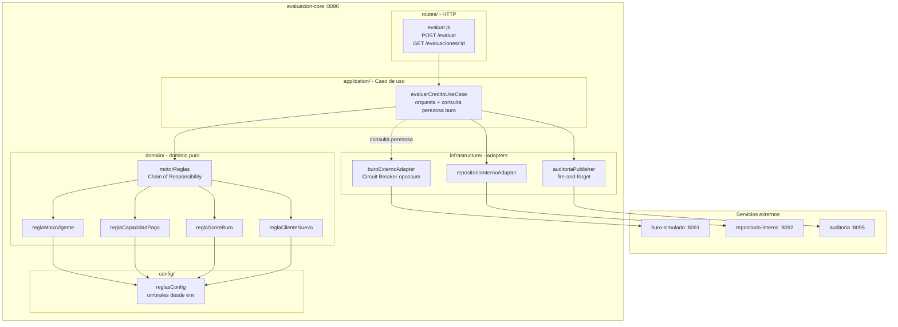
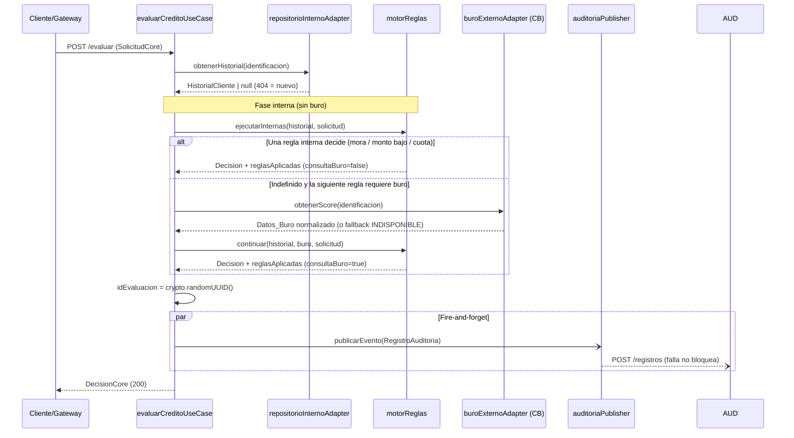

# Design Document

## Overview

Esta funcionalidad implementa la lógica real del motor de decisión crediticia dentro del servicio `evaluacion-core`, reemplazando las reglas placeholder (que hoy devuelven `null`) por estrategias de negocio ejecutables y corrigiendo la orquestación del caso de uso.

El objetivo central del diseño es doble:

1. **Corrección funcional**: implementar las 5 reglas de negocio (RF-01 a RF-05), la trazabilidad (RF-06), la resiliencia ante fallo del buró (RF-07) y la publicación de auditoría (RF-08), respetando los contratos OpenAPI de `contracts/` como fuente de verdad.
2. **Protección de los KPIs no negociables del producto**: al menos **60% de las evaluaciones resueltas sin consultar el buró**, **95% en menos de 3 s**, **p95 < 500 ms** bajo carga y **tasa de error < 1%**.

El cambio de arquitectura más relevante frente al código actual es corregir un bug de orquestación: hoy `evaluarCreditoUseCase` **siempre** consulta el buró externo antes de ejecutar el motor de reglas, lo que contradice el Requisito 2 (rechazo por mora sin consultar buró) y destruye el KPI del 60% sin buró. El diseño introduce **consulta perezosa (lazy) del buró**: las reglas internas se ejecutan primero y el buró solo se consulta cuando una regla de la cadena lo requiere y ninguna regla previa ya decidió.

Se conservan los patrones ya presentes y exigidos por el steering: **Chain of Responsibility** (motor de reglas), **Strategy** (cada regla como módulo intercambiable), **Circuit Breaker** (adapter del buró con fallback), **Repository/Adapter** (el dominio nunca conoce el esquema de las bases ni HTTP) y la publicación de auditoría desacoplada. Se añade un módulo de **configuración** para externalizar los umbrales y se documenta **Cache-Aside** como mejora opcional.

### Mapa de decisiones de diseño → requisitos

| Decisión de diseño | Requisitos que satisface |
|---|---|
| Consulta perezosa del buró (reglas internas primero) | RF-02, RF-05, RF-06 (crit. 5), KPI 60% sin buró |
| Módulo de configuración con umbrales por env var | RF-01 (crit. 5-6), RF-03 (crit. 6), RF-04 (crit. 5), RF-05 (crit. 3, 5) |
| Acumulación ordenada de `reglasAplicadas` en el motor | RF-06 (crit. 2-4) |
| `idEvaluacion` como UUID (`crypto.randomUUID`) | Contrato `DecisionCore` / `RegistroAuditoria` |
| Normalización de `Datos_Buro` en el adapter | RF-01 (crit. 4), RF-04 (crit. 4), RF-07 (crit. 1-2) |
| Circuit Breaker + fallback + timeouts cortos | RF-07, KPIs error < 1% y latencia |
| Auditoría fire-and-forget no bloqueante | RF-08 |

## Architecture

El servicio mantiene la arquitectura por capas ya establecida en `structure.md`: `routes/` (HTTP) → `application/` (caso de uso) → `domain/` (motor + reglas) → `infrastructure/` (adapters + publicador). El dominio es puro y no conoce HTTP ni el esquema de las dependencias; recibe un contexto ya normalizado.



### Estructura por capas (actualización posterior, steering `structure.md`)

Después de implementar este diseño, el steering pasó a exigir la misma estructura estándar en todos los servicios (patrón Repository), y `evaluacion-core` conserva además `domain/`. El comportamiento, los contratos y el dominio no cambian. Los componentes descritos abajo se reparten así:

| Antes | Ahora |
|---|---|
| `routes/evaluar.js` | `routes/evaluacionRoutes.js` (cablea) + `controllers/evaluacionController.js` + `middlewares/validarSolicitudCore.js` |
| `application/evaluarCreditoUseCase.js` | `services/evaluacionCreditoService.js` (`crearEvaluacionCreditoService(deps)`) |
| `domain/motorReglas.js`, `domain/reglas/*` | Sin cambios (`domain/` puro: no conoce HTTP ni repositorios) |
| `infrastructure/adapters/repositorioInternoAdapter.js` | `repositories/historialClienteRepository.interface.js` (puerto) + `repositories/httpHistorialClienteRepository.js` (implementación) → modelo `HistorialCliente` |
| `infrastructure/adapters/buroExternoAdapter.js` (breaker a nivel de módulo) | `repositories/datosBuroRepository.interface.js` (puerto) + `repositories/httpDatosBuroRepository.js` (implementación con Circuit Breaker + fallback, un breaker por instancia) → modelo `DatosBuro` |
| `infrastructure/auditoriaPublisher.js` | `clients/auditoriaPublisher.js` (`crearAuditoriaPublisher`) + `dtos/registroAuditoriaDto.js` |
| Construcción de `DecisionCore` en el caso de uso | `dtos/decisionCoreDto.js` |
| Manejador de errores en `index.js` | `middlewares/manejadorErrores.js` + `utils/errorCore.js` |
| `index.js` (todo) | `config/coreConfig.js` + `app.js` (`crearApp(deps)`) + `index.js` (raíz de composición: elige las implementaciones HTTP) |

El caso de uso depende solo de las interfaces `HistorialClienteRepository` y `DatosBuroRepository`: esto concreta el patrón Repository/Adapter del steering ("el core nunca conoce el esquema real de la base de datos, solo interfaces") y permite probar la orquestación con dobles (Properties 1, 3, 7 y 8).

### Contratos como fuente de verdad

Cada request/response se ajusta a los YAML de `contracts/` (referenciados por ruta relativa, nunca copiados dentro del servicio):

- `contracts/spec4-evaluacion-core.yaml`: `SolicitudCore` y `DecisionCore`.
- `contracts/spec6-repositorio-interno.yaml`: `HistorialCliente` (404 = cliente nuevo).
- `contracts/buro-simulado.yaml`: `ScoreResponse` (503 en `CAIDO`, latencia > 3 s en `LATENCIA_ALTA`).
- `contracts/spec7-auditoria.yaml`: `RegistroAuditoria`.

> Nota de contrato: `ScoreResponse` **no** incluye `estadoBuro`. Ese campo lo sintetiza el fallback del Circuit Breaker. Para que el dominio vea una forma consistente, el adapter **normaliza** siempre la respuesta a la forma `Datos_Buro` (ver Data Models).

### Orquestación con consulta perezosa del buró (decisión clave)

**Problema actual:** `evaluarCreditoUseCase` consulta el buró en todas las evaluaciones. Esto rompe RF-02 (rechazo por mora sin buró), RF-05 (aprobación monto bajo sin buró) y el KPI del 60% sin buró.

**Diseño propuesto:** el motor de reglas expone cuáles reglas requieren buró. El caso de uso ejecuta la cadena en **dos fases** sobre un motor síncrono:

1. **Fase interna** — ejecuta las reglas que **no** requieren buró (`reglaMoraVigente`, `reglaCapacidadPago`) usando solo `Historial_Interno`. Si alguna decide, se finaliza sin tocar el buró.
2. **Consulta condicional** — solo si la fase interna no decidió y la siguiente regla de la cadena requiere buró, el caso de uso invoca `buroExternoAdapter.obtenerScore(...)` (marcando `consultaBuroRealizada = true`).
3. **Fase con buró** — se ejecutan las reglas dependientes del buró (`reglaScoreBuro`, `reglaClienteNuevo`) con `Datos_Buro` ya normalizado.

El orden documentado de la cadena es:

`Regla_Mora_Vigente` (interna) → `Regla_Capacidad_Pago` (interna: aprobación monto bajo/historial limpio, rechazo/revisión por cuota/ingreso, revisión por datos insuficientes) → **[consultar buró si aún indefinido]** → `Regla_Score_Buro` (requiere buró) → `Regla_Cliente_Nuevo` (requiere buró para clientes sin historial) → fallback `DEFAULT_APROBADO`.

Cada regla declara un flag `requiereBuro` para que el caso de uso decida el punto de corte de la consulta perezosa sin acoplarse a nombres concretos.

**Tradeoff:** frente al flujo "siempre consultar", la consulta perezosa añade una bifurcación de orquestación (dos fases) y exige que cada regla declare si requiere buró. A cambio, protege el KPI del 60% sin buró, reduce costo variable por consulta y baja la latencia media (mora y monto bajo se resuelven en memoria, sin salida de red).



## Components and Interfaces

### 1. `routes/evaluar.js` (HTTP) — sin cambios de contrato

- `POST /evaluar` → `evaluarCreditoUseCase.ejecutar(solicitud)` → responde `DecisionCore`.
- `GET /evaluaciones/:id` → `obtenerPorId(id)`.
- No contiene lógica de negocio (regla de código del steering).

### 2. `config/reglasConfig.js` (nuevo)

Módulo único que lee `process.env` una vez y expone umbrales tipados con defaults sensatos. Las reglas leen de aquí, **nunca** de `process.env` directamente.

```js
// Interfaz conceptual
module.exports = {
  umbralScoreMinimo: number,        // UMBRAL_SCORE_MINIMO (default 600, valida rango 300-850)
  umbralScoreBueno: number,         // UMBRAL_SCORE_BUENO  (default 700, valida rango 300-850)
  porcentajeCuotaIngreso: number,   // PORCENTAJE_CUOTA_INGRESO (default 0.35)
  modoCuotaIngreso: "RECHAZADO" | "REVISION_MANUAL", // MODO_CUOTA_INGRESO (default REVISION_MANUAL)
  topeMontoAprobacionAutomatica: number // TOPE_MONTO_APROBACION_AUTOMATICA (default 500, > 0)
};
```

Cada getter valida su valor; si es inválido, la regla afectada trata el umbral como "no configurado" y devuelve `null` (o deriva a `REVISION_MANUAL` en el caso de cliente nuevo), tal como exigen RF-01 crit. 6, RF-04 crit. 5 y RF-05 crit. 5.

Nuevas variables a añadir en `.env.example`: `UMBRAL_SCORE_MINIMO`, `UMBRAL_SCORE_BUENO`, `PORCENTAJE_CUOTA_INGRESO`, `MODO_CUOTA_INGRESO`, `TOPE_MONTO_APROBACION_AUTOMATICA`.

### 3. `domain/motorReglas.js` (Chain of Responsibility) — modificado

Contrato del resultado que devuelve cada regla (`Strategy`):

```js
// Resultado de regla: null (continuar) | ResultadoRegla
{ decision: "APROBADO"|"RECHAZADO"|"REVISION_MANUAL", motivo: string, nombreRegla: string }
```

Cada módulo de regla exporta además metadatos estables:

```js
{ nombre: "REGLA_MORA_VIGENTE", requiereBuro: false, evaluar(cliente, solicitud) }
```

El motor:

- Ejecuta las reglas en orden, acumulando en un array ordenado sin duplicados el `nombre` de cada regla evaluada (RF-06 crit. 2-4).
- Devuelve `{ decision, motivo, reglasAplicadas }`. `reglasAplicadas` contiene los nombres hasta la regla que decidió, inclusive; o todos + `DEFAULT_APROBADO` si aplica el fallback.
- Soporta ejecución por fases para la consulta perezosa: método que ejecuta solo reglas con `requiereBuro === false` y método que continúa con las restantes. El acumulado `reglasAplicadas` se preserva entre fases.

### 4. Reglas (Strategy) — implementación de placeholders

| Regla | `requiereBuro` | Entrada | Salida principal | Requisito |
|---|---|---|---|---|
| `reglaMoraVigente` | false | `historial.tieneMoraVigente` | `RECHAZADO` si mora vigente; `null` si no | RF-02 |
| `reglaCapacidadPago` | false | `historial`, `solicitud`, config | `APROBADO` (monto bajo + historial limpio), `RECHAZADO`/`REVISION_MANUAL` (cuota/ingreso), `REVISION_MANUAL` (datos insuficientes), o `null` | RF-03, RF-05 |
| `reglaScoreBuro` | true | `buro.score`, config | `RECHAZADO` si `score` válido (300-850) < umbral; `null` si no | RF-01 |
| `reglaClienteNuevo` | true | `historial` ausente, `buro`, config | `REVISION_MANUAL` (buen score o buró indisponible para cliente sin historial); `null` si hay historial | RF-04, RF-07 |

Notas de implementación relevantes:

- `reglaScoreBuro` devuelve `null` si `score` es nulo, no numérico o fuera de 300-850, o si el umbral es inválido (RF-01 crit. 3-4, 6; RF-07 crit. 2) — así la cadena continúa hacia reglas internas o cliente nuevo.
- `reglaCapacidadPago` calcula `cuotaMensual = montoSolicitado / plazoMeses`; deriva a `REVISION_MANUAL` si `ingresosDeclarados` o `plazoMeses` no son números > 0 (RF-03 crit. 4-5). La aprobación por monto bajo exige historial presente con `tieneMoraVigente === false` (RF-05 crit. 1, 4).
- `reglaClienteNuevo` solo actúa cuando `historial` está ausente; con buró indisponible o `score` nulo deriva a `REVISION_MANUAL` (RF-04 crit. 4, RF-07 crit. 4).

### 5. `application/evaluarCreditoUseCase.js` — reescrito para consulta perezosa

Responsabilidades:

- Obtener historial (`repositorioInternoAdapter`).
- Ejecutar fase interna; consultar buró solo si es necesario; ejecutar fase con buró.
- Generar `idEvaluacion` con `crypto.randomUUID()` (sin nueva dependencia).
- Construir `DecisionCore` **incluyendo `reglasAplicadas`** (hoy ausente) y `consultaBuroRealizada`.
- Publicar auditoría de forma no bloqueante.

### 6. `infrastructure/adapters/buroExternoAdapter.js` (Circuit Breaker) — normalización

Mantiene opossum (`timeout 3000`, `errorThresholdPercentage 50`, `resetTimeout 10000`). Se añade **normalización**: tanto la respuesta real (`ScoreResponse`, sin `estadoBuro`) como el fallback se mapean a la forma `Datos_Buro` consistente para el dominio:

```js
// Normalizado que ve el dominio
{ score: number|null, moraExterna: boolean, deudaExternaTotal: number, estadoBuro: "DISPONIBLE"|"INDISPONIBLE" }
```

### 7. `infrastructure/auditoriaPublisher.js` (fire-and-forget) — enriquecido

El registro pasa a incluir `scoreBuro` (nullable) y `tiendaId`, soportados por `RegistroAuditoria` y hoy no enviados. La publicación no bloquea ni altera la respuesta: un fallo o timeout (3000 ms) se registra en log (RF-08 crit. 3).

## Data Models

### `SolicitudCore` (entrada — contrato spec4)

```js
{ identificacion: string, montoSolicitado: number, plazoMeses: integer, tiendaId?: string }
```

### `HistorialCliente` / `Historial_Interno` (contrato spec6; `null` si 404 = cliente nuevo)

```js
{ identificacion: string, tieneMoraVigente: boolean, creditosPrevios: integer,
  ingresosDeclarados: number|null, antiguedadMeses: integer }
```

### `Datos_Buro` (normalizado por el adapter, derivado de `ScoreResponse`)

```js
{ score: number|null,           // 300-850 real; null en fallback
  moraExterna: boolean,
  deudaExternaTotal: number,
  estadoBuro: "DISPONIBLE"|"INDISPONIBLE" }
```

### `DecisionCore` (salida — contrato spec4)

```js
{ idEvaluacion: string (uuid),
  decision: "APROBADO"|"RECHAZADO"|"REVISION_MANUAL",
  motivo: string,
  fecha: string (date-time),
  consultaBuroRealizada: boolean,
  reglasAplicadas: string[] }   // ordenado, sin duplicados
```

### `RegistroAuditoria` (hacia auditoría — contrato spec7)

```js
{ idEvaluacion: string (uuid), decision, motivo, fecha,
  tiendaId?, consultaBuroRealizada, scoreBuro: integer|null, reglasAplicadas: string[] }
```

## Correctness Properties

*Una propiedad es una característica o comportamiento que debe cumplirse en todas las ejecuciones válidas del sistema — esencialmente, una afirmación formal sobre lo que el sistema debe hacer. Las propiedades son el puente entre las especificaciones legibles por humanos y las garantías de corrección verificables por máquina.*

El motor de reglas y sus estrategias son **funciones puras** sobre `(historial, buro, solicitud)` con espacios de entrada amplios (montos, plazos, scores, ingresos, presencia/ausencia de historial), por lo que el testing basado en propiedades (PBT con `fast-check`) es apropiado. Las propiedades usan un adapter de buró simulado (mock) para contar invocaciones y forzar el fallback sin costo de red.

### Property 1: Mora vigente rechaza sin tocar el buró

*Para toda* solicitud cuyo `Historial_Interno` tiene `tieneMoraVigente = true`, la evaluación produce `decision = RECHAZADO`, `consultaBuroRealizada = false` y **cero** invocaciones al Adapter_Buro_Externo.

**Validates: Requirements 2.1, 2.3, 2.4**

### Property 2: Score bajo el umbral (con buró disponible y sin mora) rechaza

*Para todo* cliente sin mora vigente y con `Datos_Buro` cuyo `score` es un número en 300-850 y menor que `Umbral_Score_Minimo`, y que no fue resuelto por una regla interna previa, la evaluación produce `decision = RECHAZADO` por la regla de score.

**Validates: Requirements 1.1, 1.3**

### Property 3: Monto bajo con historial limpio aprueba sin buró

*Para toda* solicitud con `montoSolicitado <= Tope_Monto_Aprobacion_Automatica` cuyo `Historial_Interno` está presente con `tieneMoraVigente = false`, y con capacidad de pago suficiente, la evaluación produce `decision = APROBADO`, `consultaBuroRealizada = false` y **cero** invocaciones al buró.

**Validates: Requirements 5.1, 5.2**

### Property 4: Cliente nuevo con buen score deriva a revisión manual

*Para toda* solicitud cuyo `Historial_Interno` está ausente y cuyos `Datos_Buro` tienen `score >= Umbral_Score_Bueno`, la evaluación produce `decision = REVISION_MANUAL`.

**Validates: Requirements 4.1**

### Property 5: Toda decisión es un valor válido del dominio

*Para toda* combinación válida de `(historial, buro, solicitud)`, `decision` pertenece al conjunto `{APROBADO, RECHAZADO, REVISION_MANUAL}`.

**Validates: Requirements 1.1, 2.1, 4.1, 5.1, 6.2**

### Property 6: `reglasAplicadas` es una lista ordenada, no vacía y consistente con la regla que decidió

*Para toda* evaluación, `reglasAplicadas` es una lista no vacía, sin duplicados, en orden de ejecución, cuyo último elemento es el nombre de la regla que emitió el veredicto (o `DEFAULT_APROBADO` cuando aplica el fallback).

**Validates: Requirements 6.2, 6.3, 6.4**

### Property 7: Fallo o timeout del buró nunca produce excepción no controlada

*Para toda* solicitud evaluada mientras el buró falla, excede su timeout o tiene el Circuit Breaker abierto, la evaluación siempre produce una `DecisionCore` válida (nunca lanza una excepción no controlada), resolviéndose con reglas internas o `REVISION_MANUAL`.

**Validates: Requirements 7.1, 7.2, 7.3, 7.4, 7.5**

### Property 8: `consultaBuroRealizada` es verdadero si y solo si se invocó el adapter del buró

*Para toda* evaluación, `consultaBuroRealizada = true` si y solo si el Adapter_Buro_Externo fue invocado al menos una vez durante esa evaluación.

**Validates: Requirements 6.1, 6.5, 2.4, 5.2**

## Error Handling

- **Repositorio interno 404** → `historial = null` (cliente nuevo); flujo normal hacia `reglaClienteNuevo`.
- **Repositorio interno otro error / timeout (4000 ms)** → se propaga como error 5xx del caso de uso (el historial es dato base imprescindible); se registra en log. Se documenta como límite conocido: sin historial confiable no se puede aplicar la política interna.
- **Buró falla / timeout (3000 ms) / Circuit Breaker abierto** → el adapter devuelve fallback normalizado (`score: null`, `estadoBuro: INDISPONIBLE`); el dominio continúa con reglas internas o deriva a `REVISION_MANUAL` para clientes sin historial (RF-07). Nunca propaga excepción al caso de uso.
- **Umbral de configuración inválido o ausente** → la regla afectada se auto-inhibe devolviendo `null` (o `REVISION_MANUAL` para cliente nuevo), evitando decisiones con parámetros no confiables (RF-01 crit. 6, RF-04 crit. 5, RF-05 crit. 5).
- **Publicación de auditoría falla / timeout (3000 ms)** → se captura y registra en log; **nunca** altera ni bloquea la `DecisionCore` devuelta (RF-08 crit. 3). Patrón fire-and-forget.
- **Entrada inválida en `SolicitudCore`** → validación temprana en la ruta contra el contrato; se responde 400 antes de tocar el dominio.

## Testing Strategy

Enfoque dual: **pruebas basadas en propiedades** para la lógica pura del dominio y **pruebas de ejemplo/integración** para bordes, orquestación y dependencias externas.

### Librería de PBT

Se adopta **`fast-check`** (devDependency) sobre el runner existente **Jest + Supertest**. No se implementa PBT desde cero.

- Cada propiedad de la sección anterior se implementa con **un único test de propiedad**.
- Configuración mínima: **100 iteraciones** por propiedad (`fc.assert(..., { numRuns: 100 })`).
- Cada test se etiqueta con un comentario referenciando su propiedad de diseño, con formato:
  `// Feature: motor-decision-credito, Property {número}: {texto de la propiedad}`
- Generadores: `identificacion` (string), `montoSolicitado` (number > 0), `plazoMeses` (int > 0), `score` (int 300-850 y también nulos/fuera de rango como casos borde), `ingresosDeclarados` (number, incluyendo null y 0), presencia/ausencia de historial, y `tieneMoraVigente` booleano. Un **mock del adapter del buró** cuenta invocaciones y fuerza fallback (Properties 1, 3, 7, 8).

### Pruebas unitarias por ejemplo (Jest)

- `reglaCapacidadPago`: motivo por ingreso ausente (RF-03 crit. 4), plazo inválido (crit. 5), `Modo_Cuota_Ingreso` en `RECHAZADO` vs `REVISION_MANUAL` (crit. 2).
- `reglaScoreBuro`: motivo del rechazo menciona el umbral (RF-01 crit. 2); `score` en el límite (== umbral) continúa (crit. 3).
- `reglaClienteNuevo`: motivos de buen score vs buró indisponible (RF-04 crit. 2, 4).
- `reglasConfig`: parsing de env vars y validación de rangos/defaults.
- `idEvaluacion`: cumple formato UUID.

### Pruebas de integración (Supertest + mocks de dependencias)

- `POST /evaluar` end-to-end contra `DecisionCore` del contrato spec4 (campos y enums).
- Auditoría fire-and-forget: con el publicador fallando, la respuesta sigue siendo 200 con la misma `DecisionCore` (RF-08 crit. 3).
- Circuit Breaker: simular `CAIDO`/`LATENCIA_ALTA` del buró y verificar fallback y continuidad (RF-07 crit. 1, 5).

### Cobertura de KPIs (fuera de PBT)

- **Carga y estrés con k6** (`perf/k6/`) para validar `p95 < 500 ms`, `95% < 3 s` y `error < 1%` bajo 100-500 usuarios concurrentes.
- **Auditoría del KPI 60% sin buró**: escenario de carga con mezcla representativa de solicitudes (mora, monto bajo, score, cliente nuevo) midiendo la proporción de `consultaBuroRealizada = false`. La consulta perezosa es el mecanismo de diseño que sostiene este KPI.

### Mejora opcional: Cache-Aside

Como optimización futura (mencionada en el steering), los resultados de reglas internas por cliente podrían cachearse con TTL corto para reducir carga bajo tráfico sostenido. Se documenta como opcional y no forma parte del alcance funcional de esta feature.
