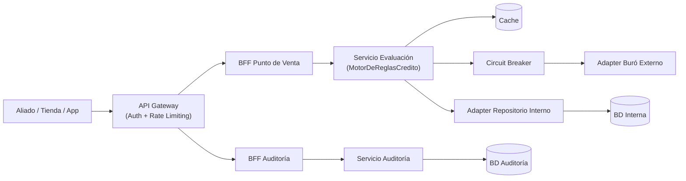
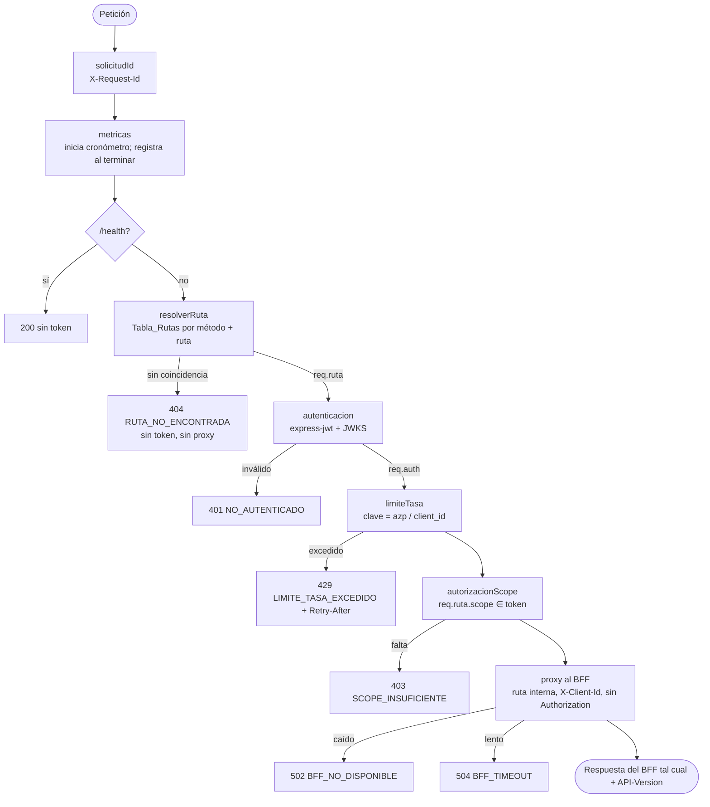

# Design Document

## Overview

Esta funcionalidad convierte el **API Gateway** (`gateway`, puerto 8080) en el punto de entrada público seguro, versionado y medible del sistema. Cada petición atraviesa una cadena de middlewares: identificación, métricas, resolución de ruta, autenticación OAuth2, límite de tasa por cliente, autorización por scope y proxy al BFF.

El objetivo central del diseño es doble:

1. **Seguridad y contrato**: autenticar con OAuth2 `client_credentials` contra Keycloak (RF-01), autorizar por scope (RF-02), limitar por cliente (RF-03), enrutar correctamente a los BFFs (RF-04) y publicar un contrato `/v1` estable (RF-05). El contrato `spec1-gateway.yaml` se actualiza **primero** (steering `tech.md`).
2. **No degradar los KPIs y hacerlos medibles**: el trabajo propio del Gateway debe ser de milisegundos (firma RS256 verificada con claves JWKS en caché, contador en memoria) y cada petición deja métricas Prometheus y un log estructurado para la Fase 4 de carga (RF-06).

Cambios frente al código actual:

- **Autenticación real.** Se reemplaza el placeholder (que acepta cualquier cabecera) por `express-jwt` + `jwks-rsa` (steering `tech.md`), con validación de firma, `iss`, `aud` y `exp`. Se elimina el `JWT_SECRET` simétrico de `docker-compose.yml`.
- **Enrutamiento corregido.** Se corrige el defecto de `http-proxy-middleware` 3.x (el prefijo no llegaba al BFF POS y `onError` se ignoraba). La ruta interna se calcula desde una **Tabla_Rutas** declarativa y los errores del proxy usan la API v3 (`on.error`).
- **Keycloak en `docker-compose.yml`.** Hoy no existe ningún emisor de tokens. Se añade con un realm importable (`infra/keycloak/resuelve-realm.json`) que define los scopes y dos clientes de demostración.
- **Consumidores actualizados.** El script k6, la prueba E2E y la colección Postman pasan a obtener un token real y usar `/v1`.

### Alineación con el steering (`.kiro/steering/`)

| Regla del steering | Cómo se cumple |
|---|---|
| `tech.md`: OAuth2 `client_credentials` vía Keycloak; JWT con `express-jwt` + `jwks-rsa` | Keycloak 25 en Compose con realm importado; `middlewares/autenticacion.js` usa `expressjwt` con `jwksRsa.expressJwtSecret` (caché + rate limit de JWKS). |
| `tech.md`: rate limiting con `express-rate-limit`, en el Gateway, **por client_id** | `middlewares/limiteTasa.js` con `keyGenerator` = `azp` / `client_id` del token. |
| `tech.md`: API Gateway sin lógica de negocio | Solo autentica, autoriza, limita, enruta y mide; no lee ni transforma cuerpos. |
| `tech.md`: timeout y error explícitos en toda llamada saliente | `proxyTimeout` por BFF y `on.error` → 502 / 504 JSON. |
| `tech.md`: contrato primero | La tarea 1 del plan actualiza `spec1-gateway.yaml` (v1.1.0), que referencia los esquemas de `spec2` y `spec3` en lugar de duplicarlos. |
| `structure.md`: estructura estándar (solo carpetas necesarias) | `config/`, `middlewares/`, `routes/` (incluida `tablaRutas.js`), `utils/`, `app.js`, `index.js`. Sin `repositories/`: el Gateway no accede a datos. |
| `product.md`: KPIs (p95 < 500 ms, error < 1 %) y Fase 4 de carga | Métricas Prometheus por ruta y código; timeouts escalonados para no convertir errores de BFF en errores genéricos. |

### Mapa de decisiones de diseño → requisitos

| Decisión de diseño | Requisitos que satisface |
|---|---|
| Keycloak + JWKS (RS256), `iss` / `aud` / `exp` validados | Req 1 |
| Tabla_Rutas declarativa (método, ruta `/v1`, scope, destino, ruta interna) | Req 2.1, Req 4, Req 5.3 |
| Resolución de ruta **antes** de autenticar | Req 4.4, Req 5.2 (404 sin token) |
| Límite de tasa **después** de autenticar, con clave = cliente | Req 3 |
| Proxy con ruta interna calculada y `on.error` v3 | Req 4.1-4.6 (corrige el defecto actual) |
| `X-Request-Id`, `X-Client-Id`; `Authorization` no se reenvía | Req 1.6, Req 4.7 |
| `prom-client` en puerto interno + log JSON por petición | Req 6 |

## Architecture

### Arquitectura de referencia del sistema

Este servicio implementa el nodo `API Gateway (Auth + Rate Limiting)`.



### Cadena de middlewares (orden y motivo)



- **Métricas primero**, para medir también los 401 / 403 / 404 / 429 (Req 6.1).
- **Resolver la ruta antes de autenticar**: una ruta inexistente (o sin `/v1`) responde 404 sin exigir token ni gastar una verificación de firma, y las métricas usan la plantilla de ruta.
- **Límite de tasa después de autenticar y antes del scope**: la clave es el cliente, así que se necesita el token validado. Un cliente que insiste con un scope que no tiene también consume su cuota, lo que limita el abuso.

### Estructura del servicio

```text
services/gateway/src/
├── config/gatewayConfig.js           # OAuth2 (issuer, audience, JWKS), destinos y timeouts, límite de tasa, métricas
├── middlewares/
│   ├── solicitudId.js                # X-Request-Id (recibido si es válido, o UUID nuevo)
│   ├── metricas.js                   # cronómetro + registro al 'finish' (Prometheus + log JSON + X-Response-Time)
│   ├── resolverRuta.js               # busca la ruta en la Tabla_Rutas; 404 si no existe
│   ├── autenticacion.js              # express-jwt + jwks-rsa (RS256, iss, aud, exp)
│   ├── limiteTasa.js                 # express-rate-limit por cliente
│   ├── autorizacionScope.js          # 403 si falta el scope de la ruta
│   └── manejadorErrores.js           # UnauthorizedError / JWKS / otros → ErrorRespuestaGateway
├── routes/
│   ├── tablaRutas.js                 # definición declarativa de endpoints /v1
│   └── proxyRoutes.js                # un proxy por destino; ruta interna desde la tabla
├── utils/
│   ├── errorGateway.js               # ErrorGateway + constructores
│   ├── scopes.js                     # lectura de scope / scp e identificador de cliente
│   └── registroMetricas.js           # registro prom-client (histograma + contador)
├── app.js                            # crearApp({ config, registroMetricas, obtenerClaveFirma? })
└── index.js                          # composición: app pública (8080) + app de métricas (9464)
```

### Tabla_Rutas (versión 1)

| Método | Ruta pública | Scope | Destino | Ruta interna |
|---|---|---|---|---|
| POST | `/v1/evaluaciones-credito` | `evaluaciones:escribir` | BFF_POS | `/evaluaciones-credito` |
| GET | `/v1/evaluaciones-credito/:id` | `evaluaciones:leer` | BFF_POS | `/evaluaciones-credito/:id` |
| GET | `/v1/auditoria/evaluaciones` | `auditoria:leer` | BFF_Auditoria | `/evaluaciones` |
| GET | `/v1/auditoria/evaluaciones/:id/detalle` | `auditoria:leer` | BFF_Auditoria | `/evaluaciones/:id/detalle` |

Cada entrada es un objeto `{ version, metodo, plantilla, scope, destino, rutaInterna(params) }`. El resolvedor compila cada plantilla a una expresión regular anclada (`^/v1/evaluaciones-credito/([^/]+)$`), así que `/v1/evaluaciones-credito/abc/extra` no coincide. Agregar `/v2` es añadir entradas con `version: "v2"` (Req 5.3).

### Flujo de una petición autorizada

```mermaid
sequenceDiagram
  participant A as Aliado
  participant KC as Keycloak
  participant GW as Gateway
  participant BFF as BFF POS

  A->>KC: POST /realms/resuelve/protocol/openid-connect/token<br/>grant_type=client_credentials (client_id, client_secret)
  KC-->>A: access_token (RS256; scope, azp, aud=resuelve-api)
  A->>GW: POST /v1/evaluaciones-credito<br/>Authorization: Bearer ...
  GW->>GW: resolverRuta → scope evaluaciones:escribir
  GW->>KC: GET JWKS (solo si la clave no está en caché)
  GW->>GW: verificar firma, iss, aud, exp · límite por azp · scope
  GW->>BFF: POST /evaluaciones-credito (sin Authorization; X-Client-Id, X-Request-Id)
  BFF-->>GW: 200 ResultadoPos
  GW-->>A: 200 ResultadoPos + API-Version: v1 + X-Request-Id + X-Response-Time
```

### Timeouts escalonados

| Tramo | Timeout | Motivo |
|---|---|---|
| Gateway → BFF_POS | `BFF_POS_TIMEOUT_MS` = 6000 | Mayor que `CORE_TIMEOUT_MS` (5000) del BFF: si el core tarda, el cliente recibe el `504 EVALUACION_TIMEOUT` descriptivo del BFF y no el genérico del Gateway. |
| Gateway → BFF_Auditoria | `BFF_AUDITORIA_TIMEOUT_MS` = 4000 | Mayor que `AUDITORIA_TIMEOUT_MS` (3000) del BFF, por la misma razón. |
| Gateway → JWKS | `JWKS_TIMEOUT_MS` = 3000 | Solo con la caché vacía o ante una clave nueva (rotación); `jwks-rsa` cachea las claves 10 minutos. |

### Modo temporal sin autenticación (`AUTH_HABILITADA=false`)

Por decisión del equipo, el Gateway se despliega **sin token** hasta integrar el Frontend Tiendas. La autenticación queda implementada y probada, y se activa por configuración sin cambiar código:

| | `AUTH_HABILITADA=false` (actual en Compose) | Sin la variable o cualquier otro valor |
|---|---|---|
| `autenticacion` + `autorizacionScope` | Se omiten de la cadena | Activos (401 / 403 / 503 JWKS) |
| `JWT_ISSUER`, `JWT_AUDIENCE`, `JWKS_URI` | No se exigen | Obligatorias: el arranque falla sin ellas |
| Clave del límite de tasa | `ip:<ip>` | `cliente:<azp>` |
| `X-Client-Id` hacia el BFF | `anonimo` | `azp` del token |
| `/v1`, proxy, métricas, errores 404/429/502/504 | Igual | Igual |

- **Seguro por defecto:** la autenticación solo se desactiva con el valor explícito `"false"`; si falta la variable, queda activa. `index.js` registra una advertencia visible al arrancar en modo temporal.
- **Para activarla:** `AUTH_HABILITADA=true` más las tres variables OAuth2, y Keycloak en Compose (tarea 7.1, pendiente). Los consumidores (k6, E2E, Postman) ya envían `Bearer <token>` si se define `GATEWAY_TOKEN` / `{{gatewayToken}}`.

### Tradeoffs

- **Contador de tasa en memoria.** `express-rate-limit` con `MemoryStore` cuenta por instancia: con N réplicas, el límite efectivo es N × `RATE_LIMIT_MAX`. Se acepta porque Compose ejecuta una instancia y no añade infraestructura. Para escalar, se inyecta un store compartido (`rate-limit-redis`) en `limiteTasa.js` sin cambiar el resto.
- **Métricas en un puerto separado.** Exponer `/metrics` en el puerto público filtraría información operativa a los aliados. Un segundo `listen` en `METRICS_PORT` (no publicado en Compose) evita necesitar autenticación para Prometheus.
- **`Authorization` no se reenvía.** Los BFFs están en la red interna y no validan tokens, así que reenviarlos solo ampliaría la superficie de exposición del secreto portador. La identidad llega como `X-Client-Id`.
- **CORS.** Se mantiene `cors()` para herramientas de desarrollo. El flujo `client_credentials` exige un secreto de cliente, que **no** debe vivir en un navegador: el Frontend Tiendas debe obtener el token desde un backend propio de la tienda. Esto se documenta como condición de integración.

## Components and Interfaces

### 1. `config/gatewayConfig.js`

```js
{
  port,                         // PORT (8080)
  metricsPort,                  // METRICS_PORT (9464)
  jwtIssuer,                    // JWT_ISSUER (p. ej. http://localhost:8180/realms/resuelve)
  jwtAudience,                  // JWT_AUDIENCE (resuelve-api)
  jwksUri,                      // JWKS_URI (http://keycloak:8080/realms/resuelve/protocol/openid-connect/certs)
  jwksTimeoutMs,                // JWKS_TIMEOUT_MS (3000)
  bffPosUrl, bffPosTimeoutMs,             // BFF_POS_URL, BFF_POS_TIMEOUT_MS (6000)
  bffAuditoriaUrl, bffAuditoriaTimeoutMs, // BFF_AUDITORIA_URL, BFF_AUDITORIA_TIMEOUT_MS (4000)
  rateLimitWindowMs, rateLimitMax         // RATE_LIMIT_WINDOW_MS (60000), RATE_LIMIT_MAX (100)
}
```

`crearGatewayConfig(env)` se puede inyectar en pruebas. Los enteros inválidos toman el default con una advertencia. Sin `JWT_ISSUER`, `JWT_AUDIENCE` o `JWKS_URI`, el arranque falla con un mensaje claro: no hay modo "sin autenticación".

### 2. `routes/tablaRutas.js`

```js
const TABLA_RUTAS = [ { version, metodo, plantilla, scope, destino: "bffPos"|"bffAuditoria", rutaInterna: (params) => string } ];
function resolverRuta(metodo, rutaPublica) // → { ...entrada, params, rutaInternaResuelta } | null
```

`rutaInterna` recibe los parámetros ya decodificados y los vuelve a codificar con `encodeURIComponent`, para evitar travesías de ruta (`..%2F`).

### 3. `middlewares/autenticacion.js`

```js
function crearAutenticacion({ jwtIssuer, jwtAudience, jwksUri, jwksTimeoutMs, obtenerClaveFirma }) // → middleware
```

- `expressjwt({ secret: obtenerClaveFirma ?? jwksRsa.expressJwtSecret({ jwksUri, cache: true, cacheMaxAge: 600000, rateLimit: true, jwksRequestsPerMinute: 10, timeout: jwksTimeoutMs }), algorithms: ["RS256"], issuer, audience, requestProperty: "auth" })`.
- Solo se aceptan tokens RS256, lo que descarta `alg: none` y la confusión de algoritmos con HS256.
- `obtenerClaveFirma` se puede inyectar en pruebas. Las pruebas de integración sí usan `jwks-rsa` contra un servidor JWKS local.

### 4. `middlewares/limiteTasa.js`

```js
function crearLimiteTasa({ rateLimitWindowMs, rateLimitMax }) // express-rate-limit
// keyGenerator: (req) => identificadorCliente(req.auth); standardHeaders: "draft-6" (RateLimit-*), legacyHeaders: false
// handler: 429 ErrorRespuestaGateway LIMITE_TASA_EXCEDIDO + Retry-After
```

### 5. `middlewares/autorizacionScope.js` y `utils/scopes.js`

```js
function scopesDelToken(auth)          // Set<string> desde "scope" (cadena con espacios) o "scp" (arreglo)
function identificadorCliente(auth)    // auth.azp ?? auth.client_id ?? "desconocido"
function autorizacionScope(req, res, next) // 403 si !scopesDelToken(req.auth).has(req.ruta.scope)
```

### 6. `routes/proxyRoutes.js`

Un `createProxyMiddleware` por destino, con:

- `pathRewrite: (_ruta, req) => req.ruta.rutaInternaResuelta + querystring`. Se calcula desde la Tabla_Rutas y no desde el prefijo montado, lo que corrige el defecto de v3.
- `proxyTimeout` y `timeout` = timeout del destino.
- `on.proxyReq`: elimina `Authorization` y añade `X-Client-Id` y `X-Request-Id`.
- `on.proxyRes`: añade `API-Version: v1`.
- `on.error`: `ECONNRESET` o `ETIMEDOUT` por `proxyTimeout` → 504 `BFF_TIMEOUT`; cualquier otro (`ECONNREFUSED`, `ENOTFOUND`, …) → 502 `BFF_NO_DISPONIBLE`. Se responde JSON sin el mensaje técnico.
- El Gateway **no** usa `express.json()`: el cuerpo se transmite tal cual al BFF, sin coste de parseo.

### 7. `middlewares/metricas.js` y `utils/registroMetricas.js`

```js
function crearRegistroMetricas() // prom-client Registry propio: gateway_http_request_duration_seconds (Histogram), gateway_http_requests_total (Counter)
// etiquetas: metodo, ruta (plantilla | "no_encontrada" | "/health"), codigo
```

- Buckets del histograma: `[0.005, 0.01, 0.025, 0.05, 0.1, 0.25, 0.5, 1, 2, 3, 5, 10]`, alineados con los umbrales de los KPIs (0,5 s y 3 s).
- Al evento `finish` de la respuesta: observa la latencia (`process.hrtime.bigint`), incrementa el contador, escribe una línea JSON en stdout y fija `X-Response-Time` antes de enviar cabeceras (vía `on-headers` interno de `res.writeHead`).
- Se usa un registro propio en lugar del global para poder aislarlo en pruebas.

### 8. `middlewares/manejadorErrores.js` y `utils/errorGateway.js`

| Situación | HTTP | `code` | `reintentable` |
|---|---|---|---|
| Sin token / token inválido / expirado / `iss` o `aud` incorrectos (`UnauthorizedError`) | 401 | `NO_AUTENTICADO` | false |
| JWKS no disponible (`JwksError`, `SigningKeyNotFoundError` con caché vacía, error de red) | 503 | `AUTORIZACION_NO_DISPONIBLE` | true |
| Scope ausente | 403 | `SCOPE_INSUFICIENTE` | false |
| Ruta inexistente | 404 | `RUTA_NO_ENCONTRADA` | false |
| Límite de tasa | 429 | `LIMITE_TASA_EXCEDIDO` | true |
| BFF caído | 502 | `BFF_NO_DISPONIBLE` | true |
| BFF lento | 504 | `BFF_TIMEOUT` | true |
| No previsto | 500 | `ERROR_INTERNO` | true |

### 9. `app.js` e `index.js`

- `crearApp({ config, registroMetricas, obtenerClaveFirma })` monta la cadena en el orden descrito.
- `crearAppMetricas(registroMetricas)` expone `GET /metrics`.
- `index.js` crea ambas apps y escucha en `port` y `metricsPort`.

### 10. Infraestructura: Keycloak y Compose

- **`infra/keycloak/resuelve-realm.json`**: realm `resuelve`.
  - Tres *client scopes* (`evaluaciones:escribir`, `evaluaciones:leer`, `auditoria:leer`) con `include.in.token.scope=true` y un *audience mapper* hacia `resuelve-api`.
  - Clientes confidenciales de demostración con cuenta de servicio: `tienda-demo` (escribir + leer) y `auditor-demo` (auditoria:leer). Sus secretos son **solo de desarrollo**.
  - Duración del token: 300 s.
- **`docker-compose.yml`**:
  - Servicio `keycloak` (`quay.io/keycloak/keycloak:25.0`, `start-dev --import-realm`, puerto `8180:8080`, `KC_HOSTNAME=http://localhost:8180`, `KC_HOSTNAME_BACKCHANNEL_DYNAMIC=true`). Así el `iss` es siempre `http://localhost:8180/realms/resuelve` y el Gateway descarga el JWKS por la red interna `http://keycloak:8080`.
  - Gateway con `JWT_ISSUER`, `JWT_AUDIENCE`, `JWKS_URI` y los timeouts; se elimina `JWT_SECRET`; `METRICS_PORT` no se publica.

### 11. Consumidores

- **`perf/k6/evaluacion-carga.js`**: `setup()` obtiene un token `client_credentials` (`tienda-demo`), usa `POST /v1/evaluaciones-credito`, verifica `aprobado` y `mensajeParaCliente` (Spec 2 v1.1.0) y fija umbrales alineados con los KPIs (`p(95)<500`, `http_req_failed<0.01`). La mezcla de identificaciones cubre los datos semilla del repositorio interno.
- **`tests/integration/flujo-completo.test.js`**: obtiene tokens de `tienda-demo` y `auditor-demo`, recorre `/v1` y la auditoría por el Gateway (`page=0&size=...`), y verifica 401 sin token y 403 con el scope equivocado.
- **`docs/postman/Resuelve_API.postman_collection.json`**: autenticación OAuth2 `client_credentials` a nivel de carpeta Gateway y rutas `/v1`.

## Data Models

```js
// Entrada de la Tabla_Rutas
{ version: "v1", metodo: "POST"|"GET", plantilla: "/v1/evaluaciones-credito/:id", scope: "evaluaciones:leer",
  destino: "bffPos"|"bffAuditoria", rutaInterna: (params) => "/evaluaciones-credito/" + encodeURIComponent(params.id) }

// Claims usados del Token_Acceso (Keycloak)
{ iss, aud: string|string[], exp, azp /* client_id */, client_id?, scope: "evaluaciones:escribir evaluaciones:leer" }

// ErrorRespuestaGateway
{ error: { code, message, reintentable } }

// Línea de log por petición
{ "tipo": "acceso", "requestId", "clientId", "metodo", "ruta", "codigo", "latenciaMs", "fecha" }
```

## Correctness Properties

*Una propiedad es una característica o comportamiento que debe cumplirse en todas las ejecuciones válidas del sistema — esencialmente, una afirmación formal sobre lo que el sistema debe hacer. Las propiedades son el puente entre las especificaciones legibles por humanos y las garantías de corrección verificables por máquina.*

Las pruebas usan un par de claves RSA generado en la prueba, un **servidor JWKS local** (para ejercitar `jwks-rsa` real) y BFFs de eco locales que devuelven método, ruta, cabeceras y cuerpo recibidos, contando las invocaciones.

### Property 1: Sin un token válido no se llega a ningún BFF

*Para todo* endpoint de la Tabla_Rutas y todo token inválido (ausente, esquema distinto de `Bearer`, texto arbitrario, firma con otra clave, algoritmo HS256 o `none`, expirado, `iss` o `aud` distintos), la respuesta es 401 `NO_AUTENTICADO` con `WWW-Authenticate: Bearer` y el BFF registra cero invocaciones.

**Validates: Requirements 1.1, 1.2, 1.3**

### Property 2: El scope decide exactamente el acceso

*Para todo* endpoint de la Tabla_Rutas y todo subconjunto de scopes en un token válido (como cadena `scope` o arreglo `scp`, con scopes parecidos como `evaluaciones:leerx`), la petición llega al BFF si y solo si el subconjunto contiene el Scope_Requerido. En otro caso, la respuesta es 403 `SCOPE_INSUFICIENTE` sin invocar al BFF.

**Validates: Requirements 2.1, 2.2, 2.3, 2.4**

### Property 3: El enrutamiento preserva método, ruta interna, query y cuerpo

*Para todo* endpoint de la Tabla_Rutas, identificador de ruta arbitrario (incluidos caracteres especiales), query string arbitraria y cuerpo JSON arbitrario, el BFF destino recibe el mismo método, exactamente la ruta interna de la tabla con el identificador codificado, la misma query y el mismo cuerpo. Además, no recibe `Authorization`, sí recibe `X-Client-Id` igual al `azp` del token, y el cliente recibe el código y el cuerpo del BFF sin cambios más `API-Version: v1`.

**Validates: Requirements 1.6, 4.1, 4.2, 4.3, 4.7, 4.8**

### Property 4: El límite de tasa es por cliente e independiente entre clientes

*Para todo* límite `L` y par de clientes `A` y `B`, tras `L` peticiones autorizadas de `A`, la siguiente de `A` responde 429 `LIMITE_TASA_EXCEDIDO` con `Retry-After`, mientras que `B` sigue obteniendo respuestas del BFF.

**Validates: Requirements 3.1, 3.2, 3.3, 3.4**

### Property 5: Rutas no versionadas o desconocidas responden 404 sin token ni proxy

*Para toda* ruta que no coincide con la Tabla_Rutas (sin `/v1`, con `/v2`, con segmentos extra o con un método no permitido), la respuesta es 404 `RUTA_NO_ENCONTRADA` aunque no haya token, y ningún BFF es invocado.

**Validates: Requirements 4.4, 5.1, 5.2**

### Property 6: Cada petición queda medida con una ruta de baja cardinalidad

*Para toda* secuencia de peticiones (autorizadas, 401, 403, 404, 429), el contador `gateway_http_requests_total` suma exactamente el número de peticiones, la suma de observaciones del histograma coincide con ese número por `(metodo, ruta, codigo)`, y ninguna etiqueta `ruta` contiene identificadores ni query strings.

**Validates: Requirements 6.1, 6.2, 6.3**

### Property 7: Todo fallo del BFF se traduce sin filtraciones

*Para todo* destino caído (puerto cerrado) o lento (demora mayor que su timeout), la respuesta es 502 `BFF_NO_DISPONIBLE` o 504 `BFF_TIMEOUT` respectivamente, en JSON con exactamente `{ error: { code, message, reintentable: true } }` y sin hosts, puertos ni mensajes del proxy.

**Validates: Requirements 4.5, 4.6**

## Error Handling

- **401** token ausente o inválido; **403** scope insuficiente; **404** ruta inexistente o sin versión; **429** límite de tasa (+ `Retry-After`).
- **503** JWKS no disponible con la clave fuera de caché (Keycloak caído recién arrancado el Gateway). Con la caché caliente, los tokens firmados con la clave vigente se siguen validando aunque Keycloak caiga.
- **502 / 504** BFF caído o lento. Los errores **del BFF** (400, 404, 502, 503, 504 con su `code`) se devuelven tal cual (Req 4.3).
- **500** no previsto, con el detalle solo en el log.

## Testing Strategy

- **`fast-check` `4.10.2`** sobre Jest + Supertest; 100 iteraciones por propiedad (menos en las que levantan servidores por iteración, indicado en cada tarea); etiqueta `// Feature: api-gateway, Property {n}: {texto}`.
- **Fixtures de prueba**:
  - `__helpers__/jwt.js`: par RSA, JWKS local servido por `http.createServer`, y `firmarToken(claims, opciones)` con `jsonwebtoken`.
  - `__helpers__/bffEco.js`: servidor que responde lo recibido y cuenta las invocaciones.
- **Ejemplos**: configuración (fallo sin issuer, audience o JWKS), JWKS caído → 503, cabeceras `RateLimit-*`, `X-Request-Id` recibido y generado, `/metrics` en el puerto de métricas, `/health` sin token.
- **Extremo a extremo con Docker**: Keycloak real con el realm importado y token `client_credentials` → Gateway → BFFs → servicios; 401 sin token, 403 con el cliente equivocado; k6 corto para comprobar que las métricas se pueblan.
