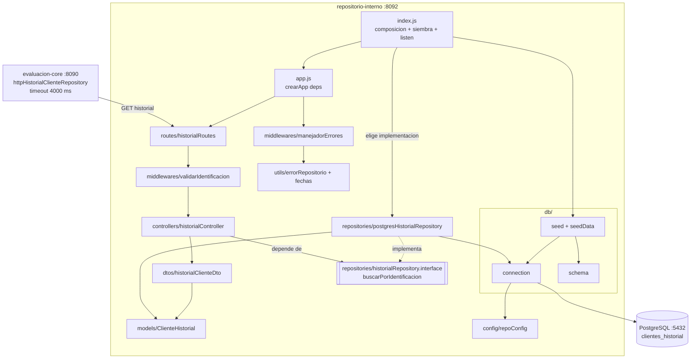
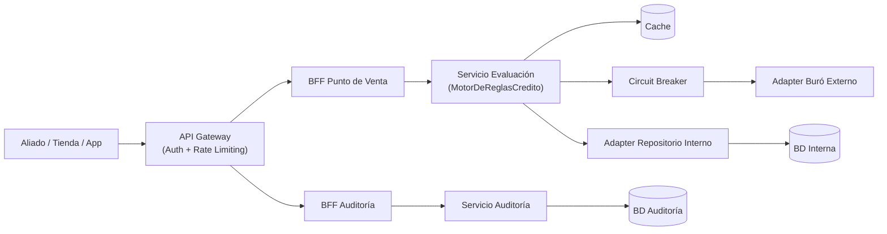
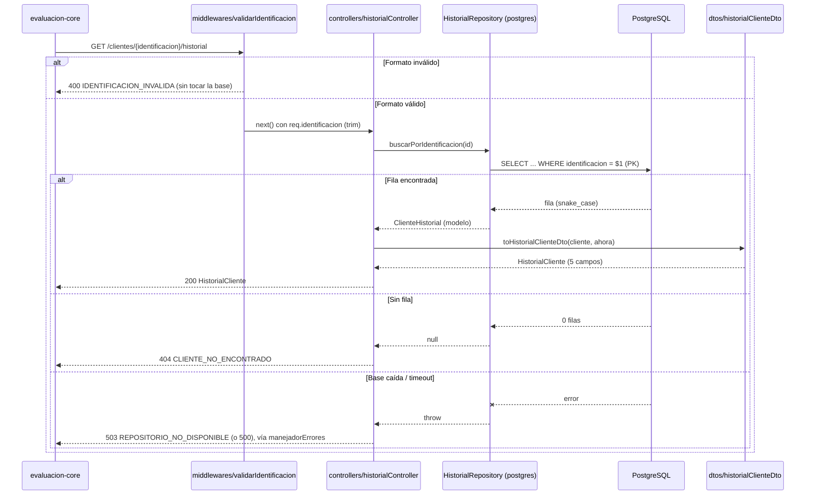
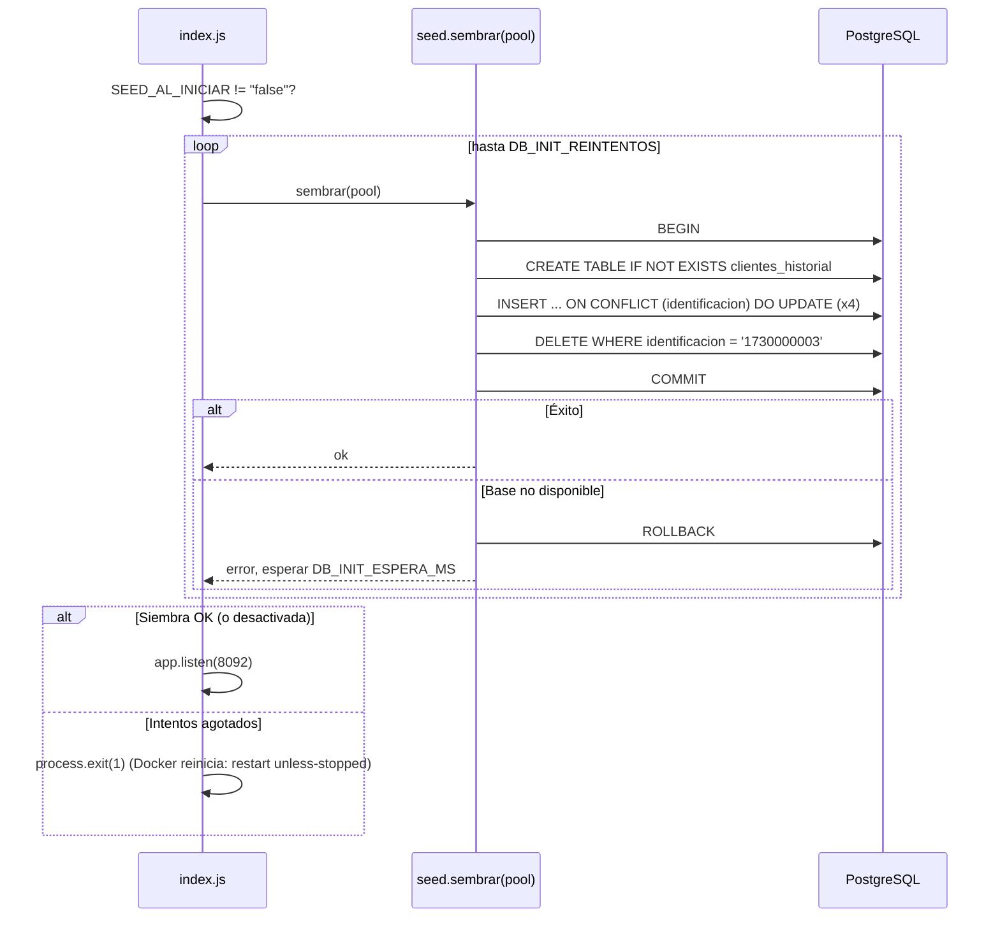

# Design Document

## Overview

Esta funcionalidad implementa la lógica real del **Repositorio Interno de Clientes** (`repositorio-interno`, puerto 8092): reemplaza la búsqueda en un arreglo en memoria por una consulta a PostgreSQL, ajusta la respuesta al contrato Spec 6 y carga datos de demostración reales e idempotentes.

El objetivo central del diseño es doble:

1. **Corrección funcional**: devolver el `HistorialCliente` exacto de Spec 6 (RF-01), responder 404 solo cuando el cliente no tiene historial (RF-02) y sembrar datos que permitan demostrar cada rama de las reglas internas del core (RF-03).
2. **Proteger los KPIs del sistema**: **95% en menos de 3 s**, **p95 < 500 ms** y **tasa de error < 1%**. El core consulta este servicio **en cada evaluación y antes de cualquier regla**, espera como máximo 4000 ms y convierte cualquier estado distinto de 200/404 en un error 5xx. Por eso el repositorio debe responder con una búsqueda O(log n) por clave primaria y fallar rápido y de forma explícita (503) cuando la base no responde, en lugar de quedar colgado hasta que venza el timeout del core.

Los cambios más relevantes frente al código actual:

- **Del arreglo a PostgreSQL.** La ruta importa `CLIENTES_SEED` y busca con `Array.find`; la base de datos no se usa. Se introduce un repositorio con consultas parametrizadas sobre la tabla `clientes_historial`.
- **El cliente nuevo responde 200.** `1730000003` ("Luis Cliente Nuevo") está en el arreglo, así que el core nunca recibe un 404 para él y la Regla_Cliente_Nuevo es inalcanzable en la demo. El proceso de siembra pasa a **garantizar su ausencia**.
- **Forma de respuesta incorrecta.** Se devuelve la fila completa (`nombres`, `diasMoraMaximo`, `creditosActivos`, `saldoPendiente`, `calificacionInterna`) y faltan `creditosPrevios`, `ingresosDeclarados` y `antiguedadMeses`. Como la Regla_Capacidad_Pago del core lee `ingresosDeclarados`, hoy **todo** cliente existente sin mora termina en "ingreso declarado ausente → REVISION_MANUAL". Se introduce un mapper por lista blanca.
- **Filtración de errores.** El manejador devuelve `err.message`. Se reemplaza por una clasificación de errores que responde con textos fijos.

Patrones aplicados: **Repository** (el SQL queda aislado detrás de `buscarPorIdentificacion`, y el core ya no conoce el esquema: ese es el propósito declarado de Spec 6), **Data Mapper** (fila → `HistorialCliente` por lista blanca), **inyección de dependencias** (la app recibe el repositorio, lo que permite probar con `pg-mem` o con dobles) y **Fail-Fast** (timeouts de conexión y de consulta menores que el timeout del consumidor).

### Alineación con el steering (`.kiro/steering/`)

| Regla del steering | Cómo se cumple |
|---|---|
| `tech.md`: Persistencia en PostgreSQL para `repositorio-interno` | Tabla `clientes_historial` en `postgres:16-alpine`, con acceso mediante `pg`. |
| `tech.md`: Repository/Adapter ("el core nunca conoce el esquema real de la base") | Interfaz `historialRepository.interface.js` + implementación `postgresHistorialRepository.js` (única que conoce el SQL), modelo `ClienteHistorial` y DTO `HistorialCliente`. El controlador depende solo de la interfaz y el core solo ve el contrato Spec 6. |
| `tech.md`: "Todo cambio de contrato se hace primero en el YAML" | La tarea 1 del plan actualiza `spec6-repositorio-interno.yaml` antes de cualquier cambio de código. |
| `tech.md`: "Toda llamada saliente debe manejar timeout y error explícitamente" | `connectionTimeoutMillis`, `statement_timeout` y `query_timeout` en el pool, con clasificación explícita 503/500. |
| `tech.md`: Circuit Breaker en adapters hacia servicios externos | No aplica aquí: en la arquitectura de referencia el breaker vive solo en `Servicio Evaluación → Adapter Buró Externo`, y `Adapter Repositorio Interno → BD Interna` es directa. La dependencia es la propia base del servicio; los timeouts del pool acotan la espera. |
| `tech.md`: Cache-Aside de "resultados de reglas internas por cliente" | Es responsabilidad de `evaluacion-core`, no de este servicio. El repositorio responde por PK en milisegundos y no cachea, para no servir mora vigente desactualizada. |
| `tech.md`: Pruebas con Jest + Supertest | Jest + Supertest, con `fast-check` y `pg-mem` como apoyo. |
| `structure.md`: contrato por ruta relativa, sin copia del YAML | No existe `openapi.yaml` dentro de `services/repositorio-interno/`. |
| `structure.md`: `src/index.js` como punto de entrada; nombres en español y camelCase | `index.js` sigue siendo el entry point y la raíz de composición (`app.js` solo construye la app para poder inyectar dependencias). Capas `config/ controllers/ dtos/ middlewares/ models/ repositories/ routes/ utils/`, con archivos en español y camelCase: `historialController.js`, `historialClienteDto.js`, `clienteHistorial.js`, `postgresHistorialRepository.js`, `errorRepositorio.js`. |
| `structure.md`: servicios independientes, sin dependencias compartidas | `pg-mem`, `fast-check` y el helper de pruebas son locales al servicio. |
| `product.md`: reglas 2, 3 y 5 dependen del historial interno | Los datos semilla cubren mora vigente (regla 2), cuota/ingreso alta y datos insuficientes (regla 3), monto bajo con historial limpio (regla 5) y cliente nuevo (regla 4, vía 404). |
| `product.md`: KPIs (p95 < 500 ms, error < 1%) | Búsqueda por PK y fallo rápido: 1500 + 2000 ms < 4000 ms del core. |

### Mapa de decisiones de diseño → requisitos

| Decisión de diseño | Requisitos que satisface |
|---|---|
| Tabla `clientes_historial` con PK `identificacion` y consulta parametrizada | RF-01 (crit. 1, 6), KPI p95 |
| Patrón Repository: interfaz + implementación PostgreSQL; fila → modelo `ClienteHistorial` → DTO por lista blanca | RF-01 (crit. 2-3), privacidad, steering `tech.md` |
| Persistir `fecha_primer_registro` y derivar `antiguedadMeses` al consultar | RF-01 (crit. 4) |
| Middleware de validación de `identificacion` antes de ir a la base | RF-01 (crit. 5) |
| 404 solo para "sin fila"; 503/500 para fallos de base | RF-02 |
| Siembra transaccional, idempotente (upsert + borrado del cliente nuevo) | RF-03 (crit. 1-5) |
| Siembra al arrancar con reintentos acotados | RF-03 (crit. 6-7) |
| Timeouts de conexión y de consulta (1500 + 2000 ms < 4000 ms del core) | Req 4 (crit. 1, 2, 5), KPIs |
| Clasificación centralizada de errores con textos fijos | Req 4 (crit. 3-4) |

## Architecture

El servicio se organiza por capas con el **patrón Repository**: el controlador depende de una **interfaz** (`historialRepository.interface.js`) y no de PostgreSQL; la implementación concreta (`postgresHistorialRepository.js`) es el único módulo que conoce el esquema. El repositorio devuelve **modelos de dominio** (`ClienteHistorial`) y el controlador los convierte al **DTO** del contrato. `index.js` es el punto de entrada (steering `structure.md`) y la *raíz de composición*: elige la implementación concreta y la inyecta en `app.js`.

```text
services/repositorio-interno/src/
├── config/
│   └── repoConfig.js                        # variables de entorno tipadas + defaults
├── controllers/
│   └── historialController.js               # HTTP <-> repositorio; arma el DTO
├── dtos/
│   └── historialClienteDto.js               # ClienteHistorial -> HistorialCliente (Spec 6, lista blanca)
├── middlewares/
│   ├── validarIdentificacion.js             # 400 antes de tocar la base
│   └── manejadorErrores.js                  # ErrorRespuesta sin filtraciones
├── models/
│   └── clienteHistorial.js                  # modelo de dominio (+ antiguedadMeses)
├── repositories/
│   ├── historialRepository.interface.js     # puerto: contrato + verificacion en runtime
│   └── postgresHistorialRepository.js       # implementacion PostgreSQL (unico que conoce el SQL)
├── routes/
│   └── historialRoutes.js                   # cablea middleware + controlador
├── utils/
│   ├── errorRepositorio.js                  # ErrorRepositorio + clasificarErrorBaseDatos
│   └── fechas.js                            # meses completos en UTC
├── db/
│   ├── connection.js                        # Pool + timeouts + parser DATE
│   ├── schema.js                            # DDL idempotente
│   ├── seed.js                              # siembra transaccional (npm run seed)
│   └── seedData.js                          # datos de demostracion
├── app.js                                   # crearApp(deps): Express + inyeccion
└── index.js                                 # punto de entrada: composicion + siembra + listen
```



**Por qué una interfaz en JavaScript.** JavaScript no tiene `implements`, así que el puerto se expresa con un `@typedef` JSDoc y una función `asegurarHistorialRepository(impl)` que verifica en tiempo de ejecución, al inyectar, que la implementación tenga los métodos del contrato. `crearApp` falla al arrancar si recibe un repositorio incompleto, en lugar de fallar en la primera petición. Así se puede reemplazar la implementación (por otra base, una en memoria o un doble de prueba) sin tocar controladores ni rutas.

### Arquitectura de referencia del sistema

Este servicio implementa los nodos `Adapter Repositorio Interno` y `BD Interna`. Lo consume el Servicio de Evaluación sin Circuit Breaker intermedio.



### Contratos como fuente de verdad

- `contracts/spec6-repositorio-interno.yaml`: `HistorialCliente` (200) y 404 = cliente nuevo. **Es el contrato que implementa este servicio.**
- Consumidor: `evaluacion-core/src/repositories/httpHistorialClienteRepository.js` (implementación de `HistorialClienteRepository`), que traduce 404 a `historial = null` y trata cualquier otro error como no recuperable (Spec 4, 500).

> **Nota de contrato (contract-first, steering `tech.md`).** Antes de tocar el código se **actualiza `contracts/spec6-repositorio-interno.yaml` (v1.1.0)**, y el código se implementa contra ese YAML. Según `structure.md`, el servicio lo referencia por ruta relativa y no guarda una copia en su carpeta. El contrato incluirá `required` y rangos en `HistorialCliente`, el esquema `ErrorRespuesta`, los códigos 400/404/500/503, `GET /health`, los servidores internos y ejemplos con los datos semilla. Hoy `spec6` no marca ningún campo como requerido ni documenta cuerpos de error.

### Flujo `GET /clientes/{identificacion}/historial`



### Flujo de arranque y siembra



**Tradeoff de sembrar al arrancar.** Sembrar dentro del proceso del servicio mezcla una tarea de despliegue con el arranque. La alternativa sería un contenedor de migración o `docker-entrypoint-initdb.d` de Postgres. Se elige sembrar al arrancar porque es un sistema de demostración: `docker compose up` debe dejar los datos listos sin pasos manuales, el volumen `postgres_data` persiste (los scripts de `initdb.d` solo corren con el volumen vacío) y el upsert idempotente restablece los datos de demo en cada arranque. En producción se desactiva con `SEED_AL_INICIAR=false` y se usa `npm run seed` o una migración. Se añade además un `healthcheck` a `postgres` en `docker-compose.yml` con `depends_on: condition: service_healthy`, para que normalmente la siembra funcione al primer intento. Los reintentos cubren el resto de los casos.

## Components and Interfaces

### 1. `src/config/repoConfig.js` (nuevo)

Lee `process.env` una vez. Ante un valor inválido usa el default y registra una advertencia (mismo criterio que `bffConfig`).

```js
module.exports = {
  db: { host, port, user, password, database },     // DB_HOST, DB_PORT, DB_USER, DB_PASSWORD, DB_NAME (defaults actuales)
  dbPoolMax: number,             // DB_POOL_MAX (default 10, entero > 0)
  dbConexionTimeoutMs: number,   // DB_CONEXION_TIMEOUT_MS (default 1500, > 0)
  dbConsultaTimeoutMs: number,   // DB_CONSULTA_TIMEOUT_MS (default 2000, > 0)
  seedAlIniciar: boolean,        // SEED_AL_INICIAR (default true; solo "false" lo desactiva)
  dbInitReintentos: number,      // DB_INIT_REINTENTOS (default 10, entero > 0)
  dbInitEsperaMs: number         // DB_INIT_ESPERA_MS (default 2000, > 0)
};
```

**Presupuesto de latencia:** `1500 ms` (obtener conexión) + `2000 ms` (consulta) = `3500 ms` en el peor caso, por debajo de los 4000 ms del adaptador del core (Req 4 crit. 5). Así el core siempre recibe un 503 explícito antes de abandonar la petición. Una consulta por PK sana tarda milisegundos, de modo que estos límites solo actúan cuando la base está degradada.

### 2. `src/db/connection.js` (modificado)

- `Pool` con `max`, `connectionTimeoutMillis`, `statement_timeout` (el servidor cancela la consulta con SQLSTATE `57014`) y `query_timeout` (corte del lado del cliente, por si el servidor no responde), tomados de `repoConfig`.
- **Parser de `DATE` (OID 1082) → texto `YYYY-MM-DD`.** Por defecto `node-pg` convierte `DATE` en un `Date` a medianoche **local**, lo que desplaza un día según la zona horaria del contenedor. Devolver el texto ISO elimina esa ambigüedad.
- `pool.on("error", ...)` registra los errores de clientes inactivos en lugar de dejar que tumben el proceso.
- Exporta `pool` y `verificarConexion()` (`SELECT 1`, usado por `/health`).

### 3. `src/db/schema.js` (nuevo)

```sql
CREATE TABLE IF NOT EXISTS clientes_historial (
  identificacion        VARCHAR(20)   PRIMARY KEY,
  tiene_mora_vigente    BOOLEAN       NOT NULL,
  creditos_previos      INTEGER       NOT NULL CHECK (creditos_previos >= 0),
  ingresos_declarados   NUMERIC(12,2) CHECK (ingresos_declarados IS NULL OR ingresos_declarados > 0),
  fecha_primer_registro DATE          NOT NULL
);
```

- La PK sobre `identificacion` da la búsqueda O(log n) que exige el KPI p95.
- Los `CHECK` replican las restricciones del contrato en la base, así que un dato inválido no puede existir y el mapper no tiene que "corregirlo".
- **Se persiste `fecha_primer_registro`, no `antiguedad_meses`**: un número de meses guardado queda desactualizado cada mes, mientras que la fecha es un hecho inmutable.

### 4. `src/db/seedData.js` (nuevo) y `src/db/seed.js` (reescrito)

`seedData.js` contiene solo datos, sin nombres ni otros datos personales (RF-03 crit. 8):

| Identificación | Mora | Créditos previos | Ingresos | Primer registro | Rama que demuestra en el core (monto/plazo de ejemplo) |
|---|---|---|---|---|---|
| `1710000001` | sí | 3 | 900 | 2022-05-10 | Regla_Mora_Vigente → `RECHAZADO` sin buró (cualquier monto) |
| `1720000002` | no | 6 | 1500 | 2021-01-20 | Regla_Capacidad_Pago → `APROBADO` sin buró (450 / 12, tope 500) |
| `1730000003` | — | — | — | — | **Sin fila** → 404 → Regla_Cliente_Nuevo con buró |
| `1740000004` | no | 1 | `null` | 2024-06-01 | Regla_Capacidad_Pago → `REVISION_MANUAL` por ingreso ausente (1200 / 12) |
| `1750000005` | no | 2 | 300 | 2023-09-15 | Regla_Capacidad_Pago → `REVISION_MANUAL` por cuota/ingreso: 1200 / 6 = 200, 200 / 300 = 66,7 % > 35 % |

Las identificaciones `1710000001`, `1720000002` y `1730000003` se mantienen porque ya las usan la colección Postman, el script k6 y el test E2E.

`seed.js` exporta `sembrar(pool)`: en una sola transacción (`BEGIN`/`COMMIT`, con `ROLLBACK` si hay error) aplica el esquema, hace upsert de cada registro con `INSERT ... ON CONFLICT (identificacion) DO UPDATE SET ...` y ejecuta `DELETE FROM clientes_historial WHERE identificacion = ANY($1)` sobre `IDENTIFICACIONES_SIN_HISTORIAL = ["1730000003"]`. Ejecutado como script (`npm run seed`), siembra con el pool real y cierra el pool.

### 5. `src/models/clienteHistorial.js` (nuevo) y `src/utils/fechas.js` (nuevo)

```js
class ClienteHistorial {
  constructor({ identificacion, tieneMoraVigente, creditosPrevios, ingresosDeclarados, fechaPrimerRegistro }) // inmutable
  antiguedadMeses(ahora) // → integer >= 0
}
```

- Modelo de dominio que devuelve cualquier `HistorialRepository`: no conoce columnas SQL ni el formato HTTP.
- `antiguedadMeses` delega en `utils/fechas.mesesCompletosEntre`: meses completos con componentes **UTC**, `(añoA − añoR) × 12 + (mesA − mesR) − (díaA < díaR ? 1 : 0)`, con mínimo 0. Acepta `YYYY-MM-DD` o un `Date`, porque `pg-mem` devuelve `Date` a medianoche UTC.

### 6. `src/repositories/historialRepository.interface.js` (nuevo, puerto)

```js
/** @typedef {{ buscarPorIdentificacion(identificacion: string): Promise<ClienteHistorial|null> }} HistorialRepository */
function asegurarHistorialRepository(implementacion) // → la misma implementación | TypeError si falta un método
```

Contrato del puerto: devuelve el `ClienteHistorial` o `null` si el cliente no tiene historial; los fallos de infraestructura se propagan como error. `crearApp` y cada implementación lo verifican al inyectar.

### 7. `src/repositories/postgresHistorialRepository.js` (nuevo, implementación)

```js
function crearPostgresHistorialRepository({ pool }) // → HistorialRepository
function filaAClienteHistorial(fila)                // → ClienteHistorial
```

```sql
SELECT identificacion, tiene_mora_vigente, creditos_previos, ingresos_declarados, fecha_primer_registro
FROM clientes_historial
WHERE identificacion = $1
```

- Es el **único** módulo que conoce la tabla y sus columnas `snake_case`.
- `filaAClienteHistorial`: `node-pg` devuelve `NUMERIC` como **cadena** (para no perder precisión). Se convierte con `Number(...)`, y `null` se mantiene `null` (RF-01 crit. 3).
- No captura los errores: los propaga para que `manejadorErrores` los clasifique.

### 8. `src/dtos/historialClienteDto.js` (nuevo)

```js
function toHistorialClienteDto(cliente, ahora) // → HistorialCliente (exactamente 5 campos)
```

Construye la respuesta por **lista blanca** (RF-01 crit. 2). `ahora` se inyecta desde el controlador para que `antiguedadMeses` sea determinista en pruebas.

### 9. `src/middlewares/validarIdentificacion.js` (nuevo)

```js
function normalizarIdentificacion(valor) // → string (con trim) | null si es inválida
function validarIdentificacion(req, res, next) // 400 IDENTIFICACION_INVALIDA o deja req.identificacion
```

Regla: `/^[0-9A-Za-z-]{1,20}$/` tras `trim()`. Cubre cédula (10), RUC (13) e identificaciones alfanuméricas, y el límite de 20 coincide con `VARCHAR(20)`. Aunque la consulta está parametrizada (sin riesgo de inyección SQL), la validación evita un viaje a la base con valores imposibles y da un 400 explícito.

### 10. `src/utils/errorRepositorio.js` (nuevo) y `src/middlewares/manejadorErrores.js` (nuevo)

```js
class ErrorRepositorio extends Error { constructor(status, code, message); toRespuesta() } // { error: { code, message } }
function clasificarErrorBaseDatos(error) // → ErrorRepositorio 503 | 500
```

| Situación | HTTP | `code` | `message` |
|---|---|---|---|
| Formato de identificación inválido | 400 | `IDENTIFICACION_INVALIDA` | "La identificación debe tener entre 1 y 20 caracteres alfanuméricos o guiones" |
| Sin fila | 404 | `CLIENTE_NO_ENCONTRADO` | "El cliente no tiene historial interno" |
| Base no disponible: `ECONNREFUSED`, `ENOTFOUND`, `ETIMEDOUT`, `ECONNRESET`, `EAI_AGAIN`; SQLSTATE de clase `08` (conexión), `57P01`-`57P03` (servidor cerrándose), `53300` (demasiadas conexiones), `57014` (consulta cancelada por timeout); mensajes de timeout de conexión o de consulta de `node-pg` | 503 | `REPOSITORIO_NO_DISPONIBLE` | "El repositorio interno no está disponible temporalmente" |
| Cualquier otro | 500 | `ERROR_INTERNO` | "Error interno en el repositorio" |

El 404 **no** incluye la identificación (RF-02 crit. 3). Hoy el mensaje la repite, y la identificación es un dato personal.

`manejadorErrores(err, req, res, next)`: `ErrorRepositorio` → su estado y cuerpo; cualquier otro error → `clasificarErrorBaseDatos`, con el detalle solo en el log.

### 11. `src/controllers/historialController.js`, `src/routes/historialRoutes.js`, `src/app.js` e `src/index.js`

- `crearHistorialController({ historialRepository, ahora })` → `obtenerHistorial(req, res, next)`: busca en el repositorio (vía la interfaz), responde 200 con el DTO o 404 si es `null`.
- `crearHistorialRoutes(controller)`: `GET /clientes/:identificacion/historial` → `validarIdentificacion` → `controller.obtenerHistorial`. Las rutas solo cablean.
- `crearApp({ historialRepository, verificarConexion, ahora })`: verifica la interfaz, monta `/health`, las rutas y `manejadorErrores`. `/health` responde **siempre 200** con `database: "UP" | "DOWN"`, para que un orquestador distinga "proceso vivo" de "base caída" (Req 4 crit. 6).
- `index.js` (punto de entrada y raíz de composición): crea `crearPostgresHistorialRepository({ pool })`, lo inyecta en `crearApp`, exporta `app` y, si `NODE_ENV !== "test"`, ejecuta `iniciar()`: siembra con reintentos, luego `listen`; si se agotan los intentos, `process.exit(1)`.

### 12. `docker-compose.yml` (modificado)

- `postgres`: `healthcheck` con `pg_isready -U resuelve_user -d resuelve_db` (intervalo 5 s, 10 reintentos).
- `repositorio-interno`: `depends_on: postgres: condition: service_healthy` y `SEED_AL_INICIAR: "true"`.

## Data Models

### `Registro_Historial` (tabla `clientes_historial`)

```js
{ identificacion: string /* PK, <= 20 */, tiene_mora_vigente: boolean, creditos_previos: integer /* >= 0 */,
  ingresos_declarados: string /* NUMERIC en node-pg */ | null, fecha_primer_registro: "YYYY-MM-DD" }
```

### `HistorialCliente` (salida — Spec 6)

```js
{ identificacion: string, tieneMoraVigente: boolean, creditosPrevios: integer /* >= 0 */,
  ingresosDeclarados: number /* > 0 */ | null, antiguedadMeses: integer /* >= 0 */ } // exactamente 5 claves
```

### `ErrorRespuesta` (salida de error)

```js
{ error: { code: string, message: string } } // sin otros campos
```

## Correctness Properties

*Una propiedad es una característica o comportamiento que debe cumplirse en todas las ejecuciones válidas del sistema — esencialmente, una afirmación formal sobre lo que el sistema debe hacer. Las propiedades son el puente entre las especificaciones legibles por humanos y las garantías de corrección verificables por máquina.*

La traducción fila → modelo → DTO, el cálculo de antigüedad y la validación son funciones puras con espacios de entrada amplios (fechas, montos, cadenas arbitrarias), por lo que PBT con `fast-check` es apropiado. Las propiedades que tocan SQL usan **`pg-mem`** (PostgreSQL en memoria), que ejecuta el mismo DDL, el upsert y la consulta parametrizada del código de producción sin requerir Docker.

### Property 1: `HistorialCliente` tiene exactamente cinco campos con los tipos del contrato

*Para toda* fila válida (con `ingresos_declarados` como número, como cadena numérica o `null`, y con columnas extra arbitrarias), `toHistorialClienteDto(filaAClienteHistorial(fila), ahora)` devuelve exactamente las claves `{identificacion, tieneMoraVigente, creditosPrevios, ingresosDeclarados, antiguedadMeses}`, conserva los valores de la fila e `ingresosDeclarados` es `number` o `null`, nunca `string`.

**Validates: Requirements 1.2, 1.3**

### Property 2: `antiguedadMeses` cuenta meses completos, nunca es negativa y no decrece con el tiempo

*Para toda* fecha de primer registro `f` y par de instantes `a1 <= a2`, `ClienteHistorial.antiguedadMeses(a1)` es un entero `>= 0`, cumple `28k <= días < 31(k+1)` (k = meses completos) cuando `a1 >= f`, y `antiguedadMeses(a1) <= antiguedadMeses(a2)`.

**Validates: Requirements 1.4**

### Property 3: Ida y vuelta por la base de datos

*Para todo* `Registro_Historial` válido insertado en la base, `GET /clientes/{identificacion}/historial` responde 200 con un cuerpo igual (profundo) a `toHistorialClienteDto(filaAClienteHistorial(registro), ahora)`, evaluado en el mismo instante.

**Validates: Requirements 1.1, 1.6**

### Property 4: Una identificación sin historial responde 404, nunca 200

*Para toda* identificación con formato válido que no está en la base, la respuesta es 404 con `error.code = CLIENTE_NO_ENCONTRADO` y un cuerpo que no contiene la identificación.

**Validates: Requirements 2.1, 2.2, 2.3**

### Property 5: Una identificación con formato inválido responde 400 sin consultar la base

*Para toda* identificación que tras `trim()` está vacía, supera los 20 caracteres o contiene caracteres fuera de `[0-9A-Za-z-]`, la respuesta es 400 con `error.code = IDENTIFICACION_INVALIDA` y el repositorio registra **cero** consultas.

**Validates: Requirements 1.5**

### Property 6: La siembra es idempotente y garantiza la ausencia del cliente nuevo

*Para todo* número de ejecuciones `n` entre 1 y 5, y para todo estado previo de la tabla (incluido uno que contenga un registro con la identificación `1730000003` o valores alterados de los datos semilla), después de ejecutar `sembrar` `n` veces la tabla contiene exactamente los datos semilla para esas identificaciones y ningún registro para `1730000003`.

**Validates: Requirements 3.1, 3.2, 3.3, 3.4, 3.5**

### Property 7: Todo fallo de la base se traduce a un error estructurado y sin filtraciones

*Para todo* error generado (códigos de red, SQLSTATE arbitrarios, mensajes arbitrarios que contienen SQL, hosts o nombres de tablas), `clasificarErrorBaseDatos(e).toRespuesta()` tiene exactamente la forma `{ error: { code, message } }`, con `code` en `{REPOSITORIO_NO_DISPONIBLE, ERROR_INTERNO}`, status 503 para los errores de disponibilidad y 500 para el resto, y ningún texto del error original en la respuesta.

**Validates: Requirements 4.1, 4.2, 4.3, 4.4**

## Error Handling

- **Identificación con formato inválido** → `400 IDENTIFICACION_INVALIDA` sin consultar la base (RF-01 crit. 5).
- **Sin fila** → `404 CLIENTE_NO_ENCONTRADO`, el único camino hacia 404 (RF-02).
- **Base caída, sin conexión disponible en `DB_CONEXION_TIMEOUT_MS` o consulta que supera `DB_CONSULTA_TIMEOUT_MS`** → `503 REPOSITORIO_NO_DISPONIBLE` (Req 4 crit. 1-2). Para el core es un fallo no recuperable (500), igual que hoy, pero llega **antes** de sus 4000 ms y sin detalles internos.
- **Error no previsto** → `500 ERROR_INTERNO`; el detalle solo va al log (Req 4 crit. 3).
- **Error de un cliente inactivo del pool** → se registra en log con `pool.on("error")`; no tumba el proceso.
- **Base no disponible al arrancar** → reintentos acotados; si se agotan, `exit(1)` y Docker reinicia el contenedor (RF-03 crit. 7).

## Testing Strategy

Enfoque dual: **pruebas basadas en propiedades** para las funciones puras y el SQL (sobre `pg-mem`), y **pruebas de ejemplo/integración** (Supertest) para HTTP, la cobertura de los datos semilla y el arranque.

### Librerías

- **`fast-check`** (devDependency, versión fijada `4.10.2`, igual que los demás servicios) sobre **Jest + Supertest**.
- **`pg-mem`** (devDependency, versión fijada): PostgreSQL en memoria compatible con la interfaz `Pool` de `node-pg`. Se usa en lugar de mocks de `query` para ejecutar el DDL, el upsert y la consulta reales. Limitación conocida: `pg-mem` no implementa `to_char` ni el cast `date::text` y devuelve `DATE` como `Date` UTC, por eso el mapper acepta ambas formas (ver componente 6). No reemplaza una prueba contra PostgreSQL real, que queda cubierta por el test E2E con Docker Compose.

### Pruebas basadas en propiedades

- Cada propiedad se implementa con **un único test**, con **100 iteraciones** (`{ numRuns: 100 }`); la Property 6 usa `{ numRuns: 25 }` porque cada iteración recrea la base en memoria.
- Etiqueta: `// Feature: repositorio-interno, Property {número}: {texto}`.
- Generadores: identificaciones válidas `fc.stringMatching(/^[0-9A-Za-z-]{1,20}$/)`; inválidas (vacías, solo espacios, más de 20 caracteres, con caracteres fuera del conjunto); fechas `fc.date` dentro de un rango acotado; `creditos_previos` `fc.nat()`; `ingresos_declarados` como `fc.option(fc.double({min: 0.01, max: 1e9}))` redondeado a 2 decimales, en forma de número o de cadena.

### Pruebas por ejemplo e integración

- `repoConfig`: defaults, parsing y reemplazo de valores inválidos; `DB_CONEXION_TIMEOUT_MS + DB_CONSULTA_TIMEOUT_MS < 4000` por defecto (Req 4 crit. 5).
- `mesesCompletosEntre` / `ClienteHistorial.antiguedadMeses`: bordes (mismo día del mes, día anterior, fin de mes, fecha futura → 0).
- Cobertura de los datos semilla (RF-03): tras `sembrar`, `1710000001` tiene mora, `1720000002` tiene buen historial, `1730000003` responde 404, y `1740000004` y `1750000005` tienen la forma esperada.
- `/health`: 200 con `database: "UP"` y con `database: "DOWN"` (verificación que falla).
- Arranque: `iniciar` reintenta hasta tener éxito, y agota los intentos llamando a `exit(1)` (con espera y salida inyectadas).

### Cobertura de KPIs (fuera de PBT)

- La consulta por PK en una tabla indexada es de milisegundos; su aporte a `p95 < 500 ms` se valida con el escenario k6 existente contra el Gateway.
- Los timeouts de base (1500 + 2000 ms) garantizan que un fallo del repositorio llegue al core antes de sus 4000 ms, sin sumar latencia de espera.
